# 02 · Linux baseline — server deployment and basic operations

**Task objective.** Bring Linux servers into a known, documented state:
addressing, accounts, remote access, time synchronization, and a repeatable
health check.

## Servers

| Host | Address | Zone | Role | Build status |
|---|---|---|---|---|
| srv-dns01 | 192.168.40.10 | Server | Internal DNS **and** company portal (Nginx) | Built — evidence below |
| srv-mon01 | 192.168.40.20 | Server | Monitoring | `TODO` |
| srv-log01 | 192.168.40.30 | Server | Log collection | `TODO` |
| srv-auto01 | 192.168.50.10 | Ops | Automation control node | `TODO` |

> The plan originally placed the portal on a dedicated `srv-web01` in the DMZ
> (192.168.60.10). In the build it runs on `srv-dns01` instead — see
> `../docs/access-control-matrix.md` for why that matters.

OS: **Rocky Linux 9.8 (Blue Onyx)**, kernel `5.14.0-687.10.1.el9_8.0.1.x86_64`,
installed via minimal ISO in VirtualBox (2 vCPU, 2048 MB RAM, 20 GB disk).

VMs use two interfaces: a NAT adapter (`10.0.2.0/24`) for internet access during
setup (`dnf update`, package installs), plus a static adapter on the zone's real
subnet per the addressing plan — since Packet Tracer and VirtualBox are
separate tools with no native bridge between them (see the top-level README's
Known Limitations).

---

## srv-dns01 — build log

### 1. Install and set hostname

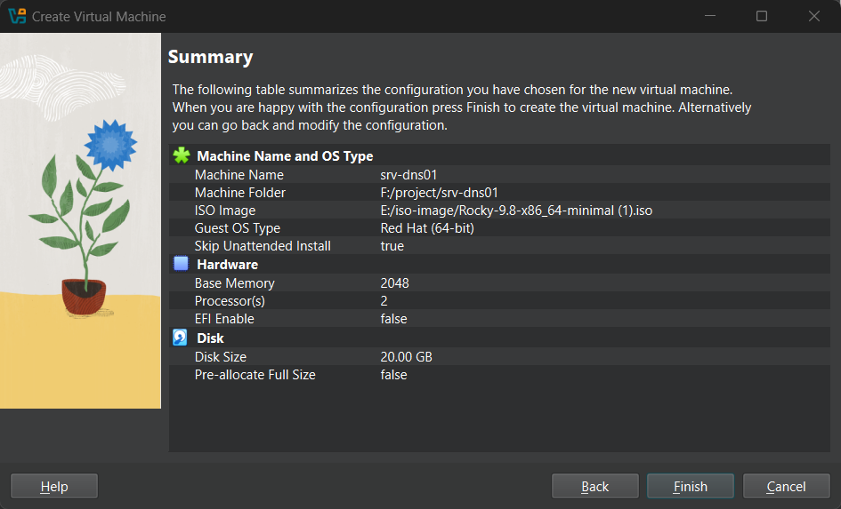
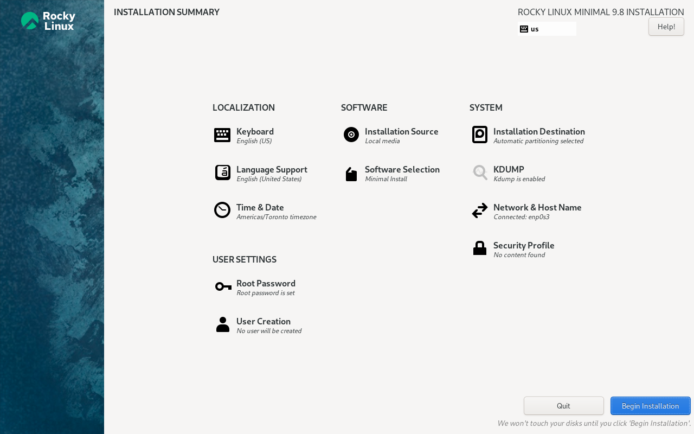

```
Rocky Linux 9.8 (Blue Onyx)
Kernel 5.14.0-687.10.1.el9_8.0.1.x86_64 on x86_64

vbox login: root
Password:
[root@vbox ~]# hostnamectl set-hostname srv-dns01
[root@vbox ~]# exec bash
[root@srv-dns01 ~]#
```

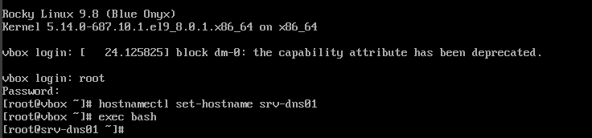

### 2. Addressing

`nmcli device status` at this point showed a single interface, `enp0s3`,
picking up an address from VirtualBox's NAT DHCP:

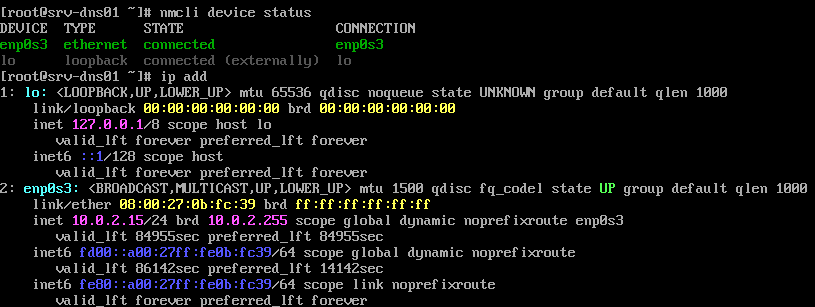

```
DEVICE  TYPE      STATE      CONNECTION
enp0s3  ethernet  connected  enp0s3
```

```
2: enp0s3: ... mtu 1500 ...
    inet 10.0.2.15/24 brd 10.0.2.255 scope global dynamic noprefixroute enp0s3
```

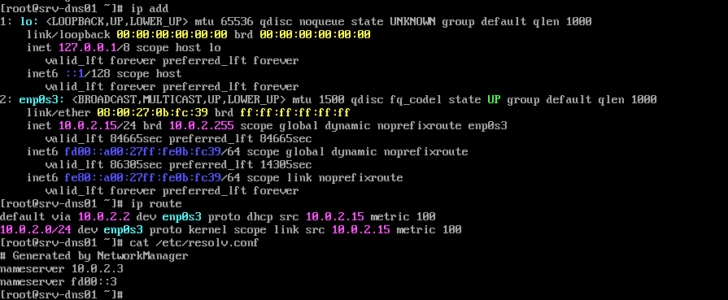

```
[root@srv-dns01 ~]# ip route
default via 10.0.2.2 dev enp0s3 proto dhcp src 10.0.2.15 metric 100
10.0.2.0/24 dev enp0s3 proto kernel src 10.0.2.15 metric 100
```

A second adapter, `enp0s8`, was then added and given the real static address
from the addressing plan:

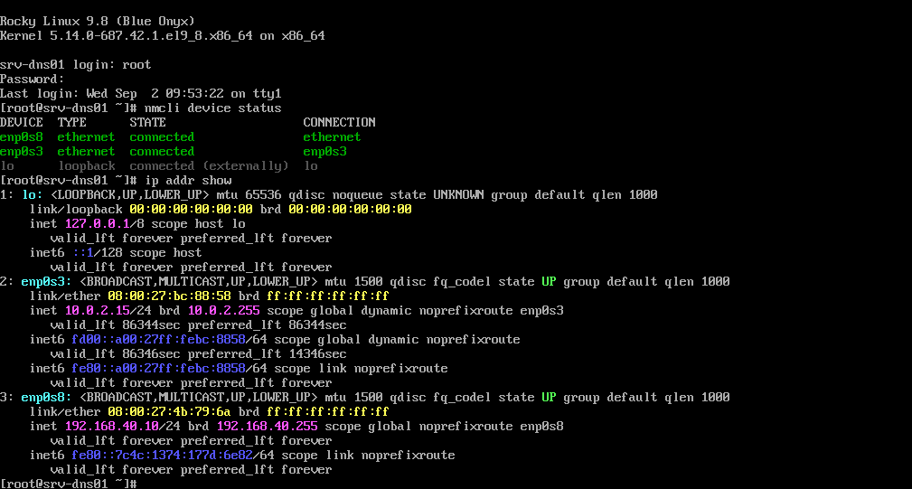

```
[root@srv-dns01 ~]# nmcli device status
DEVICE  TYPE      STATE      CONNECTION
enp0s8  ethernet  connected  ethernet
enp0s3  ethernet  connected  enp0s3

[root@srv-dns01 ~]# ip addr show
2: enp0s3: ... inet 10.0.2.15/24 ... enp0s3
3: enp0s8: ... inet 192.168.40.10/24 brd 192.168.40.255 scope global noprefixroute enp0s8
```

Confirmed: `enp0s3` stays on NAT (10.0.2.15, for `dnf`/internet), `enp0s8`
carries the real zone address (192.168.40.10/24) from the addressing plan.
This closes out what was previously an open item — the static address is now
directly evidenced, not just asserted.

`proto dhcp` on that route confirms this interface is DHCP-assigned — correct
for the NAT/internet-access adapter. The second, static interface at
192.168.40.10 (the one that matters for the addressing plan) is a separate
adapter; **`TODO`: capture `nmcli device status` and `ip addr show` together,
showing both interfaces at once, so the static 192.168.40.10 assignment is
actually evidenced rather than asserted.**

### 3. Time synchronization

```bash
dnf install chrony -y
systemctl enable --now chronyd
chronyc sources
timedatectl
```

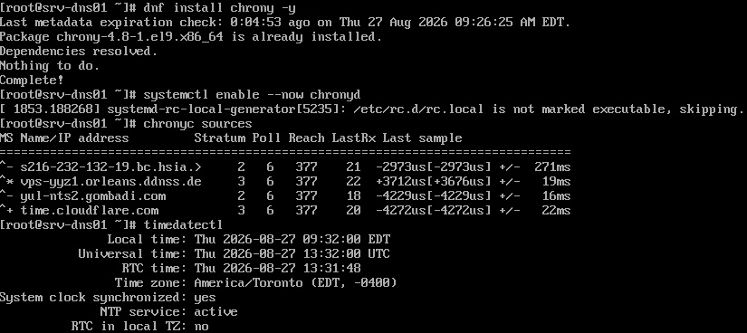

```
System clock synchronized: yes
NTP service: active
RTC in local TZ: no
```

`chronyc sources` showed four active NTP sources reachable and being polled
(`^*` marking the selected source). Confirmed synchronized before anything
else was configured — this matters because sections 06/07/10 all rely on
timestamps lining up across hosts.

### 4. System update

```bash
dnf update -y
```

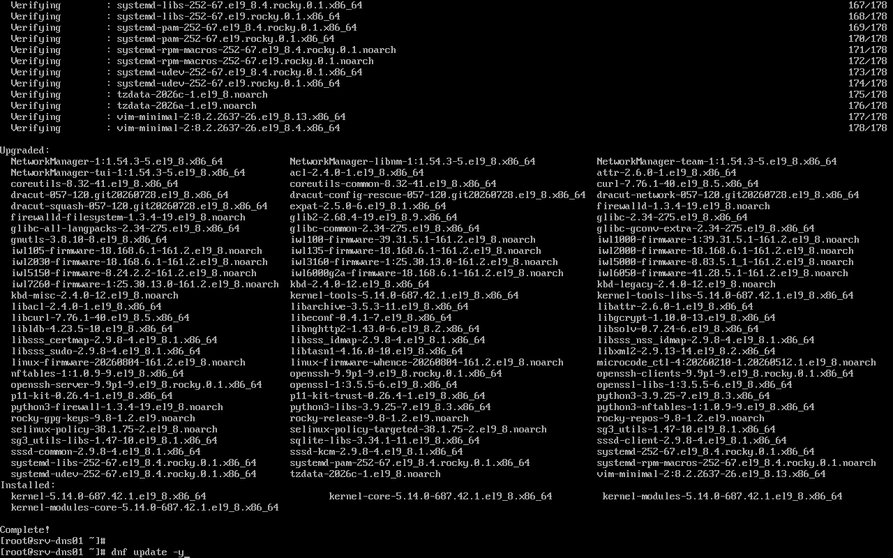

Completed cleanly — kernel, NetworkManager, chrony, and related packages
upgraded, ending on `kernel-5.14.0-687.42.1.el9_8.0.1`. No errors.

### 5. Firewall

```bash
systemctl enable --now firewalld
firewall-cmd --list-all
```

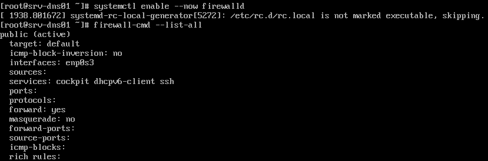

```
public (active)
  target: default
  interfaces: enp0s3
  services: cockpit dhcpv6-client ssh
  ports:
  masquerade: no
```

Default zone active on boot, only `cockpit`, `dhcpv6-client` and `ssh` open at
this stage — before Nginx/DNS were added (those show up as open ports once
section 03 is reflected here; `TODO: re-run `firewall-cmd --list-all` now that
http/dns services are running and confirm the zone reflects them).

### 6. Account creation

```bash
id yang01
```

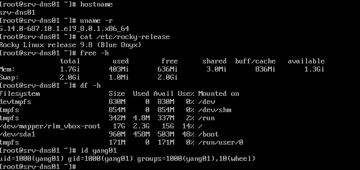

```
uid=1000(yang01) gid=1000(yang01) groups=1000(yang01),10(wheel)
```

Account is in the `wheel` group, which grants `sudo` on Rocky by default.
Confirmed directly rather than just inferred from group membership:

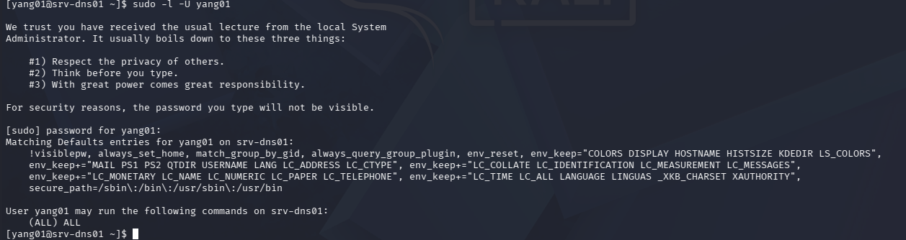

```
[yang01@srv-dns01 ~]$ sudo -l -U yang01
...
User yang01 may run the following commands on srv-dns01:
    (ALL) ALL
```

**`yang01` is the confirmed, real account name in use.** Section 10's
incident-drill write-up currently uses `ops01` in its SSH commands — that's
the inconsistency to fix, on that side: `TODO: update
../10-operations/README.md` to use `yang01` throughout, or note explicitly if
a separate `ops01` account was also created for that context.

### 7. Basic system inventory

Same screenshot as section 6 above (`srv-dns01-09-system-info-user.png`) —
`hostname`, `uname`, `free` and `df` were captured in the same session right
before `id yang01`.

```bash
hostname            # srv-dns01
uname -r             # 5.14.0-687.10.1.el9_8.0.1.x86_64
cat /etc/rocky-release   # Rocky Linux release 9.8 (Blue Onyx)
free -h
df -h
```

```
              total   used   free   shared  buff/cache  available
Mem:          1.7Gi   483Mi  636Mi  3.0Mi   836Mi       1.3Gi
Swap:         2.0Gi   1.0Mi  2.0Gi

Filesystem              Size  Used Avail Use% Mounted on
/dev/mapper/rlm_vbox-root 17G  2.3G   14G  14% /
/dev/sda1                960M  458M  503M  48% /boot
```

Nothing concerning — plenty of free memory and disk headroom at this point in
the build.

---

## srv-mon01 / srv-log01 / srv-auto01 — build log

`TODO` — same process as srv-dns01 above (install → hostname → addressing →
time sync → update → firewall → account). Doesn't need to be documented in
this much detail for each host; a `hostnamectl` + `ip addr show` per host is
enough to show each one was actually built, plus anything that differed from
the srv-dns01 process.

---

## SSH key authentication

Performed from a Kali Linux admin workstation on the same subnet as
`srv-dns01`.

**1. Generate a key pair on the admin workstation:**

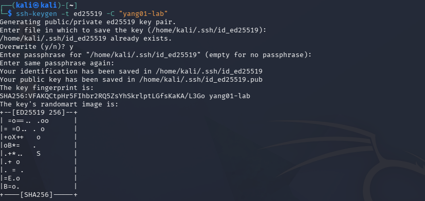

```
┌──(kali㉿kali)-[~]
└─$ ssh-keygen -t ed25519 -C "yang01-lab"
...
Your identification has been saved in /home/kali/.ssh/id_ed25519
Your public key has been saved in /home/kali/.ssh/id_ed25519.pub
```

**2. Copy the key to the server, then log in:**

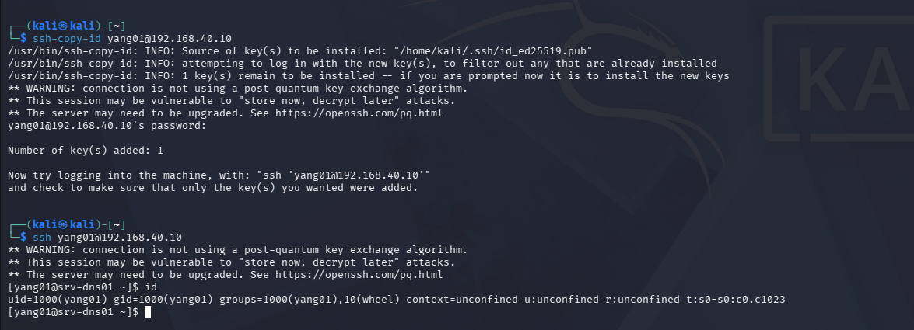

```
┌──(kali㉿kali)-[~]
└─$ ssh-copy-id yang01@192.168.40.10
...
Number of key(s) added: 1

┌──(kali㉿kali)-[~]
└─$ ssh yang01@192.168.40.10
[yang01@srv-dns01 ~]$ id
uid=1000(yang01) gid=1000(yang01) groups=1000(yang01),10(wheel) context=unconfined_u:unconfined_r:unconfined_t:s0-s0:c0.c1023
```

The `ssh yang01@192.168.40.10` line goes straight to the shell prompt with no
password re-entry — confirming the key, not a cached password, is what
authenticated the session. `id` also shows an SELinux context
(`unconfined_u:unconfined_r:...`), confirming SELinux is active on this host,
which is worth a mention: `TODO — check `getenforce` and note whether it's
Enforcing or Permissive; this affects how much the hardening in section 05
actually buys you.`

**Still open:** `TODO: was `PasswordAuthentication` actually disabled in
`sshd_config` afterward? Key login working doesn't by itself prove password
login was turned off — capture `grep PasswordAuthentication
/etc/ssh/sshd_config` to confirm.`

## Health check

```bash
hostnamectl; timedatectl; uptime; free -h; df -hT
ip address; ip route; ss -lntup
systemctl --failed
journalctl -p warning --since today
```

The `daily_check.sh` script built in section 10 already exercises most of
this in one pass — its output against `srv-dns01` showed `0 loaded units
listed` under `systemctl --failed` (clean) and Nginx/DNS both active. See
[`../10-operations/README.md`](../10-operations/README.md) for the full
output rather than duplicating it here.

## Verification

| Test | Expected | Result | Evidence |
|---|---|---|---|
| Rocky Linux installs and boots | Reaches login prompt, hostname set | Pass | `srv-dns01-03-boot-hostname.png` |
| NAT interface gets an address | `10.0.2.x` via DHCP | Pass | `srv-dns01-04-nmcli-ip-add.png` |
| Static address on the zone subnet | 192.168.40.10 assigned | Pass | `srv-dns01-10-dual-nic-static-ip.png` |
| Time sync | `timedatectl` reports synchronized | Pass | `srv-dns01-06-chrony-timedatectl.png` |
| System update completes | No errors | Pass | `srv-dns01-08-dnf-update.png` |
| Firewall active on boot | `firewalld` zone active | Pass | `srv-dns01-07-firewalld.png` |
| Account created, in `wheel` | `id` shows correct groups | Pass | `srv-dns01-09-system-info-user.png` |
| `sudo` actually works for the account | Authorized commands succeed | Pass | `srv-dns01-13-sudo-verify.png` |
| Key-based SSH | Login succeeds without password | Pass | `srv-dns01-12-ssh-copy-id-login.png` |
| Password auth disabled in `sshd_config` | `PasswordAuthentication no` | `TODO` | |
| Other three servers built | Hostname + address confirmed each | `TODO` | |

## Known limitations

1. **Password authentication may still be enabled alongside key auth** — key
   login was confirmed working, but `sshd_config` wasn't checked afterward to
   confirm `PasswordAuthentication no` was actually set.
2. **SELinux mode not confirmed** — `id` shows an SELinux context is active,
   but whether it's Enforcing or Permissive hasn't been checked
   (`getenforce`). This affects how much section 05's hardening actually buys.
3. **srv-mon01, srv-log01, srv-auto01 are not yet built or documented here** —
   only srv-dns01 has a full build log. A `hostnamectl` + `ip addr show` per
   host is enough when they're built.
4. No centralized account management (that's a section 09 concern) and no
   configuration management applied to this baseline itself yet.
5. **Section 10's incident drills reference `ops01`**, not `yang01` — the
   account name should be made consistent there.
