# 03 · Web & DNS — Nginx portal and internal resolver

**Task objective.** Bring the company portal and internal name resolution
online, with configuration validation, a real troubleshooting cycle, and a
backup of both services' configuration.

> **Deployment note.** The original plan called for a dedicated `srv-web01` in
> the DMZ (192.168.60.10). In the build, Nginx runs alongside internal DNS on
> the same host, `srv-dns01`, in the server zone instead, and VLAN 60 has no
> host on it. See [`../docs/access-control-matrix.md`](../docs/access-control-matrix.md)
> and the top-level README's Known Limitations for what that means.

---

## Internal DNS — BIND

### Install and enable

```bash
dnf install bind bind-utils -y
```

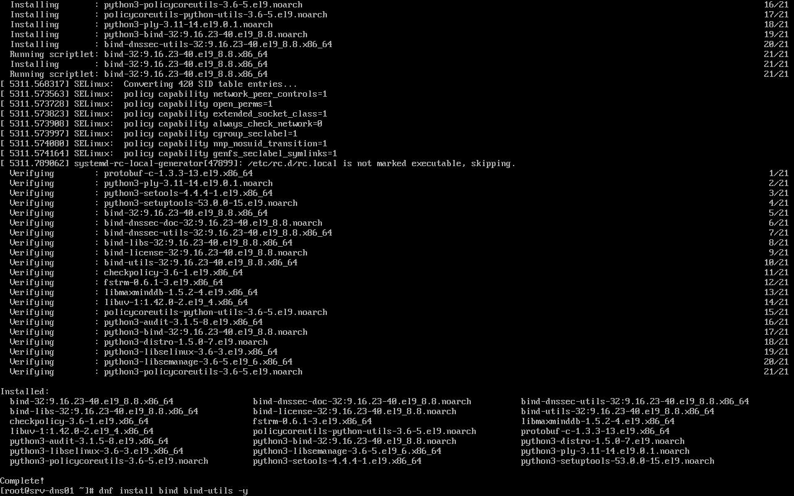

```bash
systemctl enable --now named
systemctl status named
```

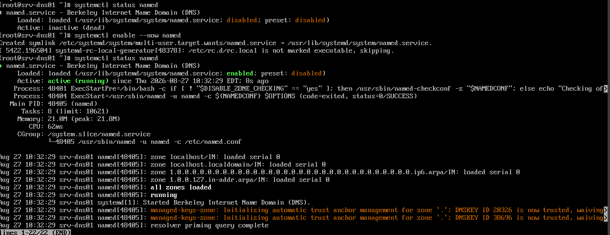

`active (running)`, all default zones loaded, resolver priming query complete.

### Firewall

```bash
firewall-cmd --permanent --add-service=dns
firewall-cmd --reload
firewall-cmd --list-all
```

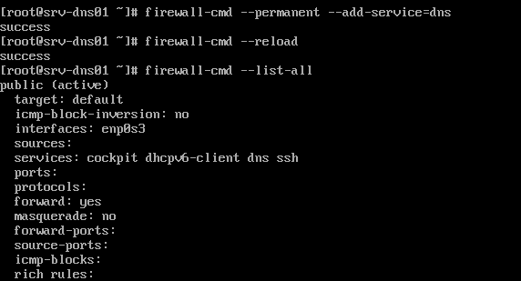

### Core configuration — `named.conf`

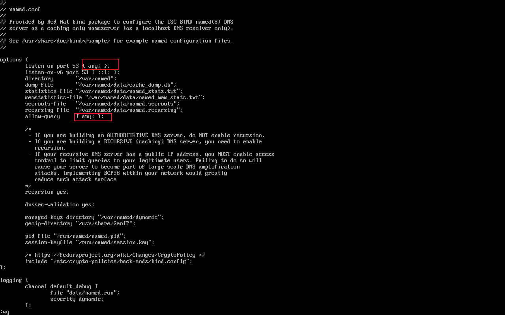

```
options {
    listen-on port 53 { any; };
    ...
    allow-query     { any; };
    ...
    recursion yes;
    dnssec-validation yes;
```

**This was flagged and then fixed, not just noted.** `listen-on { any; }` and
`allow-query { any; }` are the BIND defaults — the resolver was listening on
every interface and answering queries from any source, not scoped to internal
ranges as the plan intended. In a real network this would be open to abuse
(DNS amplification, information disclosure).

**Fix applied** — added an ACL and used it in both directives:

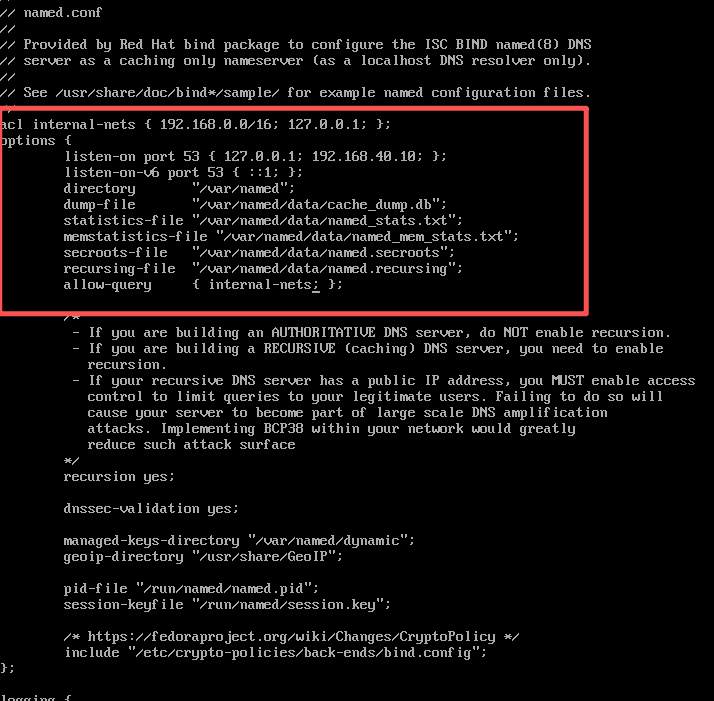

```
acl internal-nets { 192.168.0.0/16; 127.0.0.1; };

options {
    listen-on port 53 { 127.0.0.1; 192.168.40.10; };
    ...
    allow-query     { internal-nets; };
    ...
```

```bash
named-checkconf
systemctl reload named
dig @127.0.0.1 portal.lab-test.local
```

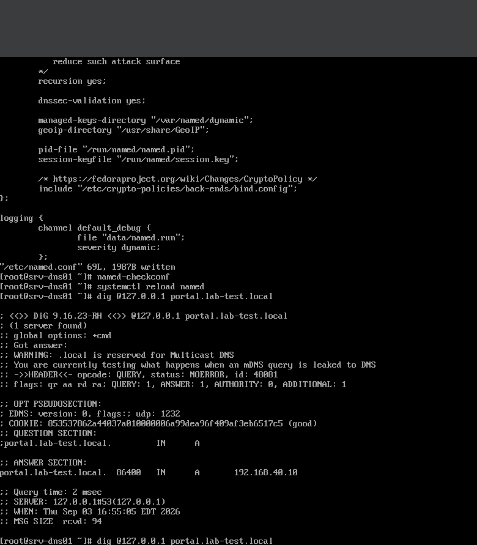

Clean syntax check, reload succeeded, and the resolver still answers correctly
for legitimate (local) queries after the restriction — confirming the ACL
didn't accidentally lock out the traffic it's supposed to serve.

### Zone declaration — `named.rfc1912.zones`

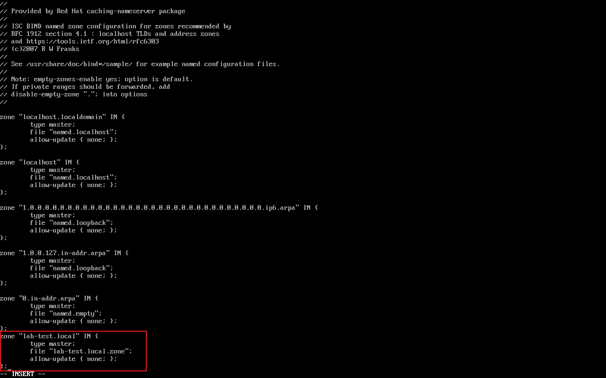

```
zone "lab-test.local" IN {
    type master;
    file "lab-test.local.zone";
    allow-update { none; };
};
```

### Zone file — initial version

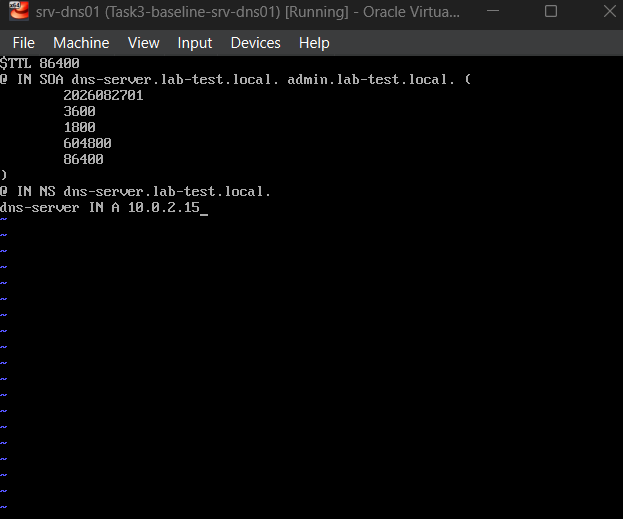

```
$TTL 86400
@ IN SOA dns-server.lab-test.local. admin.lab-test.local. (
        2026082701 ; serial
        3600       ; refresh
        1800       ; retry
        604800     ; expire
        86400 )    ; minimum
@ IN NS dns-server.lab-test.local.
dns-server IN A 10.0.2.15
```

```bash
named-checkzone lab-test.local /var/named/lab-test.local.zone
systemctl reload named
```

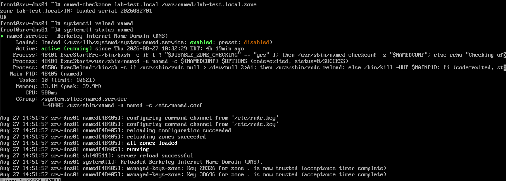

`named-checkzone` returned `OK`, reload log shows `all zones loaded` /
`running`.

### Verification — recursive and authoritative lookups

Recursive resolution (proves the resolver can reach out, not just serve its
own zone):

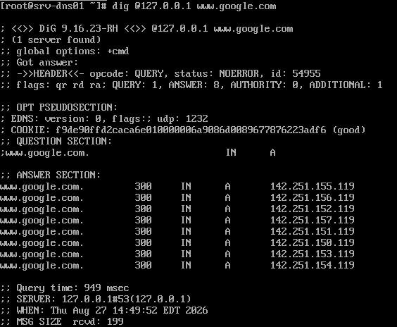

```
dig @127.0.0.1 www.google.com
;; ->>HEADER<<- opcode: QUERY, status: NOERROR
;; ANSWER SECTION: www.google.com. 300 IN A 142.251.155.119 ...
```

Authoritative resolution of the local zone:

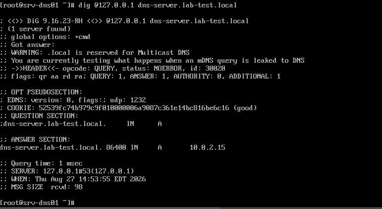

```
dig @127.0.0.1 dns-server.lab-test.local
;; WARNING: .local is reserved for Multicast DNS
;; ->>HEADER<<- opcode: QUERY, status: NOERROR
;; ANSWER SECTION: dns-server.lab-test.local. 86400 IN A 10.0.2.15
```

Both work. Two things worth flagging honestly from this output:

1. **BIND itself warns that `.local` is reserved for mDNS** (RFC 6762) —
   using it as an internal domain works in an isolated lab but collides with
   Bonjour/Avahi-style multicast DNS on a real network. A production internal
   domain would use something like `corp.internal` instead.
2. **The A record points to `10.0.2.15`** — the VirtualBox NAT address, not
   `192.168.40.10`, the static address this host actually has on the zone
   subnet (see [`../02-linux-baseline/README.md`](../02-linux-baseline/README.md)
   for the dual-NIC setup). This matters more than it looks — see the callout
   below.

```bash
named-checkconf
```


No output — clean syntax.

---

## Nginx portal

### Install and enable

```bash
sudo dnf install -y nginx
```

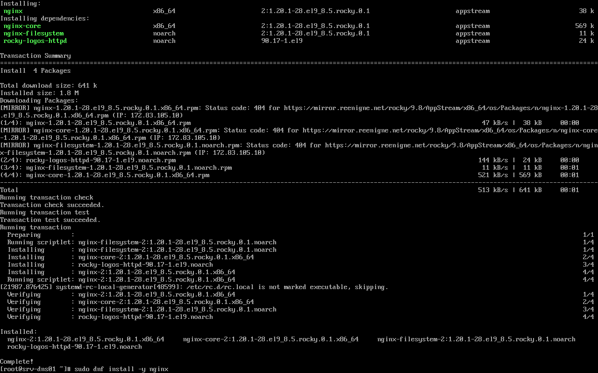

```bash
sudo systemctl enable --now nginx
systemctl status nginx
```

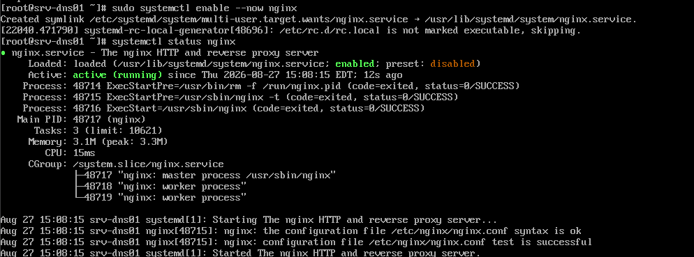

### Firewall

```bash
sudo firewall-cmd --permanent --add-service=http
sudo firewall-cmd --reload
sudo firewall-cmd --list-all
```

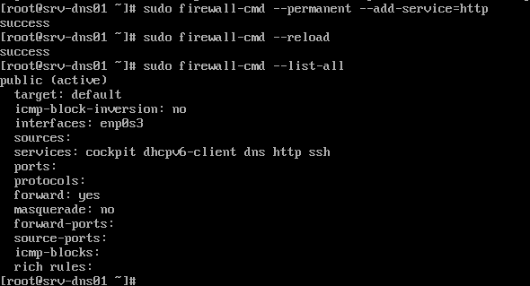

### Web root and content

```bash
sudo mkdir -p /var/www/company
sudo chown -R root:nginx /var/www/company
sudo chmod -R 750 /var/www/company
sudo vi /var/www/company/index.html
```


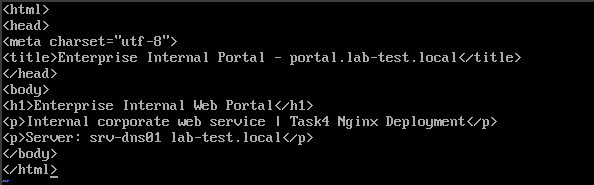

```html
<html>
<head><meta charset="utf-8"><title>Enterprise Internal Portal - portal.lab-test.local</title></head>
<body>
<h1>Enterprise Internal Web Portal</h1>
<p>Internal corporate web service | Task4 Nginx Deployment</p>
<p>Server: srv-dns01 lab-test.local</p>
</body>
</html>
```

### Virtual host — `/etc/nginx/conf.d/portal.conf`

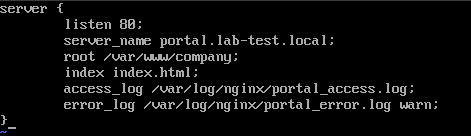

```nginx
server {
    listen 80;
    server_name portal.lab-test.local;
    root /var/www/company;
    index index.html;
    access_log /var/log/nginx/portal_access.log;
    error_log  /var/log/nginx/portal_error.log warn;
}
```

```bash
sudo nginx -t
sudo systemctl reload nginx
```

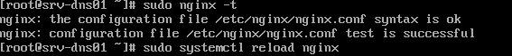

---

## Real incident: 403 Forbidden, and the actual root cause

The first local test **failed**, and this is worth documenting exactly as it
happened rather than skipping to the fixed version:

```bash
curl http://127.0.0.1
```

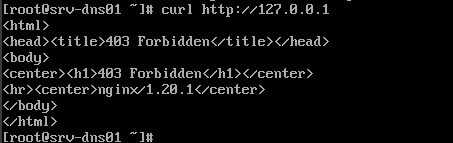

```
HTTP 403 Forbidden — nginx/1.20.1
```

**Diagnosis.** Unix permissions looked fine (`root:nginx`, `750`, group-
readable by the nginx worker). The actual cause was **SELinux** — confirmed
Enforcing on this host (see section 02) — blocking access because
`/var/www/company` carried the wrong SELinux file context. A directory
created outside the standard web paths doesn't automatically inherit
`httpd_sys_content_t`; it stays labeled `var_t`, and SELinux denies the nginx
worker access regardless of what the Unix permission bits say. This is one of
the most common "permissions look right but it's still 403" traps on
RHEL/Rocky, and figuring it out (rather than just `chmod 777`-ing it, or
disabling SELinux) is a real, demonstrable skill.

**Fix:**

```bash
sudo chown -R nginx:nginx /var/www/company
sudo chmod -R 755 /var/www/company
sudo semanage fcontext -a -t httpd_sys_content_t "/var/www/company(/.*)?"
sudo restorecon -Rv /var/www/company
sudo systemctl reload nginx
curl http://127.0.0.1
```

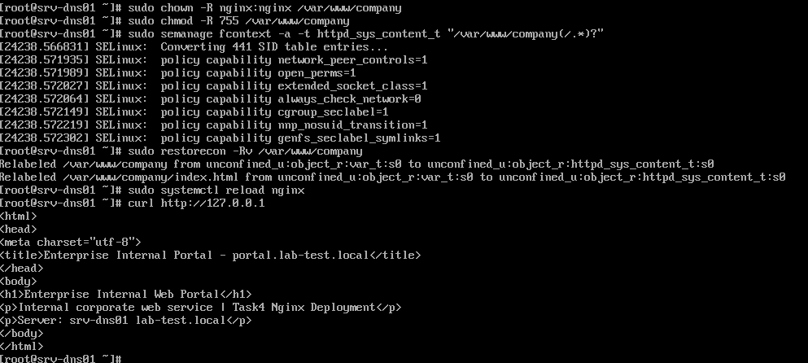

```
Relabeled /var/www/company from unconfined_u:object_r:var_t:s0 to unconfined_u:object_r:httpd_sys_content_t:s0
...
curl http://127.0.0.1 → 200, returns the real index.html content
```

`restorecon`'s own output shows the relabel happening —
`var_t` → `httpd_sys_content_t` — which is the actual proof of root cause, not
just "it works now."

---

## Making the portal resolve by name

### Add the A record and reload

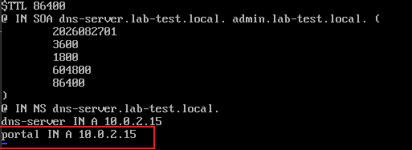

```
portal IN A 10.0.2.15
```

```bash
sudo systemctl reload named
dig @127.0.0.1 portal.lab-test.local
```

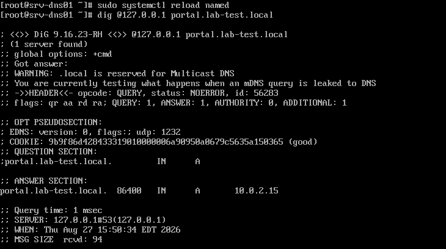

```
;; ->>HEADER<<- opcode: QUERY, status: NOERROR
;; ANSWER SECTION: portal.lab-test.local. 86400 IN A 10.0.2.15
```

### Client-side hosts entry, and the curl test

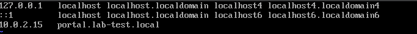

```
10.0.2.15   portal.lab-test.local
```

```bash
curl http://portal.lab-test.local
```

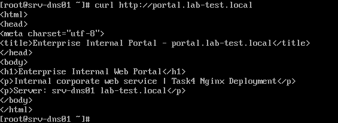

Returns the real portal HTML — the domain-name path works end to end.

### The catch that was caught — and fixed

Every command above was run **on `srv-dns01` itself** (every prompt reads
`[root@srv-dns01 ~]#`), and at this point both the `dns-server` and `portal` A
records pointed to **`10.0.2.15`** — `srv-dns01`'s VirtualBox NAT address.
In VirtualBox's default NAT mode, that address is only reachable **from the
host machine running the VM**, not from any other VM — including `srv-mon01`
on the same 192.168.40.0/24 network. The name would have resolved from another
host; the connection to that IP would then have failed. This was caught before
being called "done" rather than after.

**Fix — both A records changed to the real static address:**

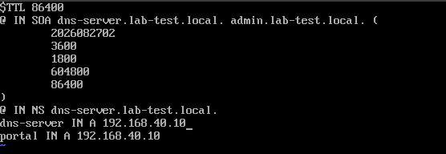

```
dns-server IN A 192.168.40.10
portal     IN A 192.168.40.10
```

```bash
named-checkzone lab-test.local /var/named/lab-test.local.zone
systemctl reload named
```

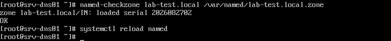

```bash
dig @127.0.0.1 portal.lab-test.local
```

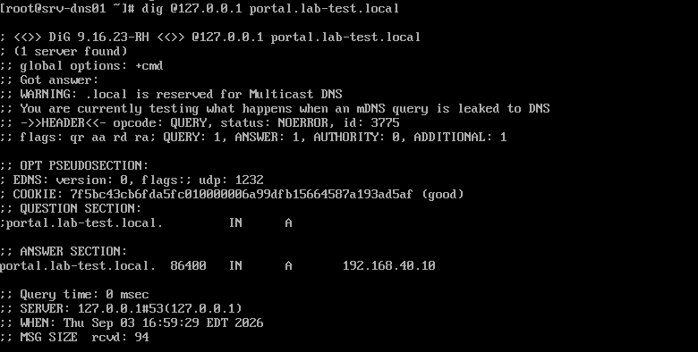

```
;; ANSWER SECTION: portal.lab-test.local. 86400 IN A 192.168.40.10
```

**Then — the test that actually matters — from a second host:**

```bash
# on srv-mon01, not srv-dns01
dig portal.lab-test.local
```

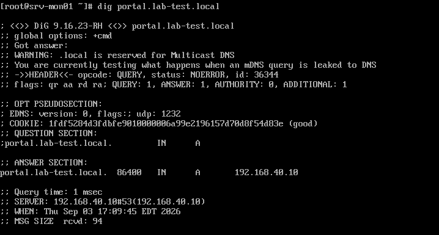

```
[root@srv-mon01 ~]# dig portal.lab-test.local
;; ANSWER SECTION: portal.lab-test.local. 86400 IN A 192.168.40.10
;; SERVER: 192.168.40.10#53(192.168.40.10)
```

Run from `srv-mon01`, querying `srv-dns01` over the network (not loopback),
and getting the correct, reachable address back. This is the difference
between "the config looks right" and "a second machine actually depends on it
and it worked" — the only kind of test that really closes this out.

---

## Real incident #2: DNS worked, curl worked, but the wrong website loaded

With DNS now correctly pointing to `192.168.40.10` and resolving from a second
host, the obvious next check — actually loading the site by name — turned up
a second, unrelated bug.

```bash
# from srv-mon01
curl -s http://portal.lab-test.local | grep -i "Rocky Linux Project"
```

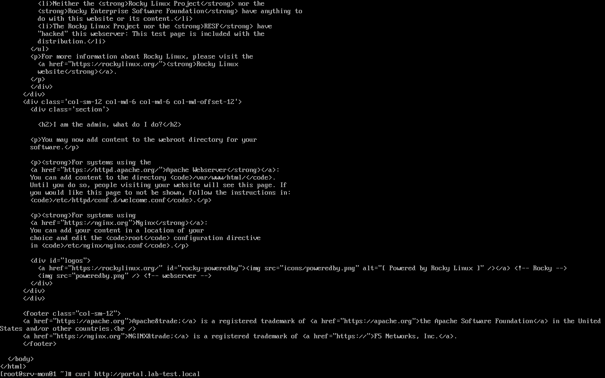
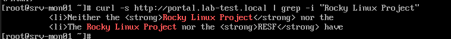

The `grep` matched — meaning the page served was Rocky Linux's **default
nginx welcome page**, not `index.html` written for this portal. DNS, routing,
and the firewall were all fine; something in Nginx itself was serving the
wrong content.

**Diagnosis.** Rather than guess, checked what Nginx actually had loaded —
not what the file on disk was believed to say, but the parsed, in-memory
configuration:

```bash
nginx -T | grep -B2 -A8 "listen 80"
```

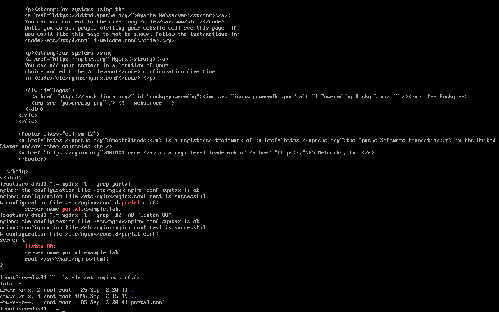

```
# configuration file /etc/nginx/conf.d/portal.conf:
server {
    listen 80;
    server_name portal.example.lab;
    root /usr/share/nginx/html;
}
```

**Root cause found:** the *live* `portal.conf` had `server_name
portal.example.lab` (the old domain from an earlier iteration of this build —
see the domain-naming issue in Known Limitations) and `root
/usr/share/nginx/html` (Nginx's default document root, not `/var/www/company`).
Because the request's `Host:` header (`portal.lab-test.local`) matched no
configured `server_name`, Nginx fell through to its default server block and
served the stock welcome page. **This is the domain-naming inconsistency
flagged elsewhere in this repo actually causing an outage**, not just looking
untidy on paper — the clearest possible argument for eventually unifying it.

**Fix:**

```bash
sudo vi /etc/nginx/conf.d/portal.conf
sudo nginx -t
sudo systemctl reload nginx
```

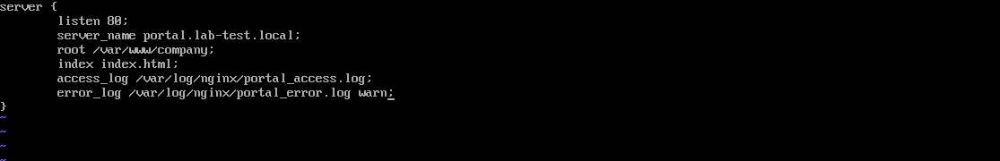

```nginx
server {
    listen 80;
    server_name portal.lab-test.local;
    root /var/www/company;
    index index.html;
    access_log /var/log/nginx/portal_access.log;
    error_log  /var/log/nginx/portal_error.log warn;
}
```

**Verified twice — locally, then cross-host:**

```bash
# on srv-dns01
curl -s http://portal.lab-test.local | grep -i "Enterprise Internal"
```

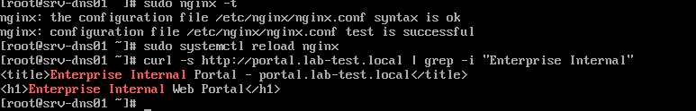

```bash
# on srv-mon01
curl -s http://portal.lab-test.local | grep -i "Enterprise Internal"
```


Both return the real portal title (`Enterprise Internal Portal -
portal.lab-test.local`). Full cycle: wrong content observed → checked the live
config rather than the file as remembered → found a stale domain and a wrong
document root → fixed → verified from two different hosts, not just the one
that was broken.

---

## Backup

```bash
sudo tar -czf /backup/config/nginx-$(date +%F).tar.gz /etc/nginx /var/www/company
```

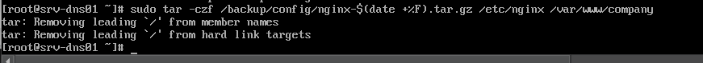

```bash
sudo tar -czf /backup/config/named-$(date +%F).tar.gz /etc/named.conf /etc/named.rfc1912.zones /var/named
sudo sha256sum /backup/config/*.tar.gz > /backup/config/SHA256SUMS
cat /backup/config/SHA256SUMS
```

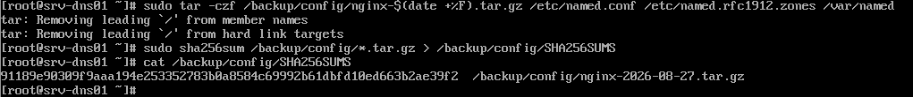

Both services' configuration backed up with checksums recorded.
**`TODO`: this is a backup, not yet a tested restore.** A backup that has
never been restored is a hypothesis — extract it to a temporary path, confirm
the content is intact, and ideally simulate a broken config and restore from
this archive to prove the recovery path actually works.

---

## Verification

| Test | Expected | Result | Evidence |
|---|---|---|---|
| `named-checkconf` / `named-checkzone` | Clean, no errors | Pass | `dns-10-named-checkconf.png`, `dns-07-checkzone-reload.png` |
| Recursive DNS resolution | External name resolves | Pass | `dns-08-dig-recursive-google.png` |
| Authoritative zone resolution | Local zone resolves | Pass | `dns-09-dig-dns-server-selfname.png` |
| Resolver restricted to internal ranges | `allow-query` scoped, not `any` | Pass — fixed with an ACL | `dns-13-named-conf-acl-fix.png`, `dns-14-checkconf-reload-dig-fix.png` |
| DNS A records use the reachable static address | 192.168.40.10, not the NAT address | Pass — fixed | `dns-16-zone-file-correct-ip.png`, `dns-18-dig-local-correct-ip.png` |
| DNS resolves correctly from a second host | `dig` from srv-mon01 returns the right IP | Pass | `dns-19-dig-from-srv-mon01-cross-host.png` |
| `nginx -t` before reload | Syntax OK | Pass | `web-07-nginx-t-reload.png` |
| Portal reachable locally by IP | HTTP 200 | Pass (after fixing a real 403/SELinux issue) | `web-08-curl-403-bug.png` → `web-09-selinux-fix-curl-200.png` |
| Portal serves the correct site, not the Nginx default | Portal title present, not Rocky welcome page | Pass (after fixing a stale `server_name`/`root`) | `web-13-grep-confirms-default-page-bug.png` → `web-16-curl-fixed-local.png` |
| Portal reachable and correct **from a second host** | HTTP 200, correct content, from srv-mon01 | Pass | `web-17-curl-fixed-cross-host.png` |
| Config backed up with integrity check | tar + sha256sum | Pass | `backup-01-nginx-config-tar.png`, `backup-02-dns-config-tar-sha256.png` |
| Restore drill | Extract backup, confirm service recovers | `TODO` | |

## Known limitations

1. **`.local` is the wrong domain suffix** — reserved for mDNS per RFC 6762;
   BIND warns about this on every query. Works in an isolated lab, would
   misbehave on a real network.
2. **Domain naming was inconsistent across the build, and it was not just
   cosmetic — it caused Real Incident #2 above.** A leftover `portal.conf`
   from an earlier `example.lab` iteration silently served the wrong content
   once the domain moved to `lab-test.local`. That specific instance is now
   fixed, but the underlying inconsistency (`lab-test.local` here, `xyang.lab`
   on the switches in section 01, `srv-log01.lab.local` in section 02) is
   still present elsewhere and could resurface the same way. Tracked as an
   open item — picking one domain and applying it everywhere is the real fix.
3. **No restore drill** — backups exist and are checksummed, but recovery
   from them has not been tested.
4. **Portal and DNS share a host and a security zone** with no boundary
   between them — see `../docs/access-control-matrix.md`.
5. HTTP only, no TLS.
