# 04 · Edge firewall — OPNsense

**Task objective.** Deploy the edge firewall, connect it to the three internal
zones, enforce the access-control matrix as real rules, and prove — not just
configure — that traffic actually flows the way the policy says it should.

Platform: **OPNsense 26.7 (amd64)**, installed in VirtualBox (ZFS, striped,
single disk).

---

## Interfaces

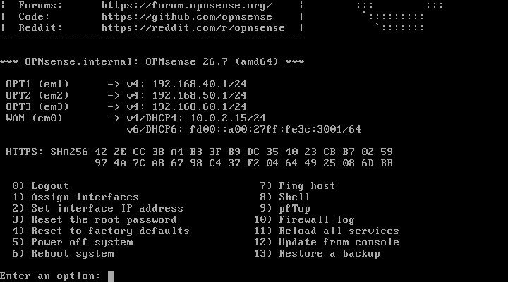

```
OPT1 (em1) -> v4: 192.168.40.1/24
OPT2 (em2) -> v4: 192.168.50.1/24
OPT3 (em3) -> v4: 192.168.60.1/24
WAN  (em0) -> v4/DHCP4: 10.0.2.15/24
```

| OPNsense interface | Zone | Subnet | Role |
|---|---|---|---|
| WAN (em0) | — | 10.0.2.0/24 (VirtualBox NAT) | Internet egress, same NAT pattern as every other host in this build |
| OPT1 (em1) | Server | 192.168.40.0/24 | Gateway for srv-dns01, srv-mon01, srv-log01 |
| OPT2 (em2) | Operations / mgmt | 192.168.50.0/24 | Gateway for srv-auto01 and the admin workstation |
| OPT3 (em3) | DMZ | 192.168.60.0/24 | No host deployed yet — see `../docs/access-control-matrix.md` |

> Confirmed from the WebGUI rule descriptions (`Allow MGMT subnet access
> firewall` on OPT2) rather than assumed — OPT2 is the management interface,
> OPT3 is the DMZ. Worth stating explicitly because it would be easy to
> transpose these from memory alone.

---

## Install

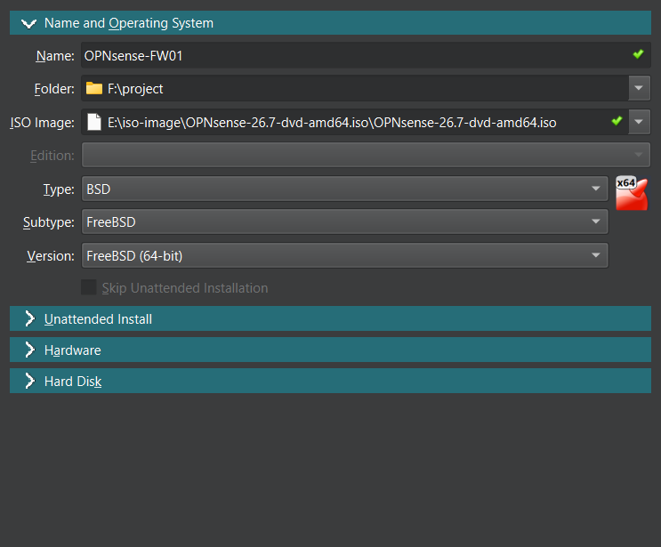
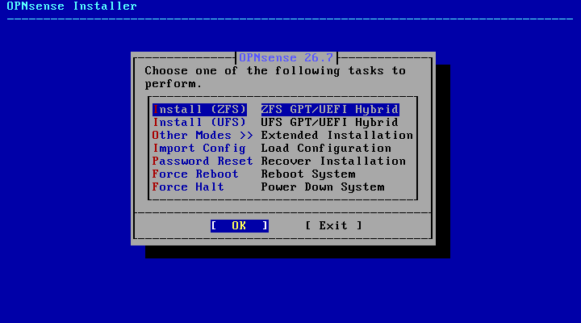
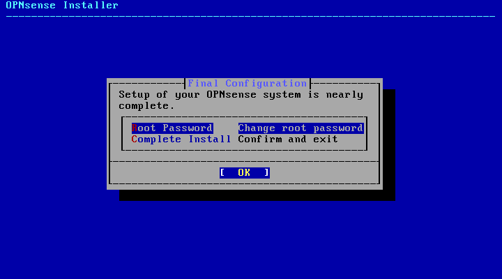
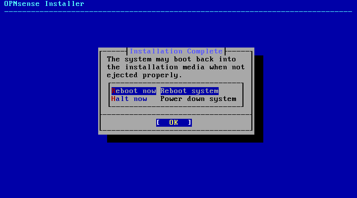

---

## Initial access: WebGUI over the management interface

The console is the only way in before any firewall rule exists, so the
sequence was: temporarily disable PF from the console shell → configure
WebGUI access from the mgmt subnet → **re-enable PF** → verify.

**1. Temporarily disable the packet filter** (console shell):

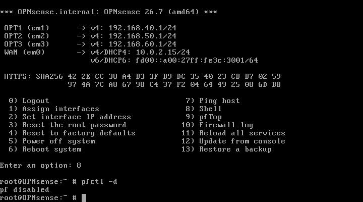

```
root@OPNsense:~ # pfctl -d
pf disabled
```

**2. Confirm the mgmt workstation (Kali, 192.168.50.100) can reach the
gateway:**

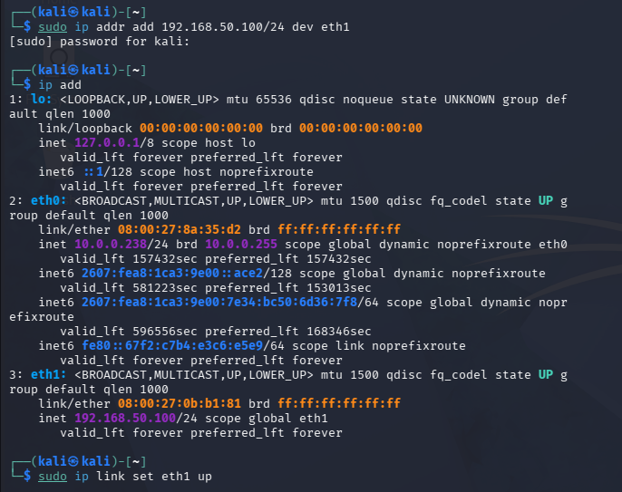
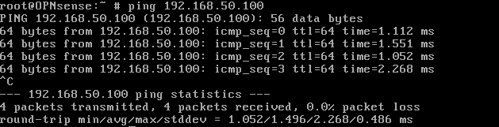

`192.168.50.100` matches `ops-client01` in the addressing plan
([`../docs/ip-vlan-plan.md`](../docs/ip-vlan-plan.md)) — Kali is filling that
role rather than a separate dedicated host.

**3. Log into the WebGUI and add rules permitting mgmt access to the
firewall itself:**

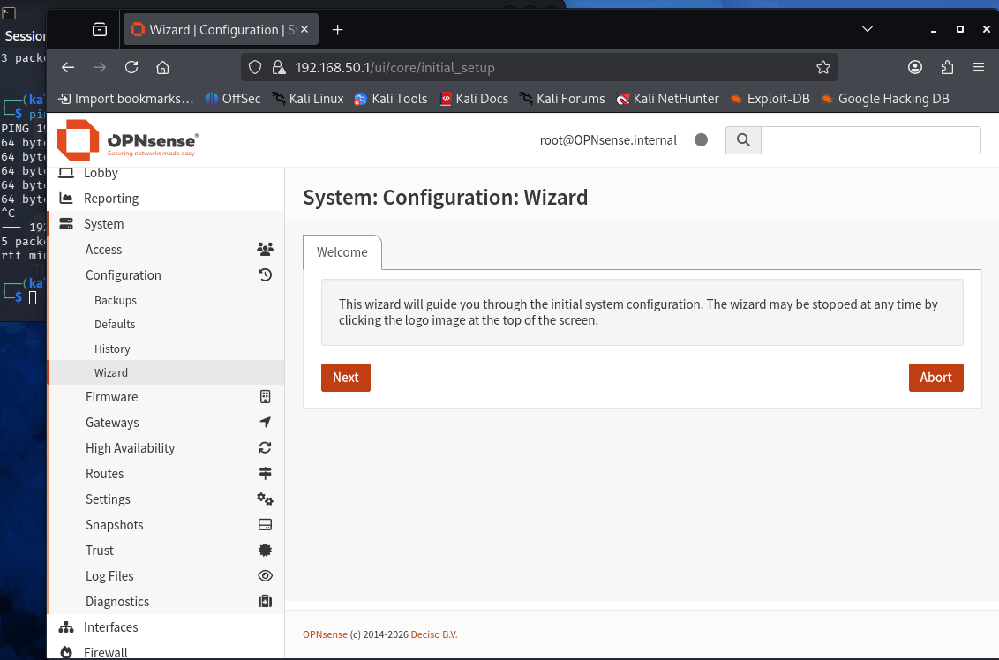
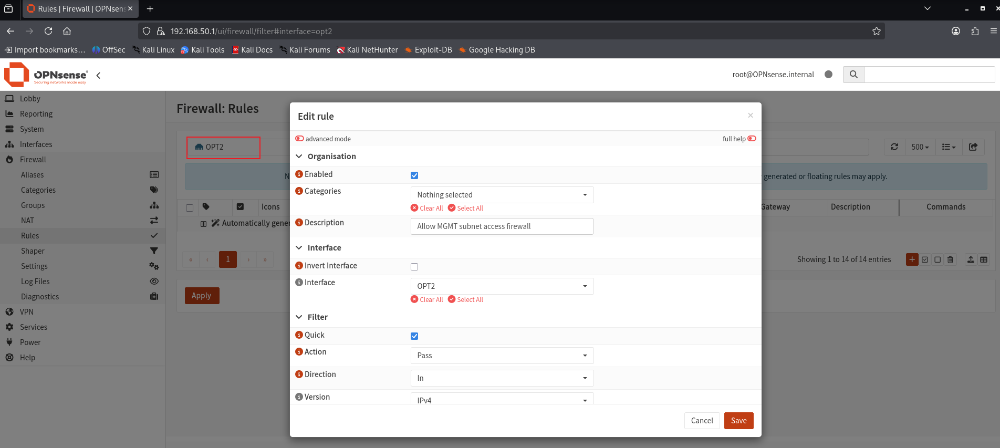
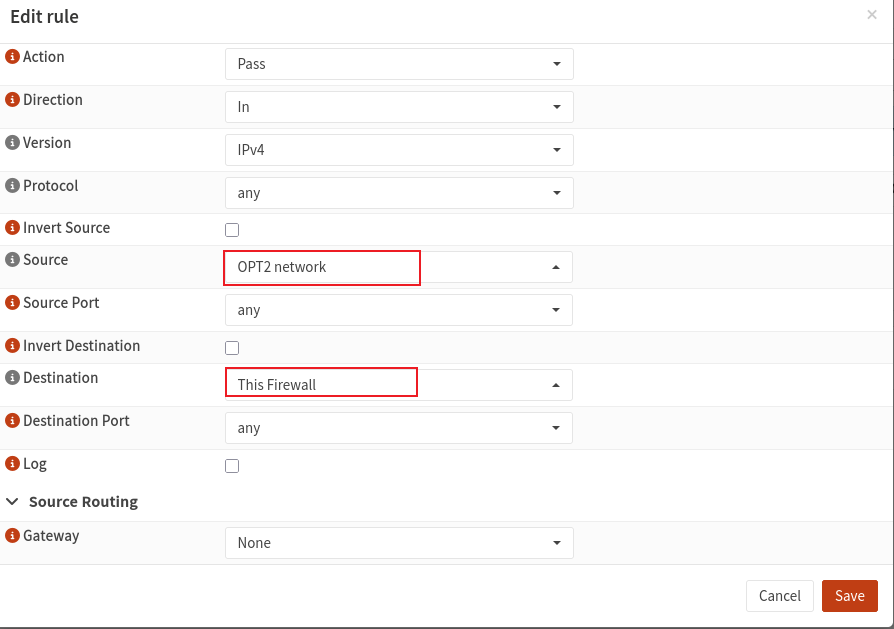
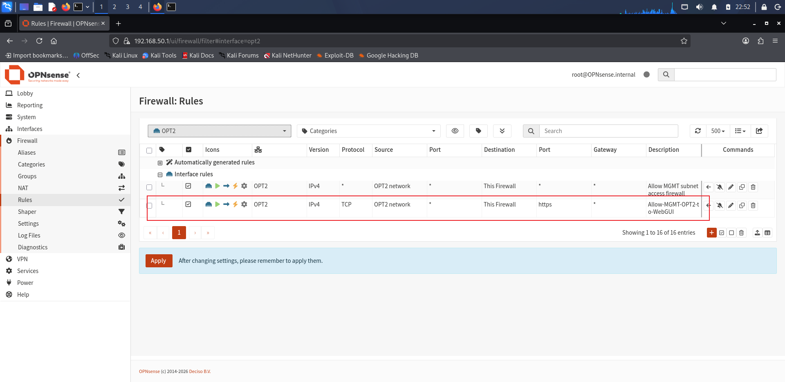

Two rules on OPT2: one broad (`OPT2 network → This Firewall, any`) and one
specific (`OPT2 network → This Firewall, TCP/https`, named
`Allow-MGMT-OPT2-to-WebGUI`). The second is redundant given the first already
covers it, but scoping the WebGUI rule specifically by name/protocol makes
intent easier to read later — worth keeping even though it's not strictly
load-bearing.

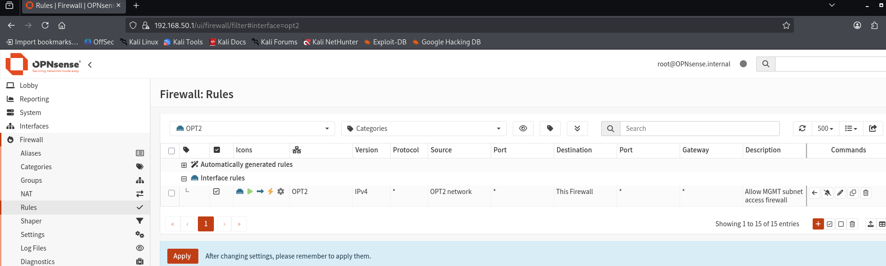

**4. Re-enable the packet filter — the step that's easy to forget:**

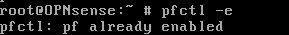

```
root@OPNsense:~ # pfctl -e
pfctl: pf already enabled
```

(Returned "already enabled" — PF had been turned back on earlier in the
session; the command was re-run as a deliberate double-check before moving
on, not skipped.)

**5. Verify WebGUI access still works with PF back on:**

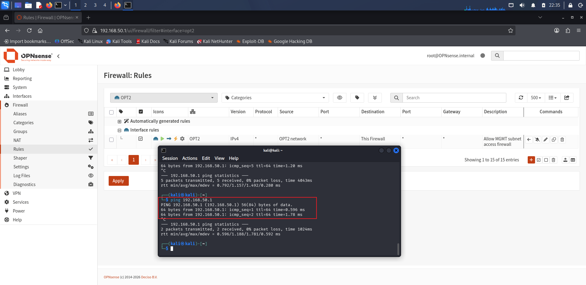

---

## NAT

**Outbound (source NAT):** Automatic mode.

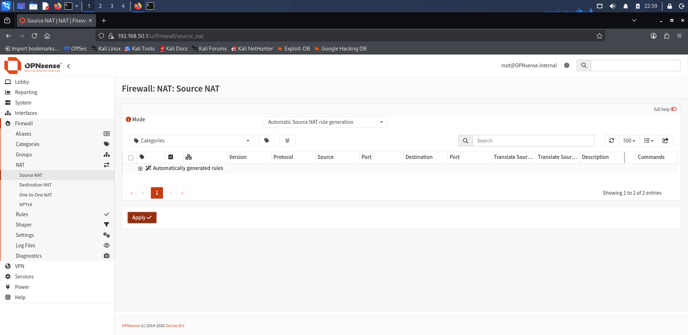

**Destination NAT (port forward to the portal):** not configured — there is
no DMZ host to forward to yet (OPT3/60 has no server deployed, per
`../docs/access-control-matrix.md`). This is an open item, not an oversight:
the portal currently runs on `srv-dns01` in the server zone
([`../03-web-dns/README.md`](../03-web-dns/README.md)), which is a separate,
larger design question, not a firewall config gap.

---

## Zone egress — internet access per zone

Each internal interface has its own "allow this zone out" rule:

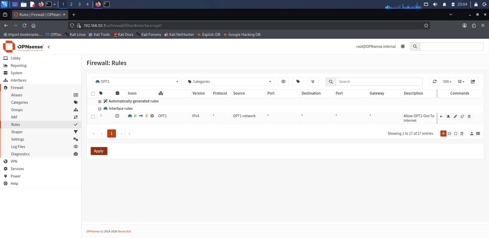
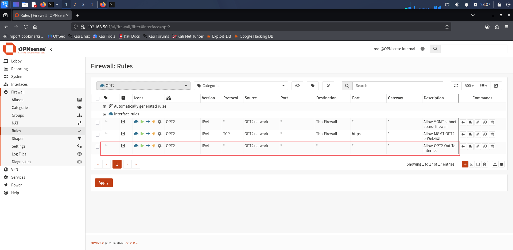
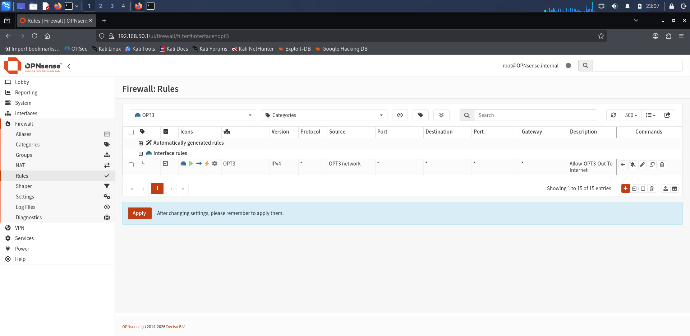

All three (`Allow-OPT1/2/3-Out-To-Internet`) are **any protocol, any
destination** — broad, not scoped to specific ports the way the office-zone
rules below are. Reasonable for the server/mgmt zones during a build phase
(package installs, updates), but worth tightening later — see Known
Limitations.

---

## Office-zone egress policy (aliases + floating rules)

Even though the office VLANs (10/20/30) aren't physically connected to this
firewall in the current topology (see the caveat below), the policy for them
was built out completely, ready for when they are.

**Aliases:**

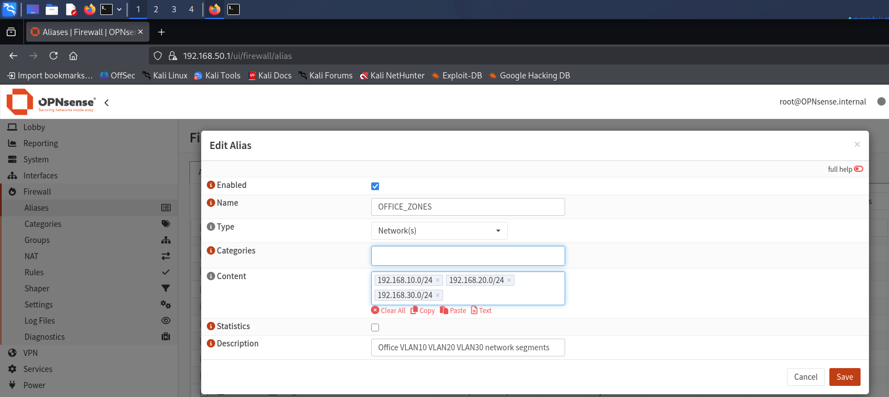
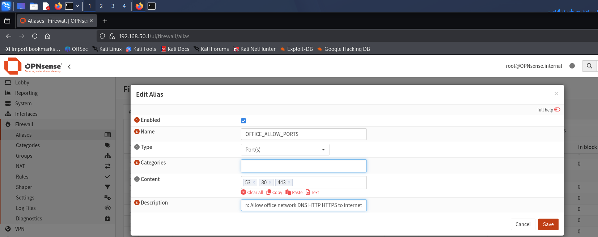

`OFFICE_ZONES` = `192.168.10.0/24, 192.168.20.0/24, 192.168.30.0/24`.
`OFFICE_ALLOW_PORTS` = `53, 80, 443`.

**Floating rules — permit narrow, then explicit deny-all:**

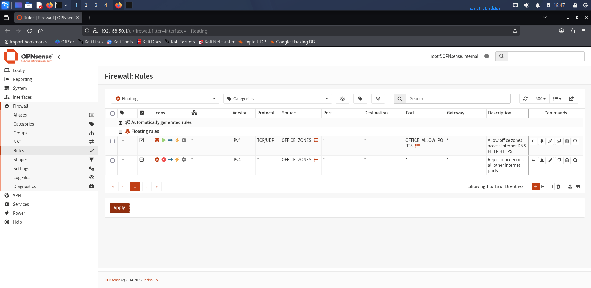

```
1. Pass   OFFICE_ZONES → any, TCP/UDP, port OFFICE_ALLOW_PORTS  — "Allow office zones access internet DNS HTTP HTTPS"
2. Reject OFFICE_ZONES → any, all other ports                   — "Reject office zones all other internet ports"
```

This is the right pattern — permit the specific case, then an explicit reject
as a backstop, rather than relying on the implicit default deny alone (which
makes the intent visible in the rule list itself, and gives something to log
on).

> **Caveat, stated plainly:** these rules are correct and will work the
> moment office traffic actually reaches this firewall — but in the current
> build, it doesn't. All three office VLANs sit behind `SW-CORE01` in Packet
> Tracer, which routes between them locally (see limitation 1 in the
> top-level README) and has no path to this OPNsense instance, which lives in
> VirtualBox. This is the same "designed, not yet reachable" situation as the
> DMZ rules in `../docs/access-control-matrix.md` — worth building anyway,
> because it's a real deliverable once the two environments are bridged or
> the topology is consolidated.

---

## Interface rules — implementing the access-control matrix

These five map directly onto the policy IDs in
[`../docs/access-control-matrix.md`](../docs/access-control-matrix.md).
Unlike the office floating rules above, **OPT1/OPT2/OPT3 traffic genuinely
does cross this firewall** — confirmed with real routing tests below, not
just configured.

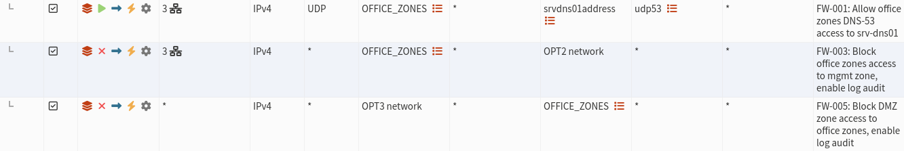
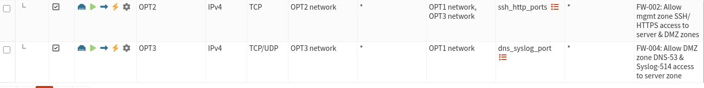

| Rule | Interface | Source | Destination | Service | Action | Matrix policy |
|---|---|---|---|---|---|---|
| FW-001 | OPT1 | OFFICE_ZONES | srv-dns01 (address alias) | UDP 53 | Pass | P-001 |
| FW-002 | OPT2 | OPT2 network | OPT1 network, OPT3 network | TCP, `ssh_http_ports` | Pass | P-005 / P-006 |
| FW-003 | OPT1 | OFFICE_ZONES | OPT2 network | any | **Reject**, logged | P-003 / P-004 |
| FW-004 | OPT3 | OPT3 network | OPT1 network | TCP/UDP, `dns_syslog_port` | Pass | P-007 |
| FW-005 | OPT3 | OPT3 network | OFFICE_ZONES | any | **Reject**, logged | P-009 |

FW-001, FW-003 and FW-005 involve `OFFICE_ZONES` and inherit the same
reachability caveat as the floating rules above. **FW-002 and FW-004 do not**
— mgmt-to-server/DMZ and DMZ-to-server both cross real OPNsense interfaces
and are the ones verified live below.

---

## Verification: real cross-zone routing, not just rule review

From Kali (mgmt zone), a static route was added toward each other zone via
the OPNsense mgmt interface, then tested:

```bash
sudo ip route add 192.168.40.0/24 via 192.168.50.1 dev eth1
ping 192.168.50.1
ping 192.168.40.10
```

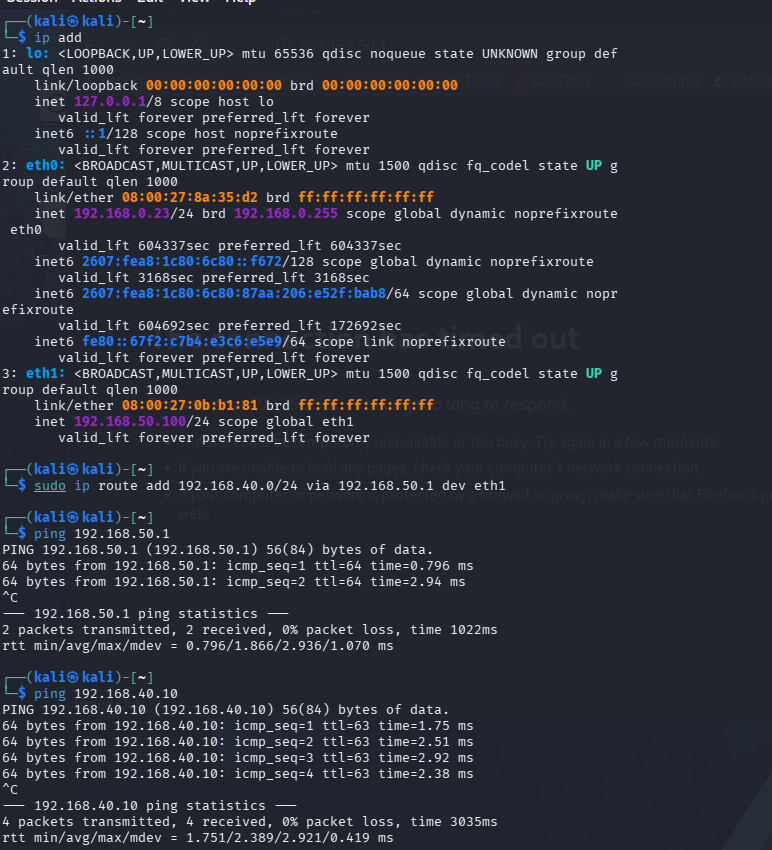

Both succeed — `192.168.40.10` (srv-dns01) responds with `ttl=63` (one hop
lower than a directly-connected host would show, consistent with routing
through the firewall rather than being on the same broadcast domain).

```bash
sudo ip route add 192.168.60.0/24 via 192.168.50.1 dev eth1
ping 192.168.60.1
```

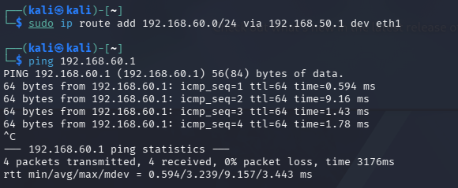

DMZ gateway reachable too (no host behind it yet to ping further).

### Final end-to-end test, after all rules were in place

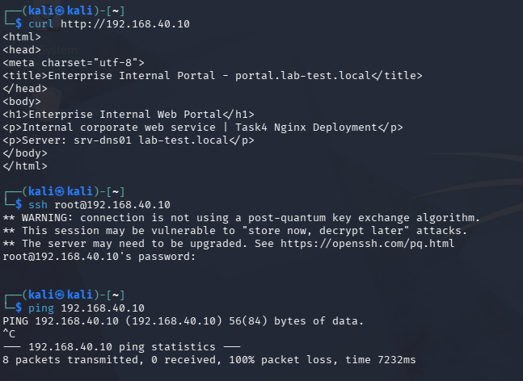

```
curl http://192.168.40.10   → succeeds, returns the real portal page
ssh root@192.168.40.10      → reaches the password prompt (TCP 22 open)
ping 192.168.40.10          → 100% packet loss
```

**Worth showing this alongside the two passing tests, not instead of it:**
TCP-based services (HTTP, SSH) work correctly end-to-end through the
firewall; ICMP does not — and the reason is right there in FW-002, not a
mystery: the rule is scoped to `TCP`, `ssh_http_ports`, which never included
ICMP in the first place. A ping failure here isn't a broken rule, it's the
literal, expected result of a protocol-and-port-scoped rule doing exactly
what it says. Least-privilege by design — if ICMP diagnostics between zones
are wanted later, that's an explicit additional rule to add, not a fix.

srv-dns01's own side was confirmed ready to receive this traffic:

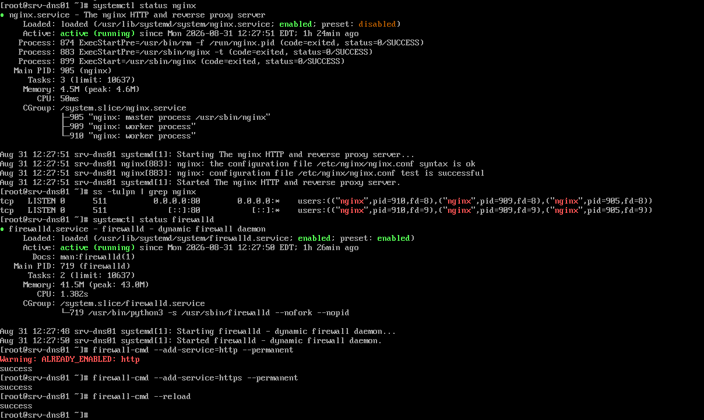

---

## Backup

The build checklist notes a full XML configuration backup was downloaded via
the WebGUI (`System → Configuration → Backups`). **`TODO`: no screenshot of
this step was found among the evidence — capture the backup download (and
ideally a restore test, or at minimum opening the XML to confirm it contains
the real config) to close this out with evidence rather than a checklist
claim.**

---

## Verification

| Test | Expected | Result | Evidence |
|---|---|---|---|
| WebGUI reachable from mgmt zone only | HTTPS to 192.168.50.1 succeeds | Pass | `fw-09-webgui-login.png` |
| PF re-enabled after initial config | `pfctl -e` confirms enabled | Pass | `fw-13-pfctl-enable.png` |
| Outbound NAT | Internal hosts reach the internet | Pass | `fw-16-nat-automatic.png` |
| Mgmt zone routes to server zone through the firewall | Ping + traceable hop (ttl-1) | Pass | `fw-23-crosszone-route-server.png` |
| Mgmt zone routes to DMZ through the firewall | Ping to DMZ gateway succeeds | Pass | `fw-24-crosszone-route-dmz.png` |
| FW-001–FW-005 rules present and match the access matrix | Rule table matches P-001–P-009 | Pass | `fw-25-fw001-003-005-rules.png`, `fw-26-fw002-004-rules.png` |
| Service reachable cross-zone (TCP) | `curl`/`ssh` succeed mgmt → server | Pass | `fw-28-final-e2e-test.png` |
| ICMP reachable cross-zone | `ping` succeeds mgmt → server | **Fails — by design, FW-002 is scoped to TCP only** | `fw-28-final-e2e-test.png` |
| Office-zone egress policy enforced | 53/80/443 only, rest rejected | Designed correctly, **not reachable from this firewall in the current topology** | `fw-22-floating-rules-office.png` |
| Config backup taken | XML export downloaded | Claimed in checklist, **no screenshot evidence** | `TODO` |

## Known limitations

1. **Office VLANs don't actually reach this firewall.** FW-001, FW-003,
   FW-005 and the office floating rules are all correctly designed but only
   take effect once traffic from VLANs 10/20/30 can physically reach OPNsense
   — currently blocked by the Packet Tracer/VirtualBox separation (top-level
   README) and by SVIs living on the core switch (section 01).
2. **ICMP is not permitted between zones, by design** — rules are scoped to
   specific TCP/UDP ports (`ssh_http_ports`, `dns_syslog_port`), not protocol
   `any`, so `ping` fails while HTTP/SSH succeed. This is the expected
   behaviour of a least-privilege ruleset, not a gap — noted here only so a
   reader doesn't mistake it for a bug. An explicit ICMP rule would be a
   deliberate addition if cross-zone diagnostics become a priority, not a fix.
3. **OPT1/OPT2/OPT3 egress-to-internet rules are all any/any**, not scoped to
   specific ports the way the office floating rules are. Reasonable during
   build/patching, worth tightening for a production-like posture.
4. **No destination NAT / port forward to the portal** — there's no DMZ host
   to forward to. Tied to the same open design question in
   `../docs/access-control-matrix.md`.
5. **Config backup is claimed but not evidenced** — no screenshot of the
   actual XML export.
6. Two of the WAN-adjacent controls a real deployment would want — outbound
   rules scoped by destination, and IDS/IPS on the WAN interface — are not
   configured; OPNsense supports both but neither was set up here.
