# 05 · Host hardening — Linux security baseline

**Task objective.** Harden `srv-dns01` beyond the section 02 baseline:
dedicated hardening account, account/authentication policy, SSH restrictions,
service and port reduction, file permissions, SUID audit, and audit logging —
each item checked, changed, and re-checked, not just applied and assumed.

**Target:** `srv-dns01` (192.168.40.10, Rocky Linux 9)
**Pre-change safeguard:** VirtualBox snapshot taken before starting
(`pre-baseline-backup`), so a lockout or bad config has a clean rollback.

---

## Account and authentication hardening

### A dedicated hardening account, created first

Before touching SSH or PAM, a separate account was created for this work —
done at the local console, not over SSH, specifically so a mistake later in
the same session can't cut off remote access before it's undone:

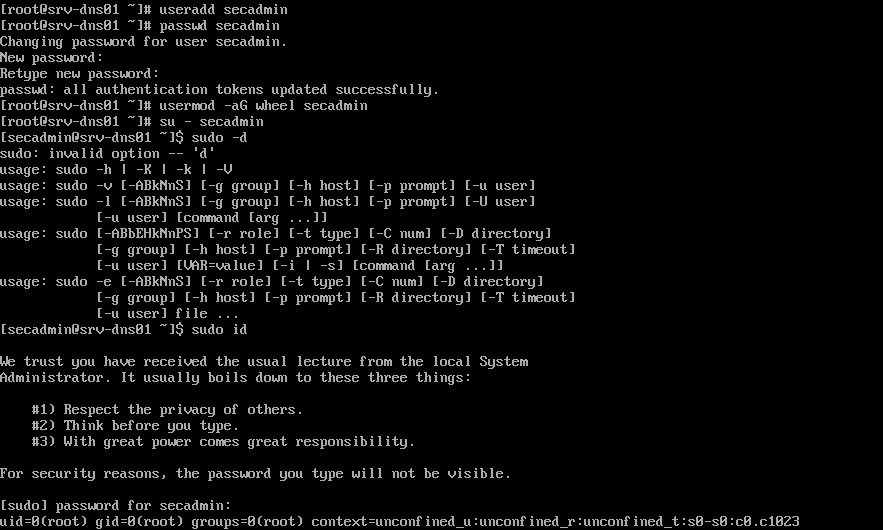

```bash
useradd secadmin
passwd secadmin
usermod -aG wheel secadmin
su - secadmin
sudo id
```

```
uid=0(root) gid=0(root) groups=0(root)
```

`sudo id` returning `uid=0(root)` confirms the account has real sudo
privilege before relying on it for anything else in this section.

> **Two admin accounts exist on this host, by design** — `yang01` (section
> 02) is the day-to-day administration and SSH-key-login account; `secadmin`
> (this section) is scoped to hardening and audit work. Kept separate
> deliberately, the same way many real environments split an operational
> account from a security/audit one, rather than consolidated into one.

### Configuration backup

```bash
mkdir -p /backup/baseline
cp /etc/passwd /etc/shadow /backup/baseline/
cp /etc/ssh/sshd_config /backup/baseline/
cp /etc/login.defs /etc/pam.d/system-auth /backup/baseline/
```

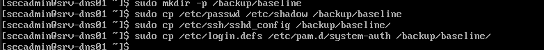

### Privileged and empty-password account check

```bash
awk -F: '($3 == 0) {print $1}' /etc/passwd
awk -F: '($2 == "") {print $1}' /etc/shadow
```

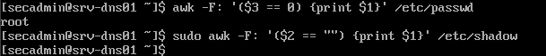

Only `root` has UID 0. No output from the empty-password check — clean.

### Password complexity policy

```bash
dnf install -y libpwquality
vi /etc/pam.d/system-auth
```

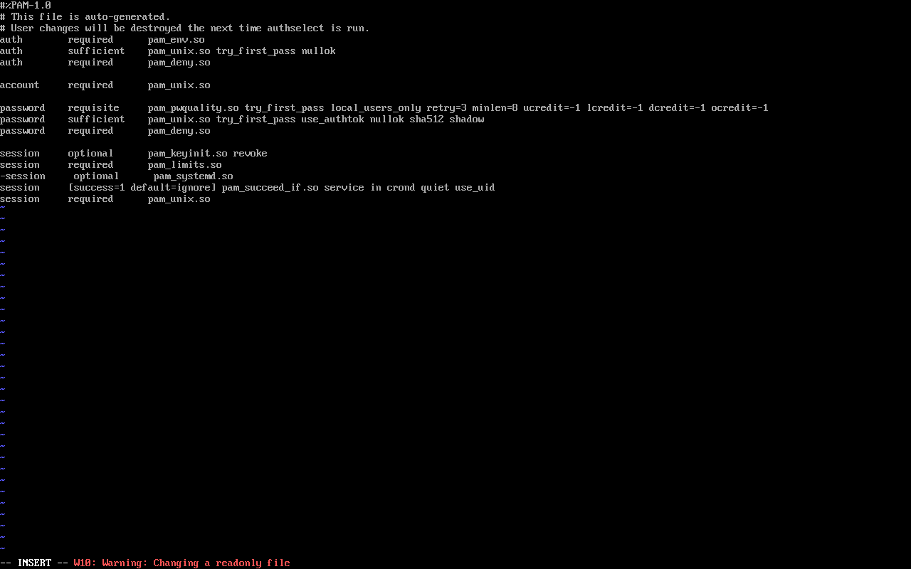

```
password    requisite     pam_pwquality.so try_first_pass local_users_only retry=3 minlen=8 ucredit=-1 lcredit=-1 dcredit=-1 ocredit=-1
```

Minimum 8 characters, at least one uppercase/lowercase/digit/special
character, 3 attempts.

> **`vi` flagged this file as auto-generated** ("This file is auto-generated.
> User changes will be destroyed the next time authselect is run") and
> warned about editing a readonly file. The edit was made and works right
> now, but it's fragile — Rocky/RHEL 9 manages `system-auth` through
> `authselect`, and running `authselect apply-changes` later would silently
> wipe this out. Noted honestly in Known Limitations rather than glossed
> over — the more correct approach is a custom `authselect` profile.

### Password aging

```bash
vi /etc/login.defs
```

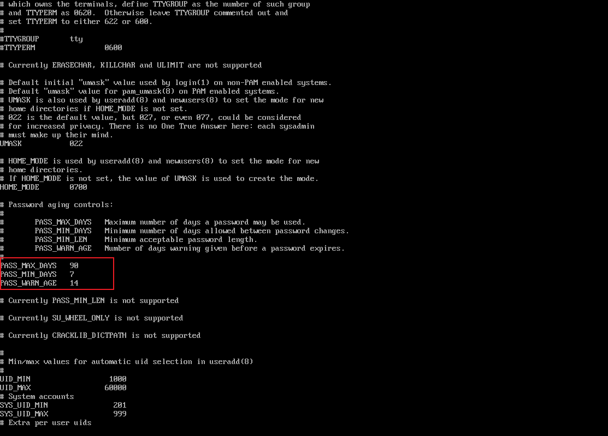

```
PASS_MAX_DAYS   90
PASS_MIN_DAYS   7
PASS_WARN_AGE   14
```

### Account lockout on repeated failure

```bash
vi /etc/pam.d/system-auth
```

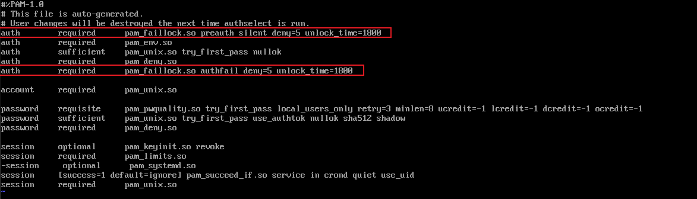

```
auth        required      pam_faillock.so preauth silent deny=5 unlock_time=1800
...
auth        required      pam_faillock.so authfail deny=5 unlock_time=1800
```

5 failed attempts locks the account for 30 minutes.

### Unused system accounts locked

```bash
sudo usermod -L games
sudo usermod -L adm
sudo usermod -L lp
```

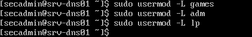

The plan also listed `news` and `uucp`; those two weren't confirmed in the
evidence. `TODO: confirm whether they exist on this system and lock them too
if so (`usermod -L news`, `usermod -L uucp`) — harmless either way if they
don't exist, `usermod` will just report no such user.`

---

## SSH hardening

```bash
cp /etc/ssh/sshd_config /etc/ssh/sshd_config.bak
vi /etc/ssh/sshd_config
```

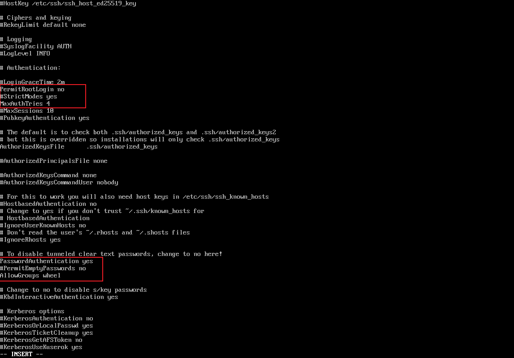

```
PermitRootLogin no
MaxAuthTries 4
AllowGroups wheel
```

```bash
sshd -t
systemctl reload sshd
```

**Verification — root denied, secadmin allowed:**

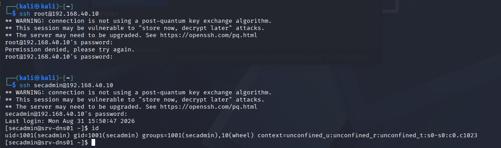

```
ssh root@192.168.40.10       → Permission denied
ssh secadmin@192.168.40.10   → succeeds, id confirms wheel membership
```

Cross-checked against the audit log later in this section — the same denials
and the successful login both show up there independently, not just in this
terminal capture.

> **Password authentication — a real sequencing note, not swept under the
> rug.** At this point in the build, `sshd_config` had
> `PasswordAuthentication yes` (intentionally, per the plan's own comment —
> "configure keys first, then switch to no"), and the `secadmin` login above
> was in fact authenticated by password. **This is no longer the current
> state.** Password authentication was confirmed disabled afterward, with
> live proof (a forced password-only connection attempt was rejected) — see
> [`../02-linux-baseline/README.md`](../02-linux-baseline/README.md). Stating
> both points here on purpose: the screenshot above is accurate for the
> moment it was taken, and the final state is accurate for right now — two
> different true things at two different times, not a contradiction.

---

## Service and port reduction

```bash
systemctl list-unit-files --state=enabled
systemctl disable --now kdump
ss -lntup
```

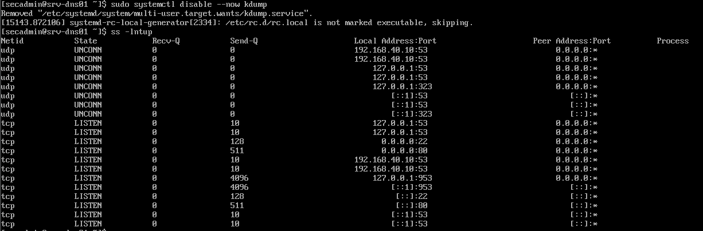

The plan called out `avahi-daemon` and `cups`; in practice `kdump` (the crash
dump service) was the one disabled — a reasonable substitution for a lab VM
that doesn't need crash-dump collection, and the plan's actual goal (remove
services with no reason to run) was still met.

**Final listening ports:**

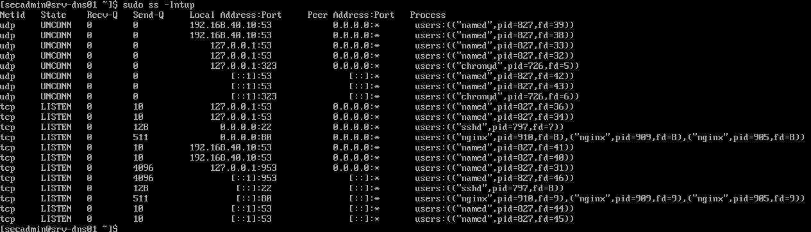

```
tcp  0.0.0.0:22   (sshd)
tcp  0.0.0.0:80   (nginx)
udp/tcp *:53      (named)
tcp 127.0.0.1:953 (named control channel, localhost only)
```

Only the approved set — 22/53/80 — plus BIND's local control channel on
`953`, which is loopback-only and not reachable from the network. **No 443**
— consistent with the standing "HTTP only, no TLS" limitation from section
03, not a new gap.

---

## Host firewall tightened

```bash
sudo firewall-cmd --permanent --remove-service=cockpit
sudo firewall-cmd --permanent --add-service=ssh
sudo firewall-cmd --permanent --add-service=dns
sudo firewall-cmd --permanent --add-service=http
sudo firewall-cmd --permanent --add-service=https
sudo firewall-cmd --reload
```

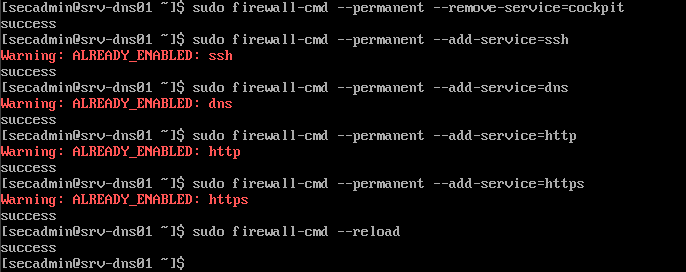

`https` and the others returned `ALREADY_ENABLED` — added earlier during the
edge-firewall verification pass (section 04) — confirming this step is
idempotent, not accidentally duplicating rules.

**Final state:**

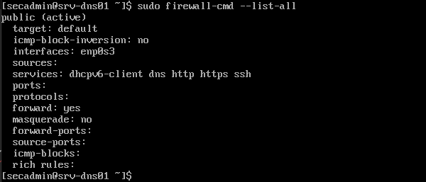

```
services: dhcpv6-client dns http https ssh
```

Cockpit (a management UI this host was never meant to expose) is gone; only
the services this host actually needs remain.

---

## File permissions and SUID audit

```bash
stat /etc/passwd /etc/shadow /etc/ssh/sshd_config
```

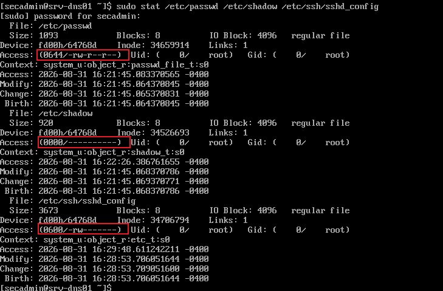

| File | Expected | Actual |
|---|---|---|
| `/etc/passwd` | `644 root:root` | `0644 root:root` ✅ |
| `/etc/shadow` | `000` or `600 root:root` | `0000 root:root` ✅ |
| `/etc/ssh/sshd_config` | `600 root:root` | `0600 root:root` ✅ |

All three match the standard baseline exactly.

```bash
find / -xdev -perm -4000 -type f 2>/dev/null
```

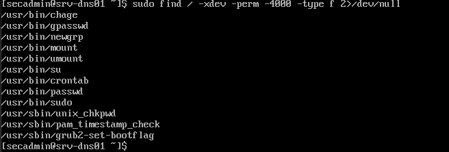

```
/usr/bin/chage /usr/bin/gpasswd /usr/bin/newgrp /usr/bin/mount /usr/bin/umount
/usr/bin/su /usr/bin/crontab /usr/bin/passwd /usr/bin/sudo
/usr/sbin/unix_chkpwd /usr/sbin/pam_timestamp_check /usr/sbin/grub2-set-bootflag
```

All eleven are stock RHEL/Rocky SUID binaries — nothing unexpected, no
third-party or manually-added SUID files present.

---

## Audit logging

```bash
sudo systemctl enable --now auditd
sudo auditctl -w /etc/passwd -p wa -k passwd_change
sudo auditctl -w /etc/shadow -p wa -k shadow_change
sudo auditctl -w /etc/ssh/sshd_config -p wa -k sshd_change
sudo auditctl -l > /etc/audit/rules.d/baseline.rules
```

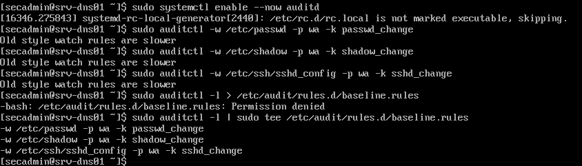

The last command failed: `-bash: /etc/audit/rules.d/baseline.rules:
Permission denied`. **This is a genuine, common gotcha worth explaining, not
hiding:** `sudo cmd > file` only runs `cmd` as root — the `>` redirect is
still performed by the original shell, which doesn't have permission to write
into `/etc/audit/rules.d/`. Fixed correctly:

```bash
sudo auditctl -l | sudo tee /etc/audit/rules.d/baseline.rules
```

Piping through a second `sudo tee` puts the *write* under root as well, not
just the command that generates the content. Small thing, but knowing why
`sudo >` doesn't do what it looks like it does is a real, checkable Linux
skill.

**Verification — an actual change, traced through the audit log:**

```bash
sudo usermod -c "audit test record" secadmin
sudo ausearch -k passwd_change
```

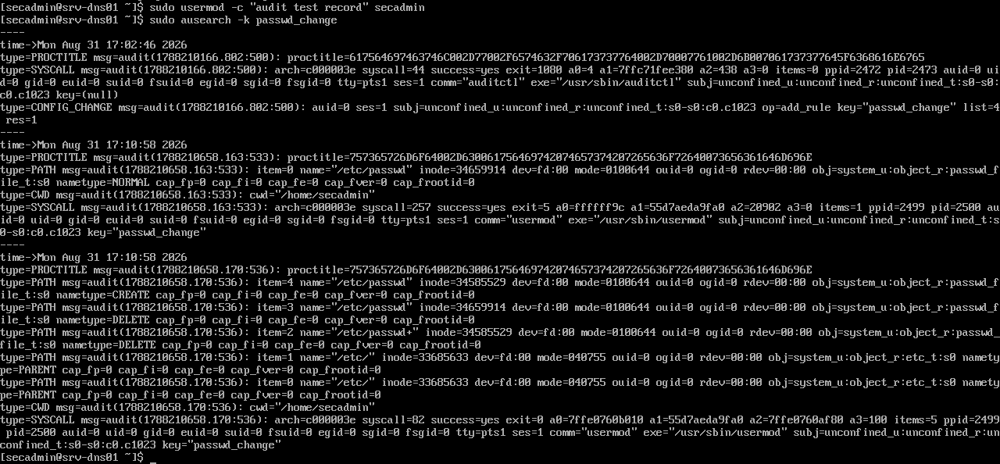

Two independent `usermod`-triggered events found against `/etc/passwd`,
tagged `passwd_change` — the watch rule is confirmed live, not just
configured.

**Login audit — also confirms the SSH hardening above independently:**

```bash
sudo ausearch -m USER_LOGIN
```

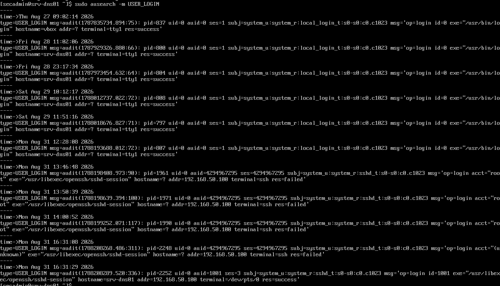

The log shows several `acct="root" ... res=failed` entries from
`addr=192.168.50.100` (Kali), followed by a successful login as `secadmin`
from the same address. This is the same result as the SSH test earlier in
this section, arrived at independently through the audit trail — two
different tools agreeing is stronger evidence than either alone.

---

## Final verification

```bash
curl http://192.168.40.10
```

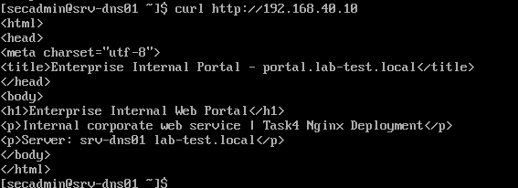

Returns the real portal content — confirming the hardening pass didn't break
the services it was protecting. This is the check that matters most: a
locked-down host that also stopped serving traffic isn't a successful
hardening pass.

## Verification

| Test | Expected | Result | Evidence |
|---|---|---|---|
| Hardening account created, sudo confirmed | `sudo id` → uid=0 | Pass | `harden-01-secadmin-create-sudo.png` |
| No unexpected UID-0 or empty-password accounts | Only `root`, no empty passwords | Pass | `harden-03-uid0-emptypass-check.png` |
| Password complexity enforced | `pam_pwquality` configured | Pass | `harden-04-pwquality-config.png` |
| Password aging set | 90/7/14 | Pass | `harden-05-login-defs.png` |
| Account lockout on repeated failure | `pam_faillock`, deny=5 | Pass | `harden-06-faillock-config.png` |
| Unused accounts locked | `games`, `adm`, `lp` locked; `news`/`uucp` don't exist on this system | Pass | `harden-07-disable-unused-accounts.png` |
| Root SSH login denied | Permission denied | Pass | `harden-09-ssh-root-denied-secadmin-ok.png`, confirmed independently in `harden-18` |
| Password authentication currently disabled | `sshd -T` reports `no` | Pass — **confirmed in section 02**, not re-tested here | See `../02-linux-baseline/README.md` |
| Unnecessary service disabled | Non-essential service off | Pass (kdump, not avahi/cups as planned) | `harden-10-kdump-disabled-ports.png` |
| Only approved ports listening | 22/53/80 | Pass | `harden-17-ports-final-check.png` |
| Host firewall scoped to real services | cockpit removed, ssh/dns/http/https only | Pass | `harden-12-firewalld-final-list.png` |
| Key file permissions correct | passwd 644, shadow 000/600, sshd_config 600 | Pass | `harden-13-file-permissions-stat.png` |
| No unexpected SUID binaries | Stock binaries only | Pass | `harden-14-suid-scan.png` |
| Audit rules survive a real test | `ausearch` finds a real change | Pass | `harden-16-ausearch-passwd-change.png` |
| Login audit trail | Failed root + successful secadmin logins logged | Pass | `harden-18-ausearch-user-login.png` |
| Services still available after hardening | Portal reachable | Pass | `harden-19-final-service-verify.png` |

## Known limitations

1. **`/etc/pam.d/system-auth` was edited directly**, and `vi` itself warned
   this file is auto-generated by `authselect` and regenerated on the next
   `authselect apply-changes`. The edits work now but aren't durable against
   that command. Correct fix: create a custom `authselect` profile
   (`authselect create-profile`) instead of editing the generated file.
2. **`news` and `uucp` accounts don't exist on this system** — confirmed
   after the fact; the lockdown plan listed them defensively, but this Rocky
   9 minimal install never created them. Nothing to lock.
3. **`PASS_MIN_LEN` is not supported** on this system (per `login.defs`'
   own comment) — password minimum length is enforced only through
   `pam_pwquality`'s `minlen=8`, which is fine, but worth knowing it's not
   double-enforced at the `login.defs` layer.
4. **auditd rules were saved with `auditctl -l | sudo tee`**, which is
   correct for *this boot*, but `auditctl`-added rules don't automatically
   persist rule *order* or interact with `augenrules` the way a proper
   `/etc/audit/rules.d/*.rules` file processed by `augenrules --load` would
   on next boot. Worth confirming the rules are still active after a reboot,
   not just right now.
5. Two internal SELinux-adjacent items remain outside this section's scope:
   no SELinux boolean review was performed (only confirmed Enforcing, in
   section 02), and no CIS benchmark or `oscap` scan was run to check this
   baseline against a published standard rather than a hand-picked checklist.
