# 06 · Monitoring — Zabbix

**Task objective.** Stand up Zabbix Server on a new host, bring the existing
server under monitoring, define a real check and trigger beyond the stock
template, and prove the whole loop — alert fires on a real fault, clears on
real recovery — not just that the dashboard loads.

**New host:** `srv-mon01` (192.168.40.20, server zone) — Zabbix Server 6.0.48,
MariaDB, Nginx + PHP-FPM web frontend.
**Monitored host:** `srv-dns01` (192.168.40.10) — Zabbix Agent 2.

---

## Building srv-mon01

VM spec: 2 vCPU, 4096 MB RAM (the plan notes this is the practical minimum —
Zabbix Server plus MariaDB plus PHP-FPM is heavier than the other hosts in
this build), 50 GB disk, Rocky Linux 9 Minimal.

```bash
nmcli connection modify enp0s8 ipv4.addresses 192.168.40.20/24
```

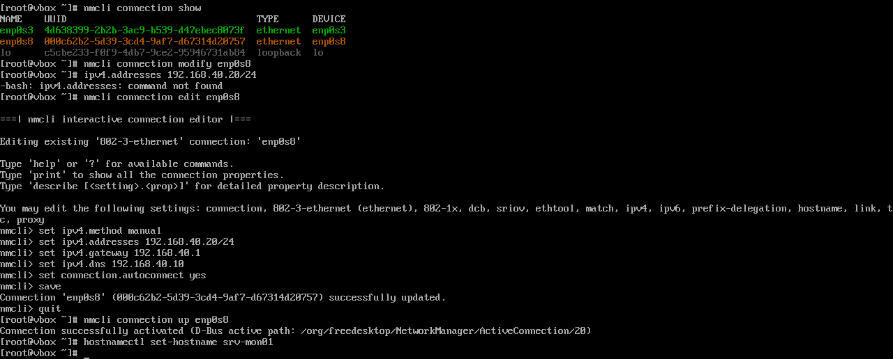

The one-line form above actually failed (`-bash: ipv4.addresses: command not
found` — a copy/paste line break split the command). Fixed by switching to
the interactive editor instead:

```bash
nmcli connection edit enp0s8
> set ipv4.method manual
> set ipv4.addresses 192.168.40.20/24
> set ipv4.gateway 192.168.40.1
> set ipv4.dns 192.168.40.10
> set connection.autoconnect yes
> save
> quit
nmcli connection up enp0s8
hostnamectl set-hostname srv-mon01
```

```bash
dnf update -y
dnf install -y vim curl wget net-tools firewalld chrony
systemctl enable --now chronyd firewalld
```

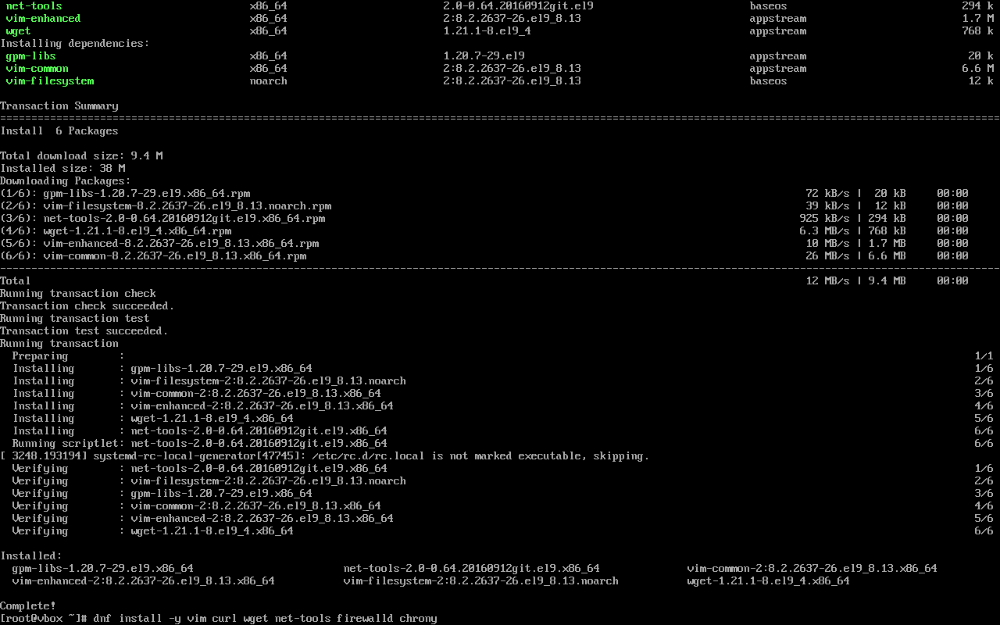
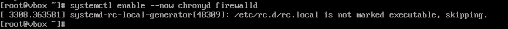

---

## Installing the Zabbix stack

### Zabbix repo

```bash
rpm -Uvh https://repo.zabbix.com/zabbix/6.0/rhel/9/x86_64/zabbix-release-6.0-4.el9.noarch.rpm
dnf clean all
```

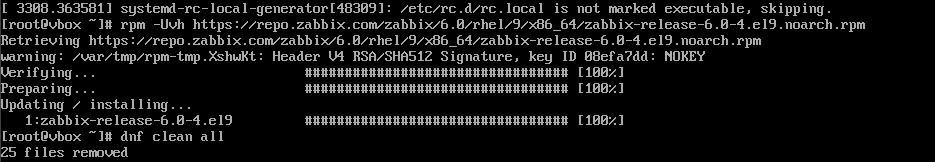

### MariaDB

```bash
dnf install -y mariadb-server mariadb
systemctl enable --now mariadb
mysql_secure_installation
```

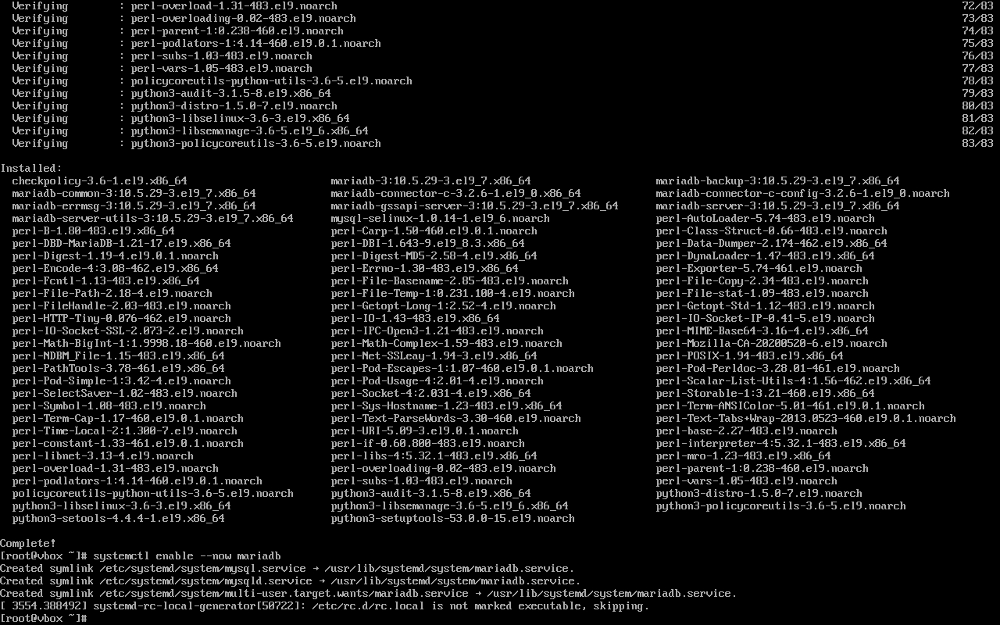
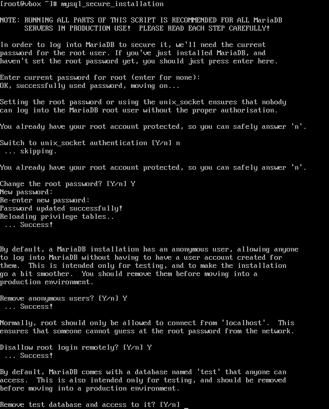
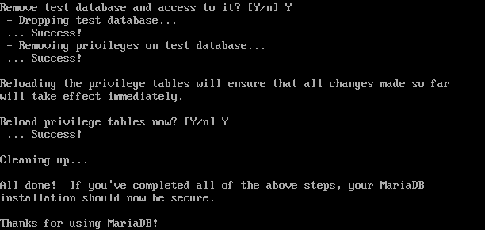

Root password set, anonymous users removed, remote root login disabled, test
database dropped — the full hardening pass, not just the default-enter
shortcut.

### Zabbix database

```sql
create database zabbix character set utf8mb4 collate utf8mb4_bin;
create user zabbix@localhost identified by 'Zabbix@123';
grant all privileges on zabbix.* to zabbix@localhost;
set global log_bin_trust_function_creators = 1;
flush privileges;
```

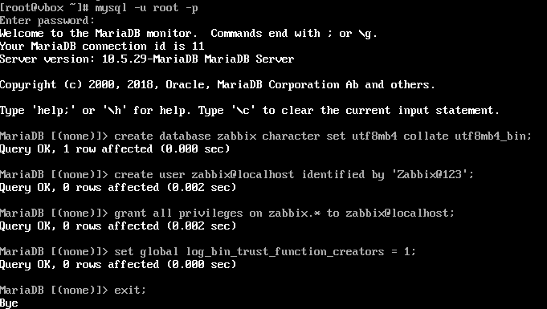

The `log_bin_trust_function_creators` setting isn't in most copy-paste guides
— it's needed because Zabbix's schema import uses stored functions/triggers,
and MariaDB with binary logging enabled otherwise refuses to create them for
a non-SUPER user. Adding it here means this step was actually understood, not
just copied.

### Zabbix server, web frontend, agent

```bash
dnf install -y zabbix-server-mysql zabbix-web-mysql zabbix-nginx-conf zabbix-sql-scripts zabbix-agent2
zcat /usr/share/zabbix-sql-scripts/mysql/server.sql.gz | mysql --default-character-set=utf8mb4 -uzabbix -p zabbix
```

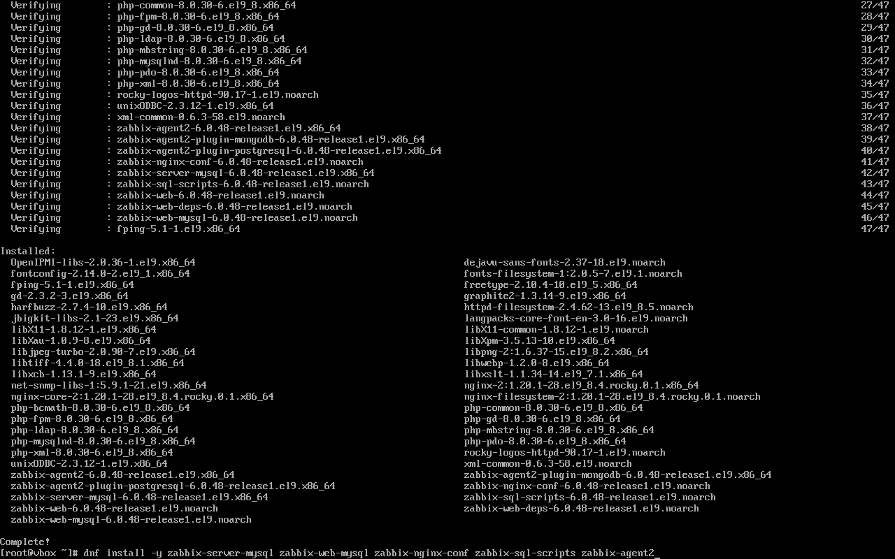

### Configuration

```bash
vi /etc/zabbix/zabbix_server.conf
```

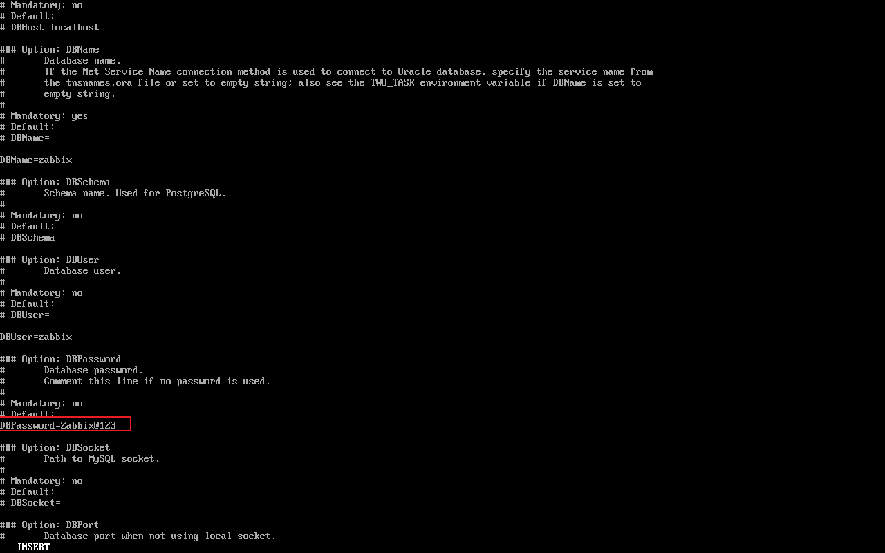

```
DBPassword=Zabbix@123
```

```bash
vi /etc/nginx/conf.d/zabbix.conf
```

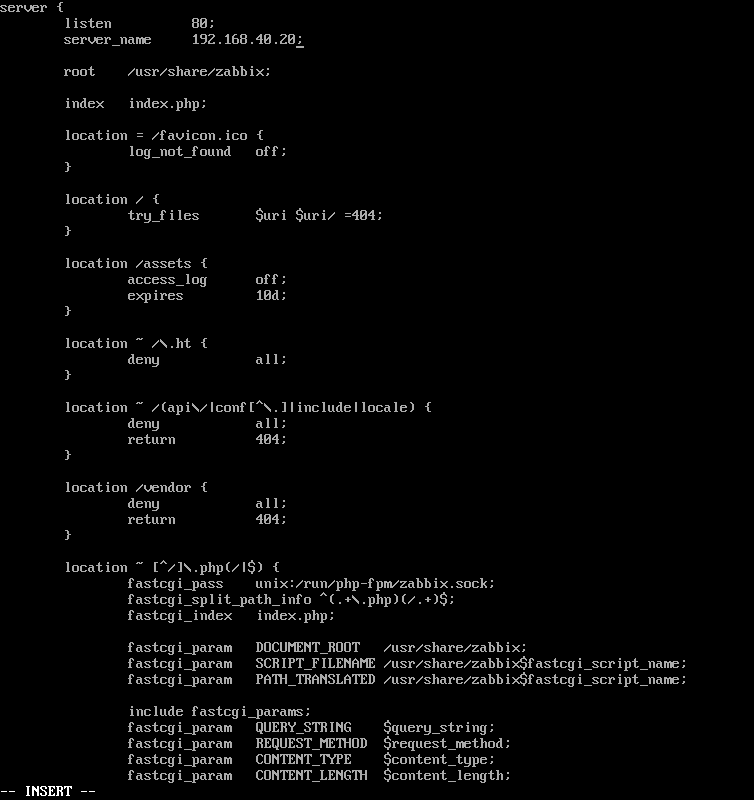

```nginx
server {
    listen 80;
    server_name 192.168.40.20;
    root /usr/share/zabbix;
    ...
    location ~ [^/]\.php(/|$) {
        fastcgi_pass unix:/run/php-fpm/zabbix.sock;
        ...
    }
}
```

```bash
systemctl enable --now zabbix-server zabbix-agent2 nginx php-fpm
firewall-cmd --permanent --add-service=http
firewall-cmd --permanent --add-port=10050/tcp
firewall-cmd --permanent --add-port=10051/tcp
firewall-cmd --reload
```

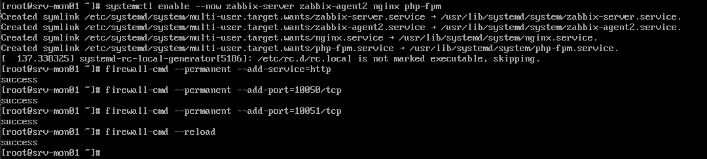

10050 = agent (passive checks), 10051 = server (active checks / trapper) —
both needed even on the server host itself, since `zabbix-agent2` also runs
locally for self-monitoring.

### A real install-time snag

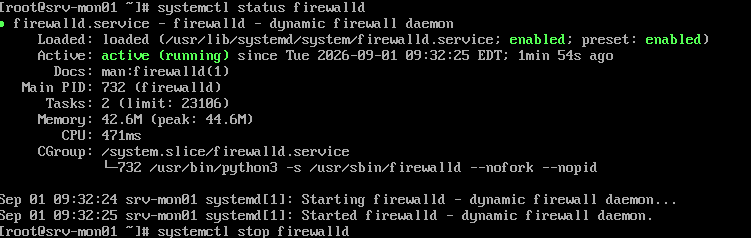
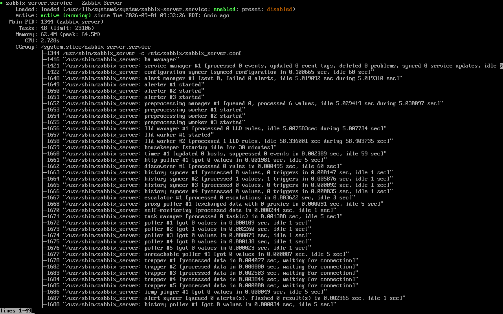
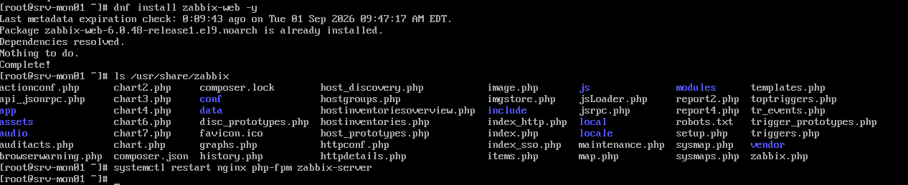

The web install wizard wasn't reachable on the first attempt. Troubleshooting
went in the right order — confirm `zabbix-server` itself was healthy first
(it was, with all manager/poller/trapper workers started), confirm the
`zabbix-web` package and its files under `/usr/share/zabbix` were actually
present (they were), then restart the web-facing services
(`nginx`, `php-fpm`, `zabbix-server`) — rather than jumping straight to
disabling the firewall as a permanent fix. `firewalld` was stopped briefly
during this diagnosis; it was confirmed back up before continuing (see
`mon-03`'s enable step and the working firewall rules used throughout the
rest of this section).

### Web installation wizard

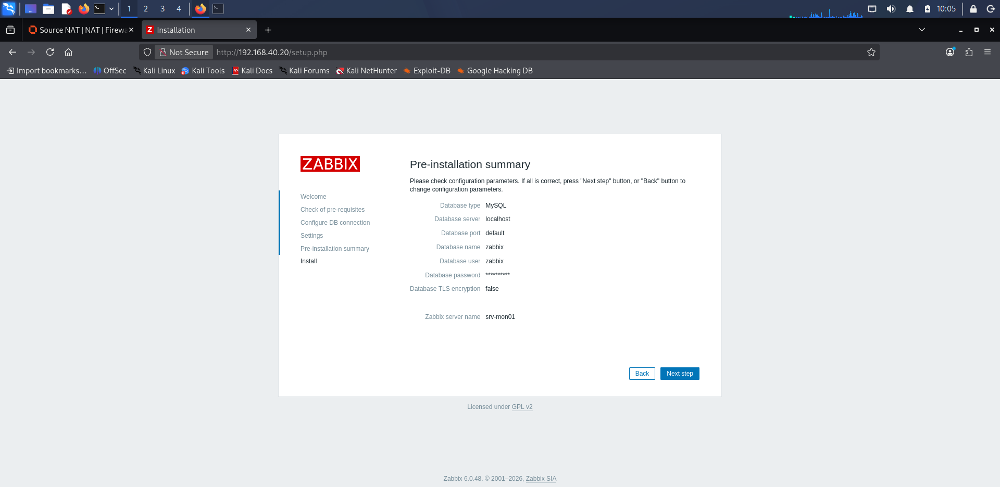

Reached from Kali (`192.168.50.100`) browsing `http://192.168.40.20/setup.php`
— itself a working cross-zone HTTP request through OPNsense, the same pattern
verified in section 04. Database type MySQL, server `localhost`, database
`zabbix`, user `zabbix`, Zabbix server name `srv-mon01`.

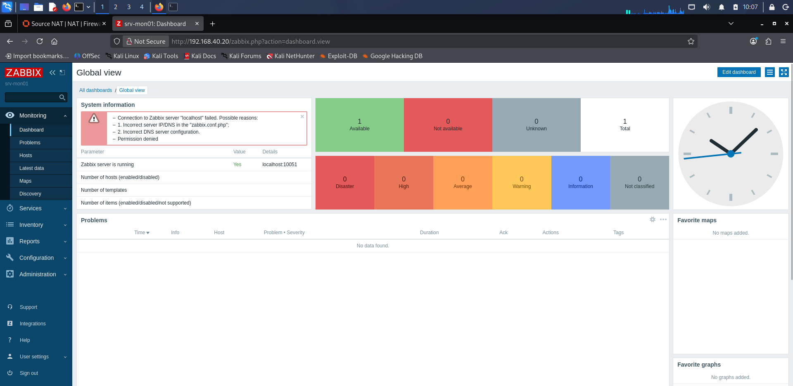

Login successful, dashboard reached. **Worth documenting the full arc here,
not just the end state:** every dashboard screenshot at this point in the
build showed a banner reading *"Connection to Zabbix server 'localhost'
failed... Permission denied"* — even though `Zabbix server is running: Yes`
was confirmed directly below it, and, as the alert drill later in this
section proves, monitoring and alerting both worked correctly the whole time.
This is the well-known Rocky/RHEL pattern where SELinux blocks the `php-fpm`
process from opening its own outbound connection to `127.0.0.1:10051` for the
frontend's live status widget — a cosmetic frontend limitation, not a
monitoring failure, but a real, visible loose end.

**Fixed:**

```bash
sudo setsebool -P httpd_can_connect_zabbix on
```

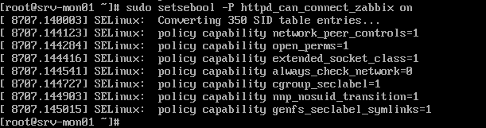

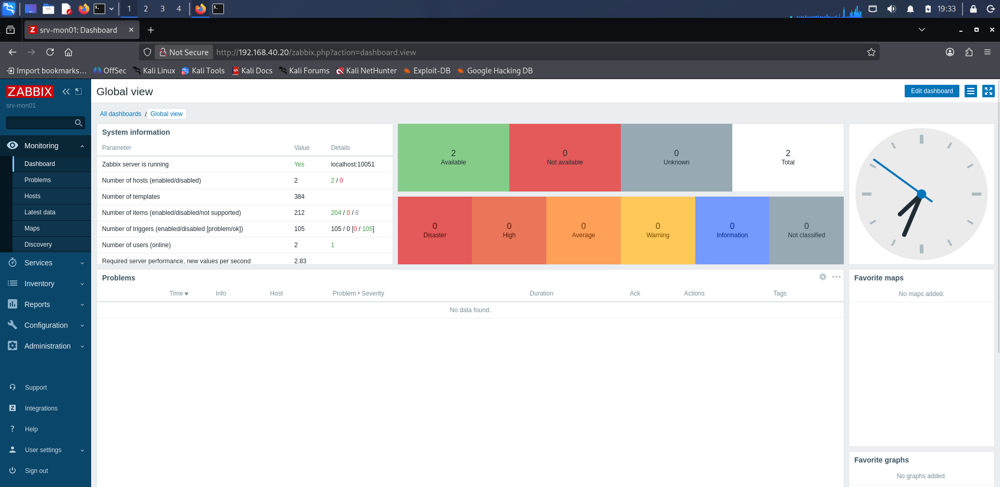

Reloading the Dashboard afterward shows the warning gone, replaced by the
full system information table — 2 hosts, 384 templates, 212 items (204
enabled), 105 triggers. Confirmed by checking the same page the problem
originally appeared on, not a different page that wouldn't show it either
way.


---

## Bringing srv-dns01 under monitoring

### Agent install and configuration

```bash
rpm -Uvh https://repo.zabbix.com/zabbix/6.0/rhel/9/x86_64/zabbix-release-6.0-4.el9.noarch.rpm
dnf install -y zabbix-agent2
```

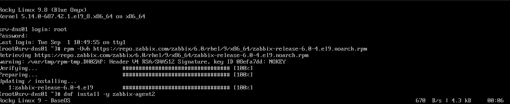

```bash
vi /etc/zabbix/zabbix_agent2.conf
```

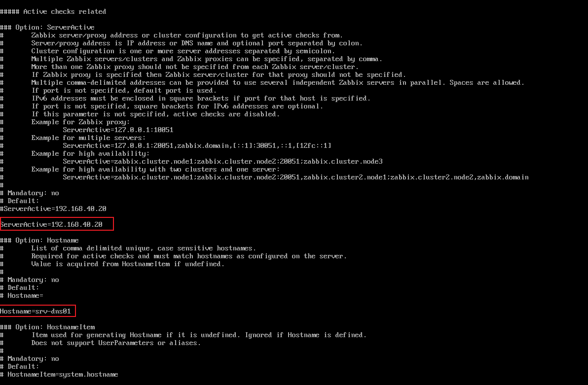

```
ServerActive=192.168.40.20
Hostname=srv-dns01
```

```bash
systemctl enable --now zabbix-agent2
firewall-cmd --permanent --add-port=10050/tcp
firewall-cmd --reload
```

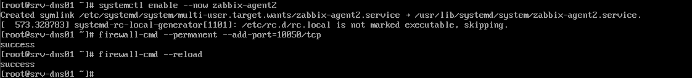

### Adding the host in the WebGUI

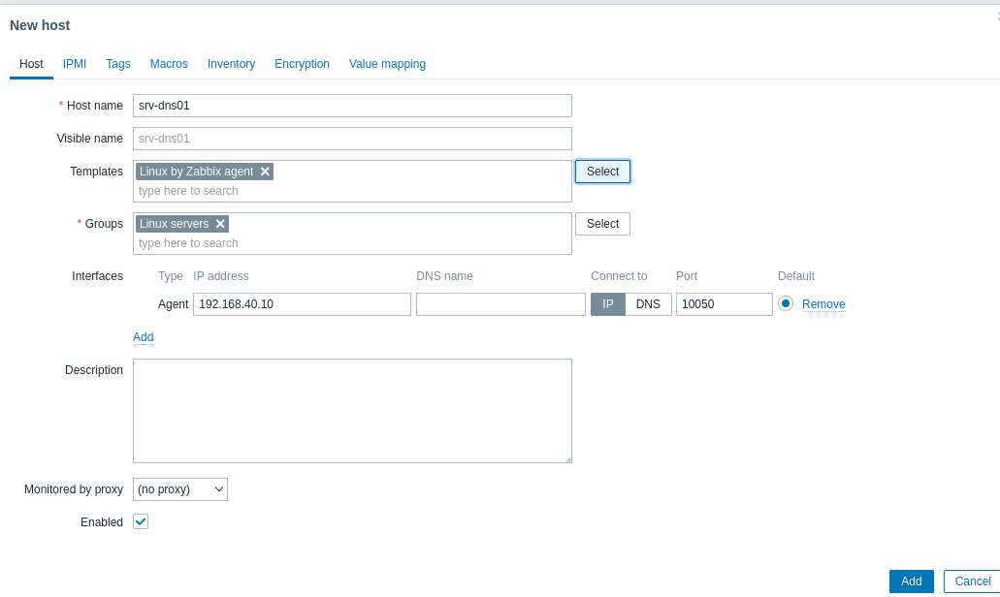

Template: **`Linux by Zabbix agent`** (the classic passive-check template,
not an Agent-2-specific variant — works fine since Agent 2 is
backward-compatible with the Agent 1 passive-check protocol, but worth being
precise about which template is actually in use rather than assuming).
Group: `Linux servers`. Interface: Agent, `192.168.40.10:10050`.

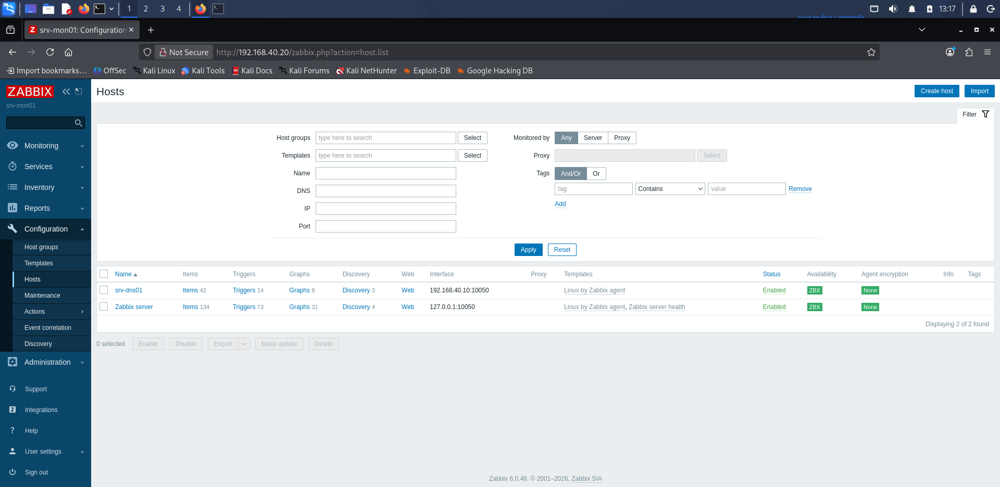

Green `ZBX` availability indicator, 42 items and 14 triggers pulled in from
the template automatically — confirmed reachable within the expected 1-2
minute window, not just added and assumed working.

---

## Custom monitoring: a check the stock template doesn't provide

Template items cover CPU/memory/disk/network/process — none of them know
this host runs a specific web service that matters. Added deliberately.

**Item:**

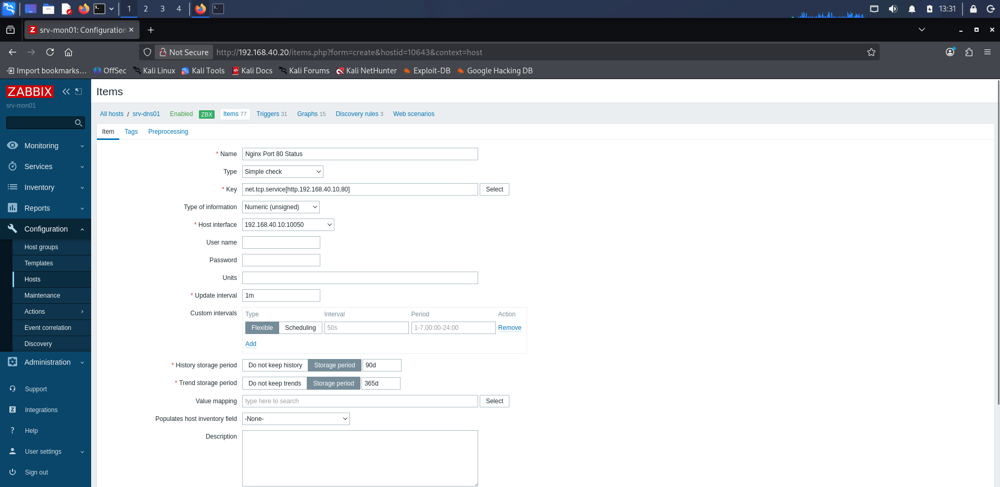

```
Name: Nginx Port 80 Status
Type: Simple check
Key: net.tcp.service[http,192.168.40.10,80]
Update interval: 1m
```

**Trigger:**

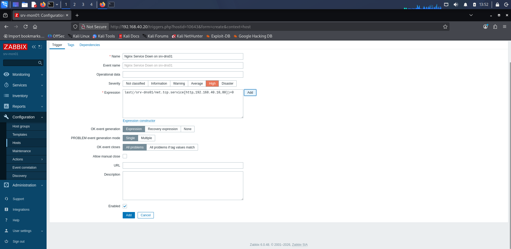

```
Name: Nginx Service Down on srv-dns01
Severity: High
Expression: last(/srv-dns01/net.tcp.service[http,192.168.40.10,80])=0
```

A "simple check" polls the port directly from the Zabbix server, independent
of the agent — meaning this specific check would still catch an outage even
if the agent process itself died, which a purely agent-based item wouldn't.

---

## Alert drill: full closed loop

**1. Break it:**

```bash
# on srv-dns01
systemctl stop nginx
```

**2. Alert fires:**


Problem appeared within the 1-minute check interval: `17:56:51`, "Nginx
Service Down on srv-dns01", High severity.

**3. Recover it:**

```bash
# on srv-dns01
systemctl start nginx
```

**4. Alert clears:**

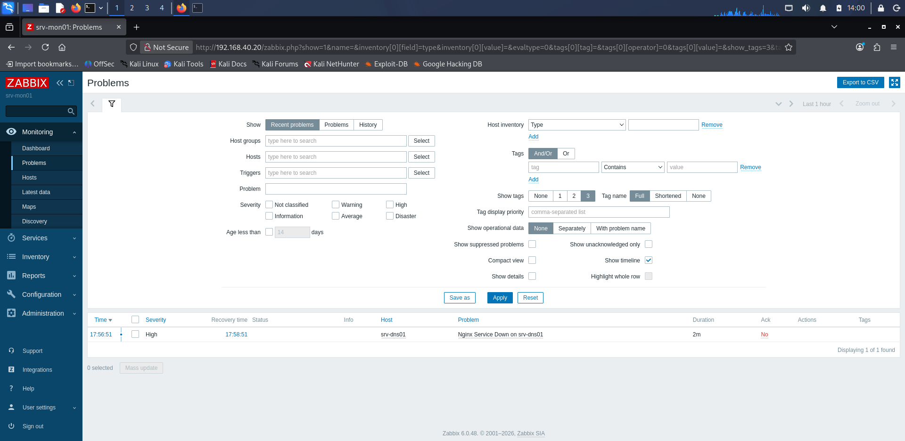

Recovery time logged: `17:58:51` — a 2-minute detection-to-recovery window,
confirmed by the platform itself, not just "I restarted it and it looked
fine."

---

## Verification

| Test | Expected | Result | Evidence |
|---|---|---|---|
| Zabbix server process healthy | All manager/poller/trapper workers started | Pass | `mon-14-zabbix-server-status.png` |
| Web frontend reachable cross-zone | Setup wizard loads from Kali via OPNsense | Pass | `mon-16-webui-preinstall-summary.png` |
| Agent host shows reachable | Green `ZBX` availability | Pass | `mon-22-webui-host-list-green.png` |
| Custom item and trigger created | Item + trigger visible on host | Pass | `mon-23`, `mon-24` |
| Alert fires on real fault | Problem appears within update interval | Pass | `mon-25-alert-triggered.png` |
| Alert clears on real recovery | Recovery time logged | Pass | `mon-26-alert-recovered.png` |
| Frontend-to-backend status check | No connection warning on dashboard | Pass — fixed with `setsebool`, confirmed on reload | `mon-17` (before) → `mon-29` (fix applied) → `mon-28` (confirmed clear) |
| Default Zabbix web credentials changed | `Admin` password rotated | Not confirmed either way | |

## Known limitations

1. **Default Zabbix web credentials (`Admin`/`zabbix`)** — not confirmed
   either way whether these were rotated.
2. **`zabbix_server.conf` contains the database password in plaintext**
   (`DBPassword=Zabbix@123`) — standard for Zabbix, but file permissions on
   this config weren't specifically checked (unlike `sshd_config` in section
   05, which was).
3. **Only one host is monitored.** `srv-log01` and `srv-auto01` exist
   (section 02) but have no Zabbix agent yet.
4. **No notification channel configured** — alerts are visible on the
   dashboard but nothing was set up to page/email/message anyone; the drill
   above relied on watching the dashboard directly.
5. **No `getenforce` output captured specifically for `srv-mon01`** —
   assumed Enforcing, consistent with the rest of the Rocky 9 builds. The
   SELinux boolean fix above (needed to clear the frontend warning) is
   itself indirect confirmation it's Enforcing and not Permissive, but it
   was never checked directly the way `srv-dns01` was in section 02.
