# 07 · Logging and incident response — Wazuh

**Task objective.** Stand up centralized log collection and security event
detection, bring the existing server under agent monitoring, and prove
detection actually works against a real (simulated) attack — not just that
the dashboard loads.

**New host:** `srv-log01` (192.168.40.30, server zone) — Wazuh 4.7.5,
single-node (manager + indexer + dashboard all on one host).
**Monitored host:** `srv-dns01` (192.168.40.10) — Wazuh Agent.

---

## A real resource constraint, handled deliberately

Wazuh's single-node install manual recommends 8 GB RAM; the host machine
running this whole build can't sustain that on top of everything else running
simultaneously. Rather than under-provisioning and getting an unstable
install, the build runs in two alternating modes:

- **Mode A** — OPNsense + `srv-dns01` + `srv-mon01` (+ Kali as needed):
  everyday network/web/monitoring work.
- **Mode B** — OPNsense + `srv-dns01` + `srv-log01`: Zabbix VMs shut down
  first, freeing RAM for Wazuh/OpenSearch, which is the heaviest thing in
  this entire build.

This is a real, stated infrastructure limitation, not a design flaw — a
production environment would size hardware for concurrent operation; a
single-laptop lab can't, so the honest choice was to say so and switch modes
deliberately rather than run everything degraded at once.

---

## Building srv-log01

```bash
nmcli connection edit enp0s8
> set ipv4.method manual
> set ipv4.addresses 192.168.40.30/24
> set ipv4.gateway 192.168.40.1
> set ipv4.dns 192.168.40.10
> set connection.autoconnect yes
> save
```

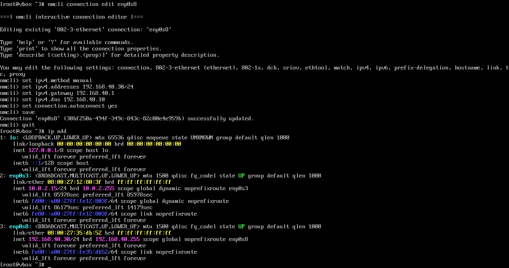

```bash
hostnamectl set-hostname srv-log01.lab.local
setenforce 0
systemctl stop firewalld
systemctl disable firewalld
```

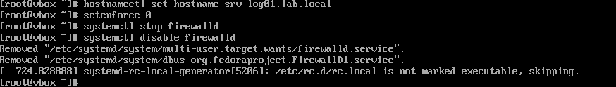

**Worth flagging plainly, not glossing over:** this is the only host in the
entire build where SELinux was switched to **Permissive** and the host
firewall was **disabled outright**, rather than tuned. It's a defensible,
practical call — freeing up the effort budget to get a genuinely
resource-heavy, unfamiliar stack (OpenSearch + Wazuh) running instead of
fighting SELinux denials and port-by-port firewall rules on top of that — but
it means the one host aggregating security-relevant logs across the fleet
currently has the *weakest* host-level hardening of any server here, relying
entirely on the OPNsense edge firewall (section 04) for network protection.
Worth revisiting once the stack is stable: re-enable `firewalld` with the
specific Wazuh/OpenSearch ports opened, and move SELinux back to Enforcing
with the needed policy exceptions rather than switching it off.

---

## Installing Wazuh (single-node, all-in-one)

```bash
curl -sO https://packages.wazuh.com/4.7/wazuh-install.sh
bash wazuh-install.sh -a
```

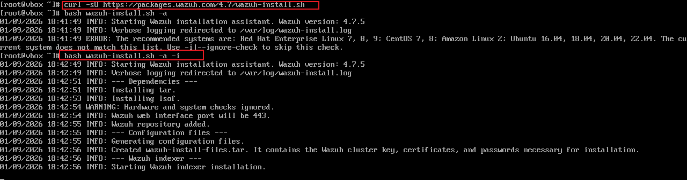

First attempt stopped immediately: *"The recommended systems are: Red Hat
Enterprise Linux 7, 8, 9... The current system does not match this list."*
Rocky Linux 9 is RHEL-compatible but not on the installer's exact allowlist —
re-run with `-i` (ignore the hardware/OS check) resolved it correctly, rather
than switching to a different install method. Installation then proceeded
through indexer, manager, and dashboard automatically, generating certificates
and credentials into `wazuh-install-files.tar` — meaning the admin password is
whatever this installer generated, not a fixed default; it should be pulled
from that archive when logging in and rotated/recorded per the organization's
usual credential handling, not assumed to be `admin`/`admin`.

**All three components confirmed running:**

```bash
sudo /var/ossec/bin/wazuh-control status
sudo systemctl status wazuh-manager --no-pager
sudo systemctl status wazuh-indexer --no-pager
sudo systemctl status wazuh-dashboard --no-pager
```

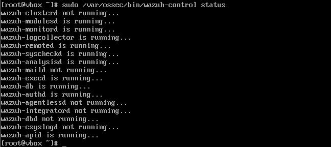
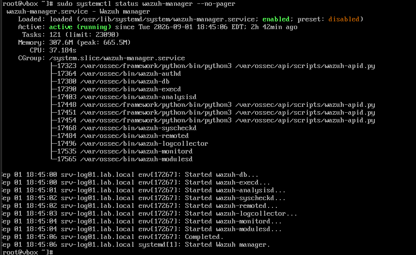
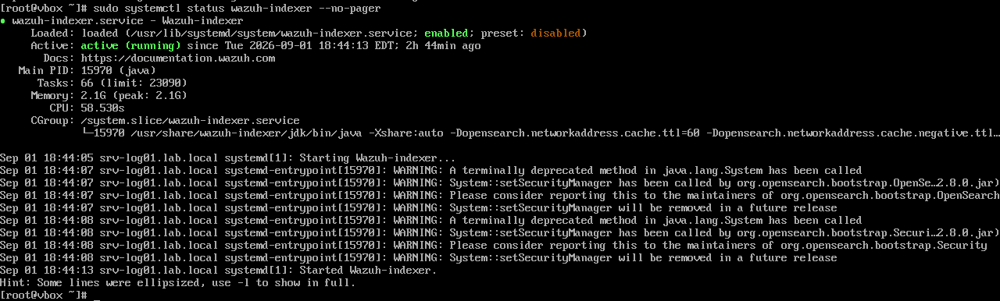
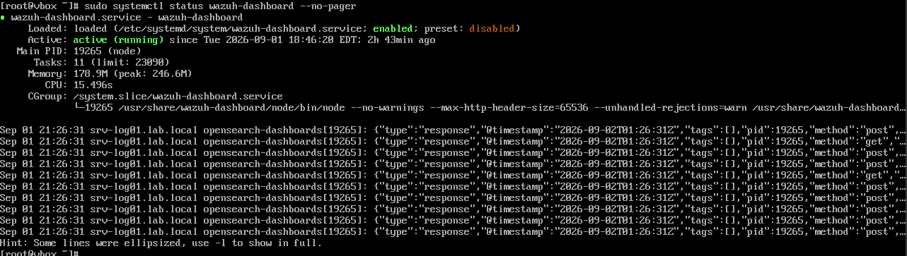

The handful of daemons reported "not running" (`wazuh-clusterd`,
`wazuh-maild`, `wazuh-agentlessd`, `wazuh-integratord`, `wazuh-dbd`,
`wazuh-csyslogd`) are all optional features not in use here — clustering,
email, agentless monitoring, external integrations — not a partial or broken
install.

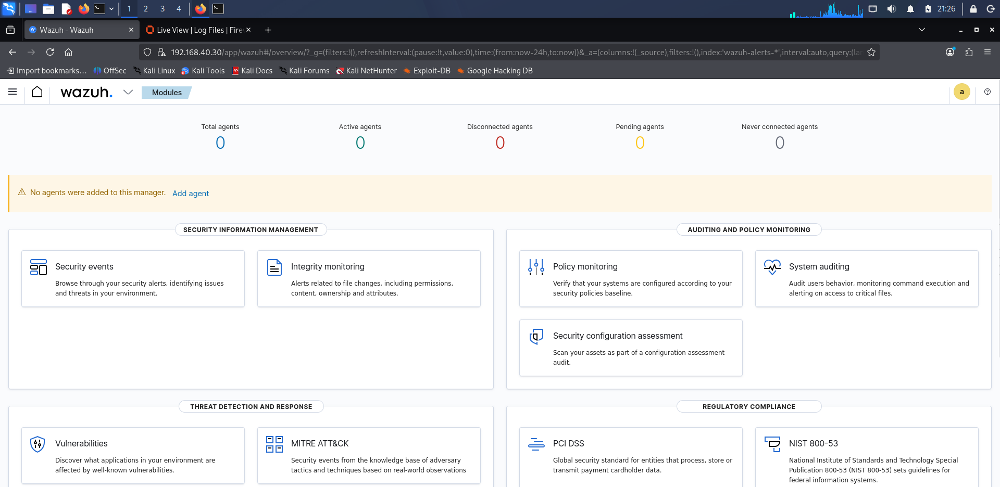

Dashboard reached at `https://192.168.40.30`, confirmed before any agent was
added (0 agents, matching a fresh install).

---

## Agent on srv-dns01

```bash
sudo rpm --import https://packages.wazuh.com/key/GPG-KEY-WAZUH
sudo cat > /etc/yum.repos.d/wazuh.repo << 'EOF'
[wazuh]
gpgcheck=1
gpgkey=https://packages.wazuh.com/key/GPG-KEY-WAZUH
enabled=1
name=EL-$releasever - Wazuh
baseurl=https://packages.wazuh.com/4.x/yum/
protect=1
EOF
sudo dnf install -y wazuh-agent
```

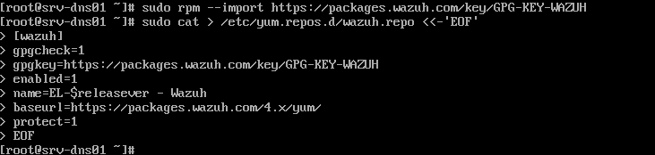
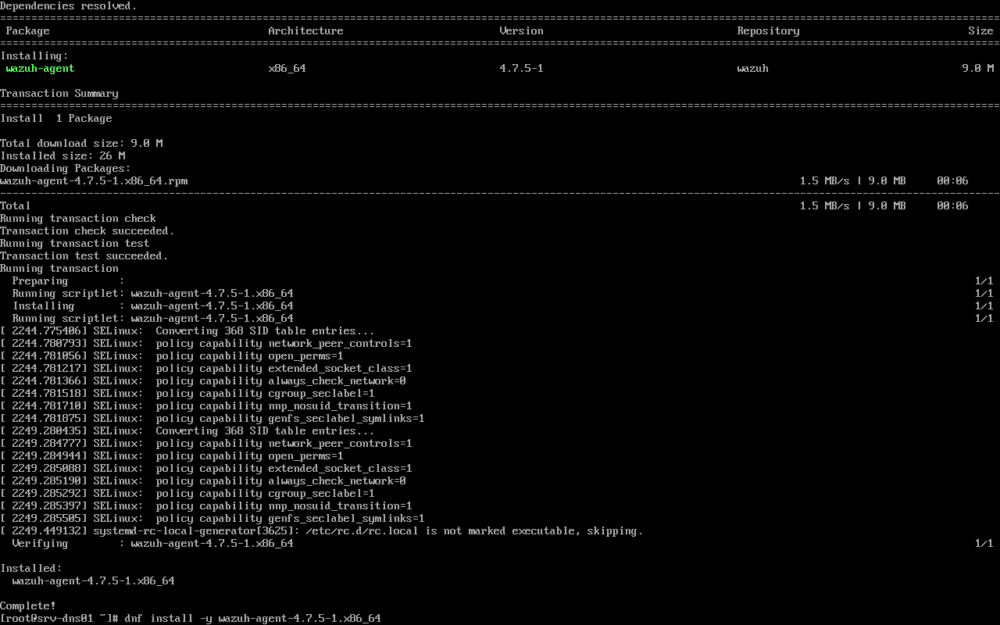

```bash
sudo sed -i 's/MANAGER_IP/192.168.40.30/' /var/ossec/etc/ossec.conf
sudo systemctl daemon-reload
sudo systemctl enable --now wazuh-agent
```

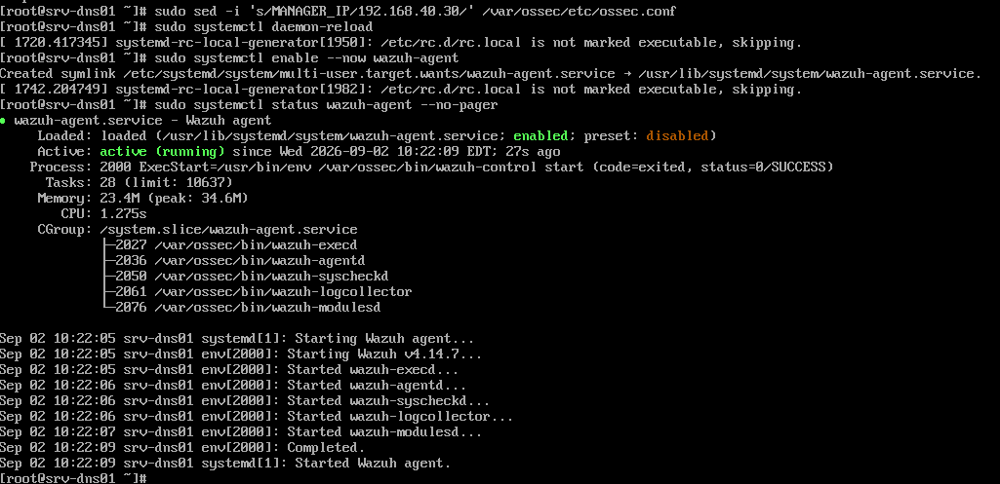

```bash
sudo tail -n 30 /var/ossec/logs/ossec.log
```

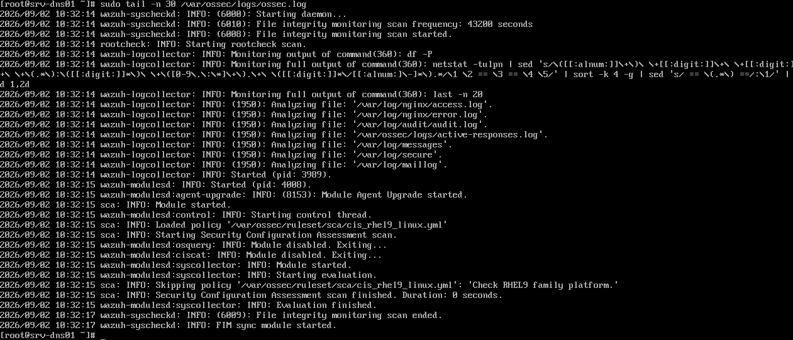

The agent's default log sources came up automatically —
`/var/log/nginx/access.log`, `/var/log/audit/audit.log`, `/var/log/messages`,
`/var/log/secure`, `/var/log/maillog` — before any custom configuration was
added. `TODO: this capture doesn't include an explicit "Connected to server
'192.168.40.30'" line; the agent showing Active in the dashboard (below)
is strong indirect confirmation, but worth grabbing that exact log line too
for a complete record.`

**Confirmed in the dashboard:**

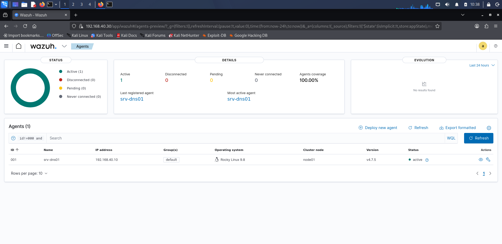
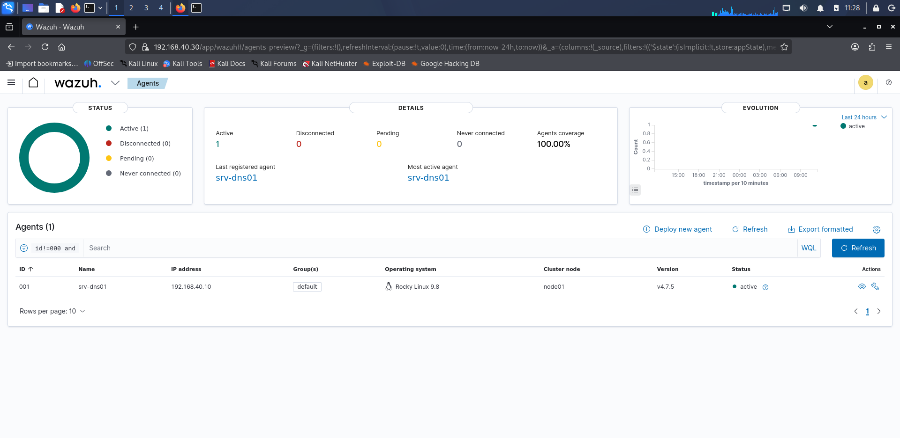

`srv-dns01`, ID 001, Rocky Linux 9.8, v4.7.5, **Active**, 100% coverage.

---

## Custom log sources: Nginx and SSH

```bash
sudo vim /var/ossec/etc/ossec.conf
```

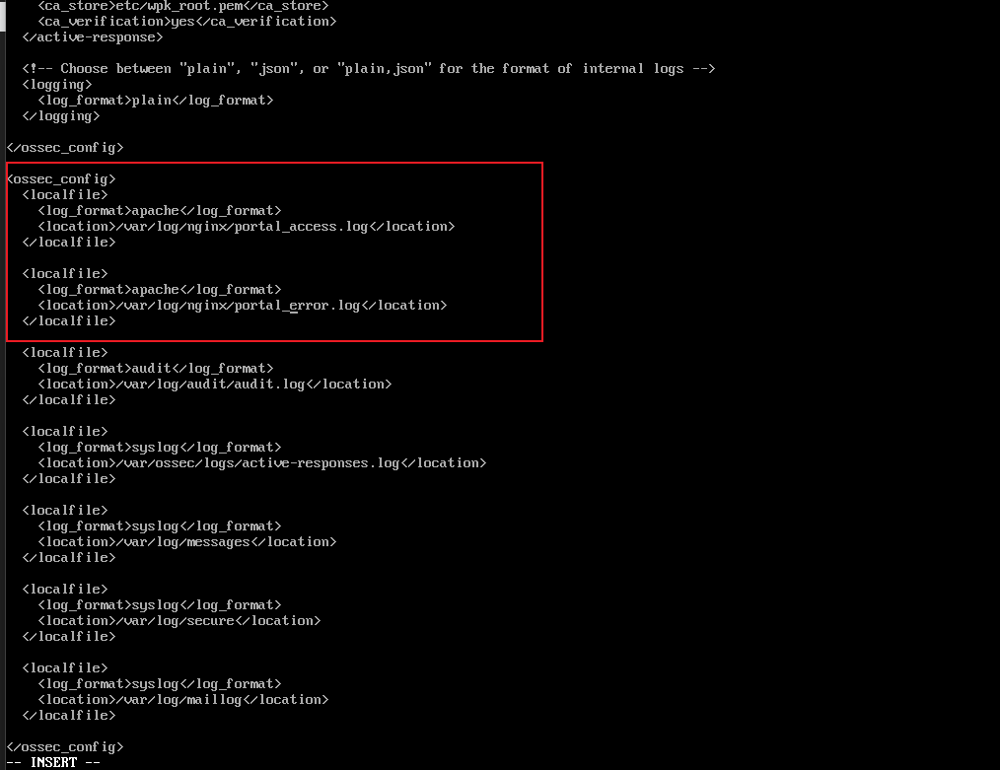

```xml
<ossec_config>
  <localfile>
    <log_format>apache</log_format>
    <location>/var/log/nginx/portal_access.log</location>
  </localfile>
  <localfile>
    <log_format>apache</log_format>
    <location>/var/log/nginx/portal_error.log</location>
  </localfile>
</ossec_config>
```

**One precise detail worth getting right:** the edit landed as a *second*
`<ossec_config>` root block appended after the first one's closing tag,
rather than being inserted inside the existing block — visible in the
screenshot as the new block starting right after a prior `</ossec_config>`.
Wazuh's config parser does support multiple `<ossec_config>` blocks in one
file and merges them, so this isn't broken, but it reads as an accidental
side effect of pasting a snippet that included its own wrapper tags rather
than a deliberate structural choice.

```bash
sudo systemctl restart wazuh-agent
sudo ls -la /var/log/nginx/
sudo tail -n 10 /var/log/nginx/portal_access.log
sudo tail -n 10 /var/log/secure
```

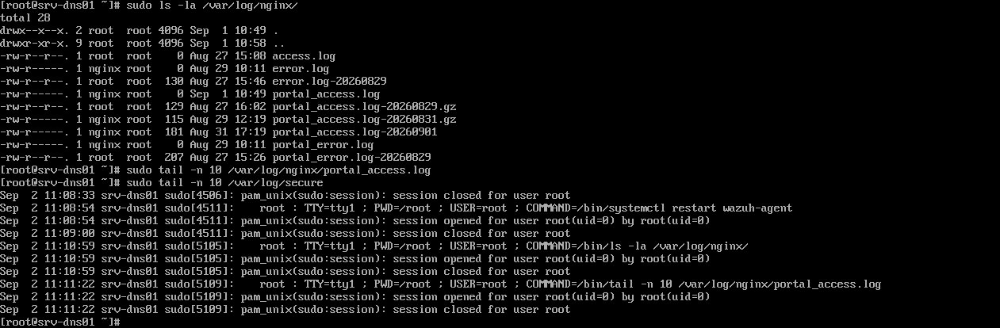

**Finding at the time:** `portal_access.log` exists (confirmed by `ls`) but
was **0 bytes** at check time — no recent HTTP requests had hit the portal to
generate access-log lines. Rotated archives from earlier dates
(`portal_access.log-20260829.gz`, etc.) do have content, so the log path and
rotation are working; there just wasn't fresh traffic during this check.
`/var/log/secure` has real, current content (sudo session activity).

### Closing the loop: generating real traffic and confirming ingestion

Fixed by doing exactly what the finding above called for — generating real
requests, then checking Wazuh for the resulting events.

```bash
# from Kali (192.168.50.100)
curl http://192.168.40.10
curl http://192.168.40.10
curl http://192.168.40.10
```

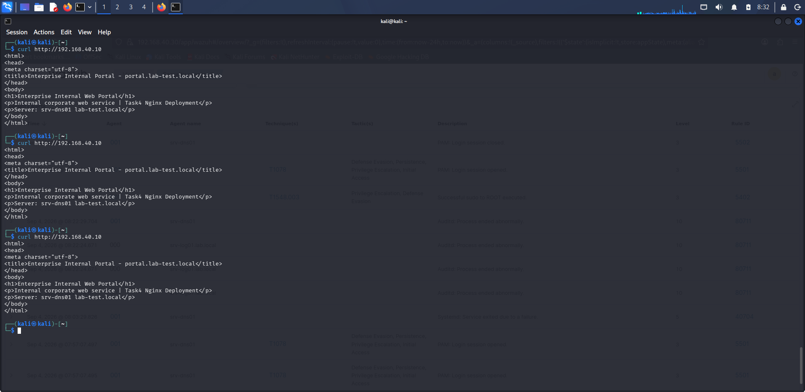

```bash
# on srv-dns01
sudo tail -n 5 /var/log/nginx/portal_access.log
```

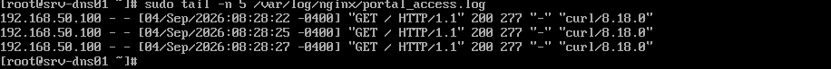

Three fresh `200` entries from `192.168.50.100`, timestamped seconds apart —
the log path is genuinely live now, not just configured.

**First check in Wazuh came back empty — and that result itself needed
interpreting, not just accepting:**

```
location: "/var/log/nginx/portal_access.log"
```

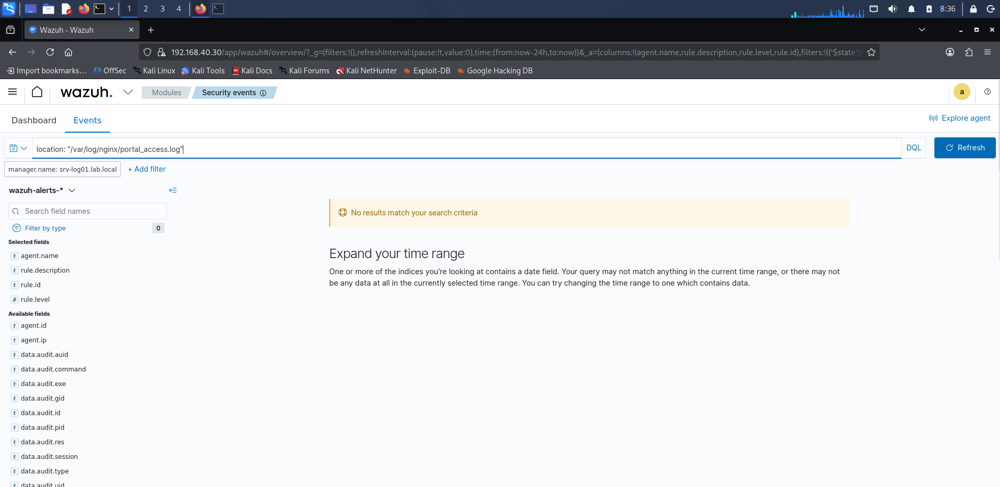

No hits, despite the log file clearly having fresh content seconds earlier.
**The reason isn't a broken pipeline — it's that Wazuh's ruleset generates
alerts for anomalies, not for routine `200 OK` traffic.** A successful GET
request has nothing in it worth escalating, so it's parsed and indexed but
never crosses the severity threshold that makes it show up as a "security
event." Concluding "not ingested" from an empty alert search would have been
the wrong diagnosis — the fix was to test with something that *should*
generate a rule match:

```bash
curl http://192.168.40.10/this-page-does-not-exist-xyz123
curl http://192.168.40.10/this-page-does-not-exist-xyz123
curl http://192.168.40.10/this-page-does-not-exist-xyz123
```

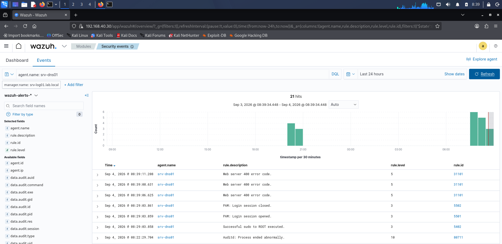

Three matching alerts, one per request: **"Web server 400 error code," rule
`31101`, level 5** — proof the Nginx access log is genuinely flowing into
Wazuh. The earlier empty search wasn't a failure; it was a correct result
that needed the right follow-up test to interpret properly, which is the
more realistic version of "verifying a pipeline" than just seeing green on
the first try.

---

## Security events: real data flowing

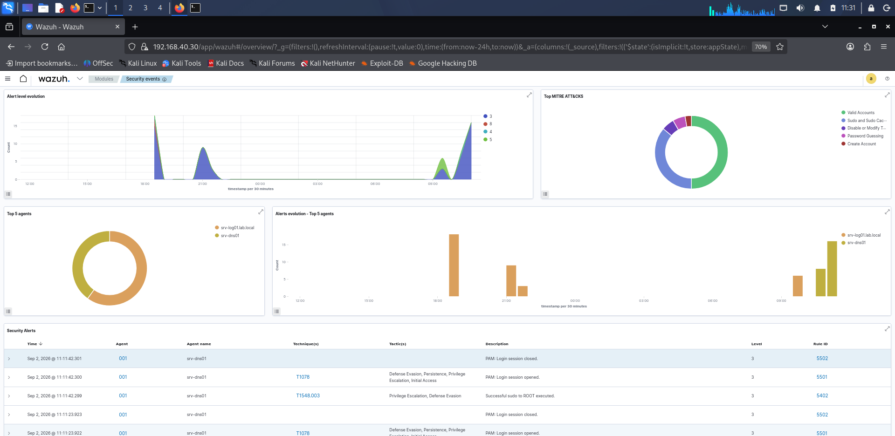

Alert volume over time, MITRE ATT&CK technique breakdown (Valid Accounts,
Sudo and Sudo Caching, Password Guessing, Create Account), and both agents
(`srv-dns01`, and `srv-log01.lab.local` monitoring itself) contributing
events — this is the manager and indexer pipeline actually working, not a
static demo screen.

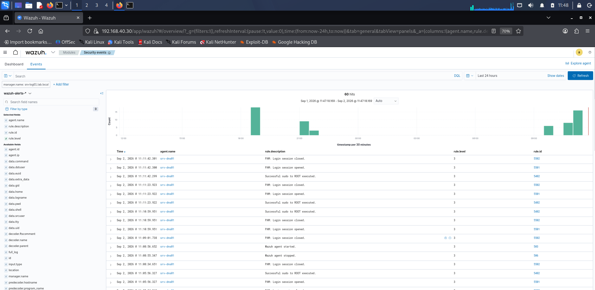

Real PAM login/logout and `sudo` escalation events from `srv-dns01`, each
tagged with rule ID and severity level — this is the baseline signal the
brute-force drill below stands out against.

---

## Simulated security event: SSH brute-force

**1. Generate the activity**, on `srv-dns01`:

```bash
ssh nonexistent_user@127.0.0.1
# wrong password, Ctrl+C, repeated 3-5 times
```

**2. Detected:**

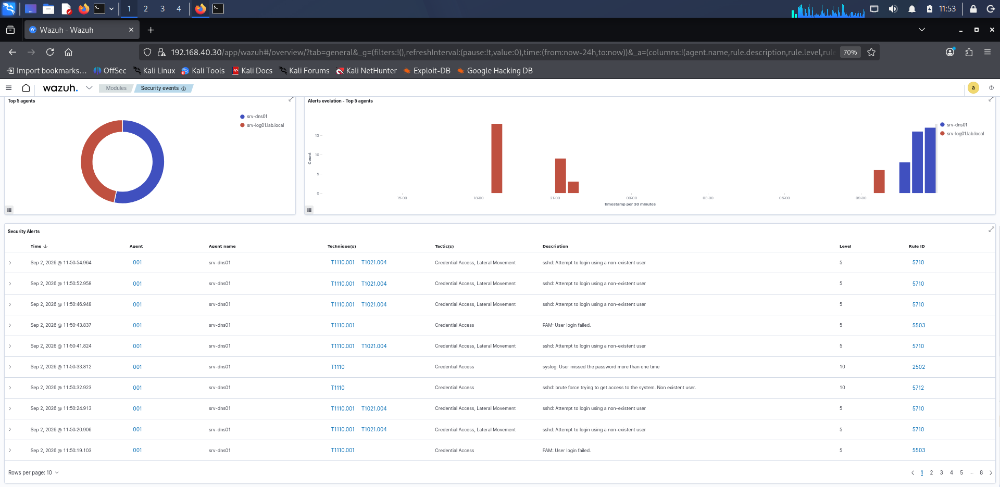

Multiple distinct rules fired, correlated to the same activity, at
**higher** severity than the plan anticipated ("level 5 or higher" was the
expectation; level 10 is what actually showed up):

| Rule ID | Level | Description |
|---|---|---|
| 5710 | 5 | sshd: Attempt to login using a non-existent user |
| 2502 | 10 | syslog: User missed the password more than one time |
| 5712 | 10 | sshd: brute force trying to get access to the system. Non existent user |

MITRE mapping: `T1110.001` (Password Guessing), `T1021.004` (Remote
Services: SSH); tactics `Credential Access`, `Lateral Movement`.

**3. Full detail, on the highest-signal event:**

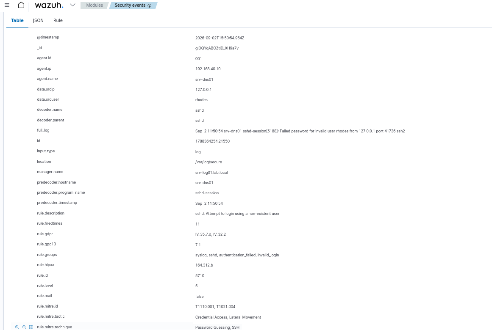

```
agent.ip: 192.168.40.10          agent.name: srv-dns01
data.srcip: 127.0.0.1            data.srcuser: rhodes
rule.id: 5710                    rule.level: 5
rule.mitre.tactic: Credential Access, Lateral Movement
rule.mitre.technique: Password Guessing, SSH
rule.groups: syslog, sshd, authentication_failed, invalid_login
full_log: Sep 2 11:50:54 srv-dns01 sshd-session[5188]: Failed password
          for invalid user rhodes from 127.0.0.1 port 41736 ssh2
```

Wazuh also auto-tagged this against `rule.gdpr`, `rule.hipaa`, and
`rule.gpg13` compliance frameworks — genuinely useful for an org that has to
report against those standards, not something manually configured here.

---

## Security incident ticket — SEC-001

Filled from [`../10-operations/templates/security-event.md`](../10-operations/templates/security-event.md),
using the real rule ID and level captured above rather than placeholders:

| Field | Content |
|---|---|
| Event ID and severity | SEC-001 / Medium |
| Detected at / how | 2026-09-02 11:50:54 UTC / Wazuh Security Events, automatic |
| Assets, accounts and addresses | `srv-dns01` (192.168.40.10); attempted account `rhodes` (nonexistent); source `127.0.0.1` (drill, self-originated) |
| Observed behaviour | Repeated SSH login failures against a non-existent user in a short window; Wazuh rule 5710 (level 5) and 5712/2502 (level 10) fired, tagged brute-force |
| Raw log and evidence location | `/var/log/secure` on `srv-dns01`; Wazuh alert detail (`log-21`, `log-22`); full log line quoted above |
| Impact assessment | Simulated — sourced from the host itself, no real external exposure. Confirms Wazuh correctly detects and escalates brute-force patterns, which matters because real attempts will look identical in the logs |
| Verdict | Drill, not a real intrusion — confirmed by source (loopback) and by design (deliberately triggered) |
| Containment actions | None required — no real access was gained or attempted against a real account |
| Recovery actions | None required — SSH and all other services remained available throughout |
| Verification | Legitimate SSH logins (key-based, section 02) continued to work normally during and after the drill |
| Follow-up improvements | Deploy `fail2ban` or an equivalent to auto-block repeat offenders; complete the move to key-only SSH (`PasswordAuthentication no`, already done per section 02) so password-guessing has nothing to guess against; periodically review Wazuh rule tuning |
| Handled by / reviewed by | `[Your name]` / `[Instructor / self-reviewed]` |

---

## Log source inventory

```bash
cat > log_source_inventory.md << 'EOF'
# Log source inventory
|Asset|IP Address|Log Type|Log Path|Collection Method|Retention Policy|
|---|---|---|---|---|---|
|srv-dns01|192.168.40.10|System Log|/var/log/messages|Wazuh Agent|90 days|
|srv-dns01|192.168.40.10|SSH Authentication Log|/var/log/secure|Wazuh Agent|90 days|
|srv-dns01|192.168.40.10|Nginx Access Log|/var/log/nginx/portal_access.log|Wazuh Agent|30 days|
|srv-dns01|192.168.40.10|Nginx Error Log|/var/log/nginx/portal_error.log|Wazuh Agent|30 days|
EOF
```

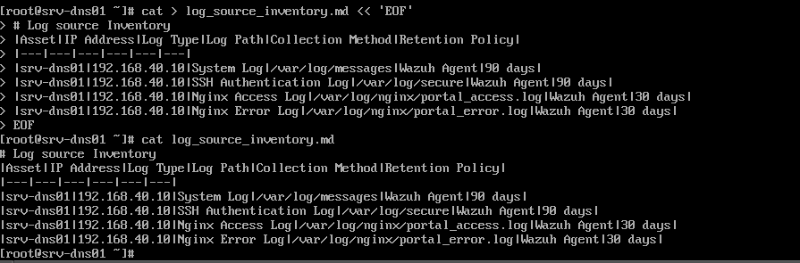

## Verification

| Test | Expected | Result | Evidence |
|---|---|---|---|
| Wazuh manager/indexer/dashboard all running | `active (running)` | Pass | `log-04`, `log-07`, `log-08`, `log-09` |
| Dashboard reachable | Login page loads at 192.168.40.30 | Pass | `log-06-dashboard-first-login.png` |
| Agent installed and connected | Dashboard shows Active, 100% coverage | Pass | `log-15-dashboard-agent-active.png` |
| Security events flowing | Real PAM/sudo events visible | Pass | `log-20-security-events-table.png` |
| SSH brute-force detected | Alert(s) fire, correlated rules | Pass — exceeded expectation (level 10, not just 5) | `log-21`, `log-22` |
| Nginx log ingestion | Nginx-derived events visible in Wazuh | Pass — confirmed via a deliberate 404 test after an initial empty search was correctly diagnosed | `log-24`, `log-25`, `log-26` (empty search), `log-27` (confirmed) |
| Agent connection confirmed in its own log | "Connected to server" line in ossec.log | **Not captured** — inferred from dashboard Active status instead | |
| Log source inventory created | File exists with correct paths | Pass | `log-23-log-source-inventory.png` |

## Known limitations

1. **SELinux Permissive and firewalld disabled on `srv-log01`** — the
   weakest host-level hardening of any server in this build, on the host
   that aggregates the most security-sensitive data. A deliberate
   resource-vs-effort trade-off during setup, not an oversight, but worth
   revisiting: re-enable `firewalld` with the specific ports Wazuh/OpenSearch
   need, and return SELinux to Enforcing with policy exceptions rather than
   Permissive.
2. **`ossec.conf` has two separate `<ossec_config>` root blocks** rather than
   one — functionally fine (Wazuh merges them), but reads as an accidental
   result of pasting a snippet including its own wrapper tags.
3. **Default/generated Wazuh admin credentials** — the installer generates
   real credentials into `wazuh-install-files.tar` rather than using a fixed
   default, which is good, but there's no record here of that password being
   retrieved, stored securely, or rotated.
4. **Only `srv-dns01` has an agent.** `srv-mon01`, `srv-log01` itself (beyond
   its own manager-side self-monitoring), and `srv-auto01` aren't
   agent-monitored.
5. **This section depends on Mode B being active** (Zabbix VMs shut down) —
   meaning Wazuh and Zabbix cannot be demonstrated live at the same time on
   the current hardware, only sequentially. Worth stating plainly when
   presenting this project, rather than implying a fully concurrent stack.
6. Consistent with the project-wide domain-naming issue
   (`srv-log01.lab.local` here, `lab-test.local` elsewhere) — no new instance
   of it, just another data point for the existing open item.
