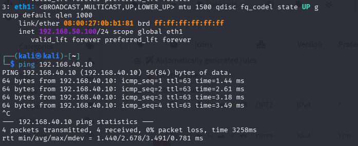
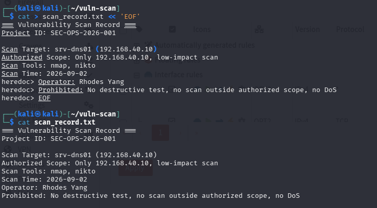
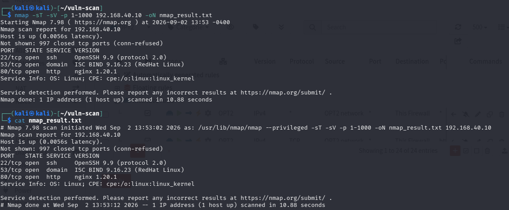
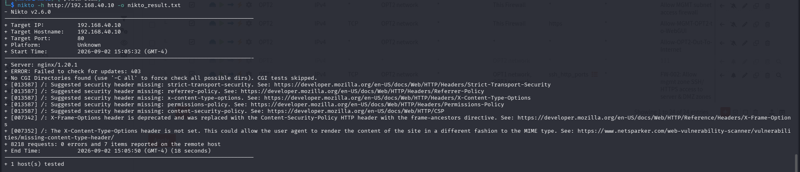
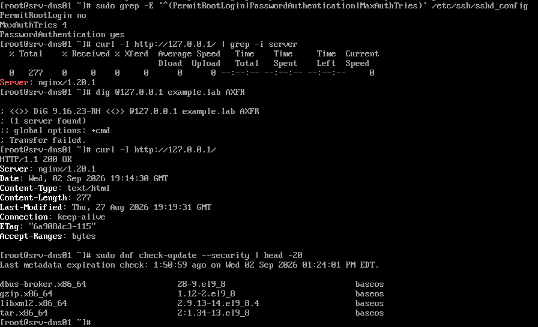
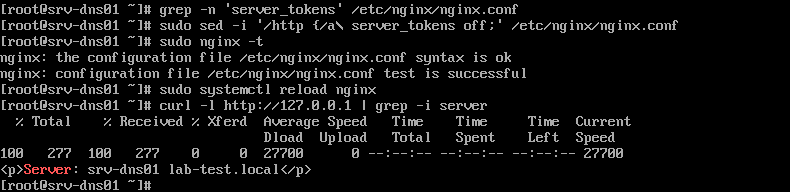
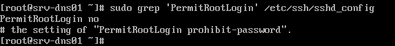
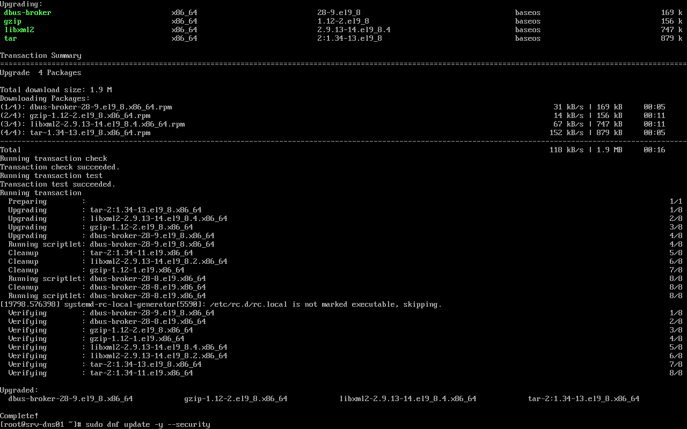
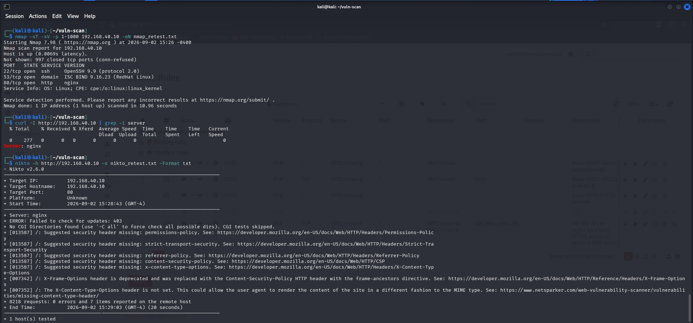

# 08 · Vulnerability management — scan, validate, remediate, retest

**Task objective.** Run an authorized, scoped vulnerability scan against a
single lab asset, manually validate what the scanner reports rather than
trusting it blindly, fix at least one real finding, and retest from outside
the host to prove the fix actually took effect.

> **Authorization scope.** Scanning was limited to `srv-dns01`
> (192.168.40.10), a host in this lab that I own and operate. No other
> address, and no internet-facing or third-party system, was scanned, probed,
> or tested at any point. A VirtualBox snapshot of the target existed before
> scanning began.

Scanner host: Kali (192.168.50.100, ops zone) · Target: `srv-dns01`
(192.168.40.10, server zone) · Tools: `nmap`, `nikto`

---

## Pre-scan: confirm reachability, record the authorization

```bash
ip address
ping -c 3 192.168.40.10
```



```bash
mkdir -p ~/vuln-scan && cd ~/vuln-scan
cat > scan_record.txt << 'EOF'
=== Vulnerability Scan Record ===
Project ID: SEC-OPS-2026-001
Scan Target: srv-dns01 (192.168.40.10)
Authorized Scope: Only 192.168.40.10, low-impact scan
Scan Tools: nmap, nikto
Scan Time: 2026-09-02
Operator: Rhodes Yang
Prohibited: No destructive test, no scan outside authorized scope, no DoS
EOF
```



Writing this before running a single scan tool matters — it's the record
that proves scope and intent were defined up front, not reconstructed after
the fact to justify whatever the scan happened to touch.

---

## Scan: nmap (ports and service versions)

```bash
nmap -sT -sV -p 1-1000 192.168.40.10 -oN nmap_result.txt
```

`-sT` (full TCP connect, no root needed, less likely to be dropped by a
firewall than a SYN scan) and a 1000-port cap — deliberately low-impact
rather than an aggressive full scan.



```
22/tcp open  ssh     OpenSSH 9.9 (protocol 2.0)
53/tcp open  domain  ISC BIND 9.16.23 (RedHat Linux)
80/tcp open  http    nginx 1.20.1
```

Exactly three ports open — matching the approved set from section 05's
hardening pass. No unexpected services turned up by an external scan, which
is itself a useful confirmation that the host firewall and OPNsense are
doing their job, not just that they were configured correctly on paper.

---

## Scan: nikto (web-layer findings)

```bash
nikto -h http://192.168.40.10 -o nikto_result.txt -Format txt
```



Seven findings, all the same category — missing recommended security
headers (`Strict-Transport-Security`, `X-Content-Type-Options`,
`Content-Security-Policy`, `Referrer-Policy`, `Permissions-Policy`,
`X-Frame-Options`) — plus the Nginx version banner (`nginx/1.20.1`) exposed
in the `Server` response header. No exploitable vulnerability found; every
item here is informational hardening, not a live weakness.

---

## Manual review — validating what the scanners reported

Scanner output gets treated as a lead, not a verdict — every item checked
directly on the host before deciding what's real and what to fix.

```bash
sudo grep -E '^(PermitRootLogin|PasswordAuthentication|MaxAuthTries)' /etc/ssh/sshd_config
curl -I http://127.0.0.1 | grep -i server
sudo dig @127.0.0.1 example.lab AXFR
sudo dnf check-update --security | head -20
```



| Finding | Result | Interpretation |
|---|---|---|
| `PermitRootLogin` | `no` | Correct — matches section 05's hardening |
| `MaxAuthTries` | `4` | Correct — matches section 05 |
| `PasswordAuthentication` | `yes` | **See note below** |
| Nginx version header | `nginx/1.20.1` | Confirmed real — matches nikto and nmap; this is the finding remediated below |
| DNS zone transfer (AXFR) | `Transfer failed` | **Good** — the resolver correctly refuses an unauthorized zone transfer, not a finding |
| Pending security updates | 4 packages (`dbus-broker`, `gzip`, `libxml2`, `tar`) | Real, not "already current" — applied below |

**On `PasswordAuthentication yes`:** this is the same sshd_config setting
documented in [`../05-hardening/README.md`](../05-hardening/README.md) — at
this point in the build (Sep 2), the file still read `yes`, set
intentionally as an interim step before switching to key-only auth. The
confirmed, current state (verified afterward with `sshd -T` and a live
forced-password-rejection test) is `PasswordAuthentication no` — see
[`../02-linux-baseline/README.md`](../02-linux-baseline/README.md). Recorded
here as what the scan actually found at the time, not silently corrected to
match a later state, since that's what an honest scan record looks like.

---

## Remediation

### 1. Hide the Nginx version number

```bash
grep -n 'server_tokens' /etc/nginx/nginx.conf
sudo sed -i '/http {/a\    server_tokens off;' /etc/nginx/nginx.conf
sudo nginx -t
sudo systemctl reload nginx
curl -I http://127.0.0.1 | grep -i server
```



Config change applied and reloaded cleanly. **The immediate verification
command on this line, though, has a real problem worth being honest about:**
its output was `<p>Server: srv-dns01 lab-test.local</p>` — that's a line from
the portal's own HTML **body** (written into `index.html` in section 03), not
an HTTP response header. A `curl -I` request shouldn't return body content at
all, so this particular check didn't actually confirm what it looked like it
confirmed. Rather than trust it, the real confirmation came later — see the
Kali retest below, where the same check, run correctly against the actual
header from outside the host, gives an unambiguous answer.

### 2. Confirm root SSH login is disabled

```bash
sudo grep 'PermitRootLogin' /etc/ssh/sshd_config
```



Already `no` — no change needed, already compliant from section 05.

### 3. Install available security updates

```bash
sudo dnf update -y --security
```



Four packages upgraded (`dbus-broker`, `gzip`, `libxml2`, `tar`) — real
updates were available and applied, not a no-op.

---

## Retest — from Kali, not from the host itself

The point of a retest is proving the fix works from an attacker's vantage
point (outside the host), not from inside where a config file could look
right without the running service actually reflecting it.

```bash
nmap -sT -sV -p 1-1000 192.168.40.10 -oN nmap_retest.txt
curl -I http://192.168.40.10 | grep -i server
nikto -h http://192.168.40.10 -o nikto_retest.txt -Format txt
```



```
Server: nginx
```

This time the correct thing was checked — the actual HTTP response header,
from a different host, over the network — and it confirms the fix cleanly:
no version number. `nmap` still shows the same three ports (expected, nothing
here was meant to change). `nikto`'s retest still lists the same seven
missing-header suggestions (not remediated in this task, tracked below) but
no longer reports a version-disclosure finding.

---

## Vulnerability report — SEC-OPS-2026-001

| Field | Content |
|---|---|
| Target asset | `srv-dns01` (192.168.40.10) |
| Scan tools | nmap 7.98, Nikto 2.6.0 |
| Scan date | 2026-09-02 |
| Authorized scope | 192.168.40.10 only, low-impact scan |

**Finding 1 — Nginx version disclosure**
- Risk: Low
- Evidence: `curl -I` returned `Server: nginx/1.20.1`; Nikto flagged the
  version as fingerprint-able
- Impact: A version-specific banner narrows the search space for known CVEs
  affecting that exact release
- Remediation: `server_tokens off;` added to `nginx.conf`, reloaded
- Retest: `Server: nginx` (no version), confirmed from Kali — ✅ closed

**Finding 2 — Missing security response headers**
- Risk: Low (informational)
- Evidence: Nikto — 7 suggested headers absent (HSTS, CSP,
  X-Content-Type-Options, Referrer-Policy, Permissions-Policy,
  X-Frame-Options replacement)
- Impact: Doesn't enable an attack on its own; absence weakens
  defense-in-depth against browser-side attacks (clickjacking, MIME
  sniffing) if a future vulnerability appeared elsewhere in the app
- Remediation: **Not done in this task** — tracked as a follow-up
- Retest: Same findings persist, as expected

**Finding 3 — Pending security updates**
- Risk: Medium (varies by package)
- Evidence: `dnf check-update --security` listed 4 packages
- Remediation: `dnf update -y --security` — applied
- Retest: Not independently re-verified with a second `check-update` pass —
  worth adding

**Summary:** 3 issues identified; 2 remediated and retested (Nginx version
disclosure, security package updates); 1 accepted as a tracked follow-up
(missing security headers). All three services (Nginx, DNS, SSH) confirmed
running normally throughout — hardening did not break what it was
protecting.

---

## Verification

| Test | Expected | Result | Evidence |
|---|---|---|---|
| Scan scoped and authorized, recorded before scanning | Written record with scope/tools/prohibitions | Pass | `vuln-02-scan-record.png` |
| Port scan limited to approved services | Only 22/53/80 open | Pass | `vuln-03-nmap-result.png` |
| Web scan completes, no destructive tests | Nikto completes, informational findings only | Pass | `vuln-04-nikto-result.png` |
| Manual validation of each scanner finding | Every item checked directly on the host | Pass | `vuln-05-manual-review.png` |
| At least one real remediation applied | Config or package change made | Pass — two applied (version hiding, security updates) | `vuln-06`, `vuln-08` |
| Remediation verified from outside the host | Retest from Kali confirms the fix | Pass | `vuln-09-retest-from-kali.png` |
| Local (pre-retest) verification command was itself checked for correctness | No blind trust in a command's output | Pass — the flawed `curl -I` check on the host was caught and re-done properly from Kali | `vuln-06` (flagged) → `vuln-09` (correct) |
| Vulnerability report completed | Findings, risk, remediation, retest documented | Pass | This section |

## Known limitations

1. **The initial post-remediation check for the Nginx version fix was run
   incorrectly** — it matched a line from the page body rather than the
   actual response header. Caught and corrected by the proper retest from
   Kali; noted here so the mistake itself is part of the record, not hidden.
2. **The 7 missing-security-header findings from Nikto were not
   remediated** — a real, tracked follow-up (adding
   `add_header Strict-Transport-Security ...` etc. to the Nginx config), not
   silently dropped from the report.
3. **Security package updates weren't independently re-verified** — a second
   `dnf check-update --security` after the upgrade would confirm zero
   packages remain outstanding, closing the loop the same way the Nginx
   fix was closed.
4. **`PasswordAuthentication yes` was the state found in this scan** — the
   current, confirmed state is `no` (section 02) — see the note in the
   manual review section above. Not a live gap, but worth being precise
   about which document reflects "right now."
5. **Only one host was scanned.** `srv-mon01`, `srv-log01`, and `srv-auto01`
   haven't been through this same scan/validate/remediate/retest cycle.
6. **No authenticated (credentialed) scan was performed** — only external,
   unauthenticated scanning. A credentialed scan (or `oscap`/CIS benchmark
   run, also flagged as a gap in section 05) would surface a different,
   deeper set of findings than what an outside attacker sees.
