# 09 · Automation — Ansible

**Task objective.** Stand up an Ansible control node, configure key-based
access to a managed host, run ad-hoc baseline checks, template and deploy a
real service config, and prove the deployment is idempotent — with the
results version-controlled in Git.

**Control node:** `srv-auto01` (192.168.50.10, ops zone) — Ansible-core
2.14.18, Git 2.52.0.
**Managed host:** `srv-dns01` (192.168.40.10), account `ops01`.

---

## Real incident: automation reintroduced a bug section 03 had already fixed

The Jinja2 template built and deployed in this section
(`templates/portal.conf.j2`) initially contained the **exact stale values**
— `server_name portal.example.lab;` and `root /usr/share/nginx/html;` —
that were identified as a real bug and fixed by hand in
[`../03-web-dns/README.md`](../03-web-dns/README.md) ("Real incident #2").
The domain had moved to `portal.lab-test.local` and the document root to
`/var/www/company` weeks before this template was written, but the template
was authored from an earlier reference and never updated to match.

The `copy` task deployed this file with `changed: true` (see below) — the
file on disk really was overwritten. **This is documented in full further
down, including the fix** — the short version: it was found, traced to two
separate causes (not one), and closed out with a redeploy through the same
Ansible tooling that caused it, not a manual workaround.


---

## Control node setup

```bash
sudo nmcli connection edit enp0s8
> set ipv4.method manual
> set ipv4.addresses 192.168.50.10/24
> set ipv4.gateway 192.168.50.1
> set ipv4.dns 192.168.40.10
> save
sudo hostnamectl set-hostname srv-auto01
```

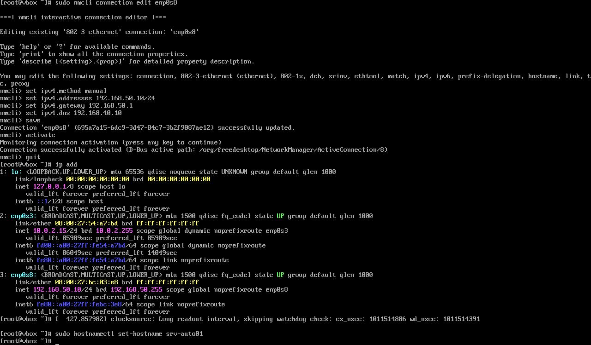

```bash
sudo ip route add 192.168.40.0/24 via 192.168.50.1 dev enp0s8
ping -c 3 192.168.40.10
```

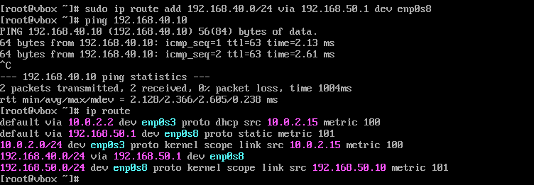

```bash
sudo dnf install -y ansible-core git
ansible --version
git --version
```

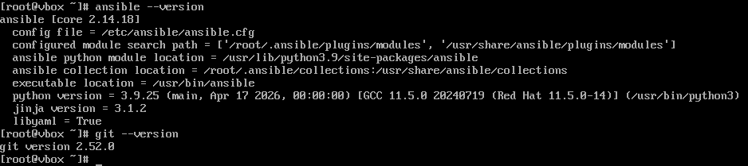

---

## SSH key access to the managed host

```bash
ssh-keygen -t ed25519 -C "ops01-ansible"
ssh-copy-id ops01@192.168.40.10
ssh ops01@192.168.40.10 "hostname && whoami"
```

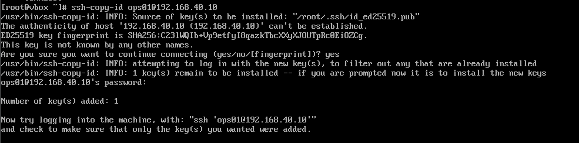


Key-based login confirmed — no password prompt, returns `srv-dns01` /
`ops01`. **Precise detail worth noting:** the key pair was generated as
`root` on `srv-auto01` (prompt reads `[root@vbox ~]#`), not under a separate
non-root account — matching the same pattern already flagged for
`srv-mon01` in section 06 (no dedicated non-root account on the control
side either).

### `ops01`'s sudo access — a real, meaningful finding

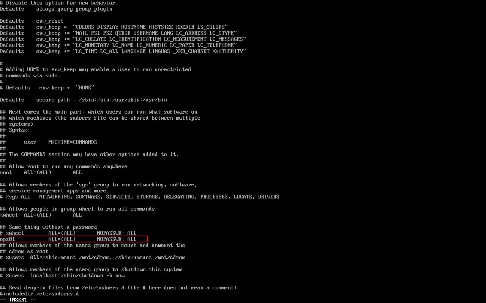

```
ops01    ALL=(ALL)    NOPASSWD: ALL
```


`ops01` has **unrestricted, passwordless sudo** on `srv-dns01`. This is a
common practical shortcut for Ansible automation (no password prompt to
handle over `become`), but it means `root` on `srv-auto01` — the automation
control node — now has unrestricted root-equivalent access to `srv-dns01`
with no password gate in between. Worth being precise about the trust chain
this creates, not just that it "works."

**Account inventory on `srv-dns01`, now complete across three sections:**

| Account | Purpose | Section |
|---|---|---|
| `yang01` | Day-to-day admin, SSH key login | 02 |
| `secadmin` | Hardening / audit work | 05 |
| `ops01` | Ansible automation, passwordless sudo | 09 (here) |

Three separate-purpose accounts is a defensible design (least-privilege by
role) — but it was never stated as a deliberate plan up front; it's the
result of three different tasks each creating what they needed. Worth
documenting as the actual, final account model rather than leaving it
implicit.

---

## Project structure and inventory

```bash
mkdir -p ~/enterprise-secops/ansible
cd ~/enterprise-secops/ansible
git init
cat > inventory.ini << 'EOF'
[web]
srv-dns01 ansible_host=192.168.40.10

[all:vars]
ansible_user=ops01
ansible_python_interpreter=/usr/bin/python3
EOF
```

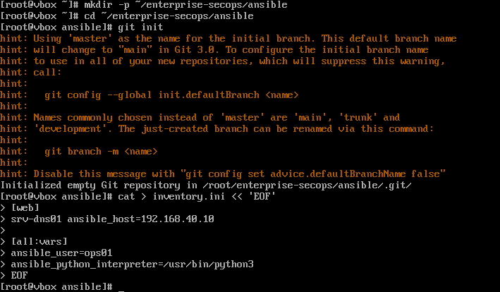

Only `[web]` / `srv-dns01` is in the inventory — `srv-mon01` was planned as
an optional `[infra]` group if it also had `ops01` and keys configured, but
that step wasn't done, so it correctly isn't in the final inventory rather
than being listed and silently failing.

```bash
ansible-inventory -i inventory.ini --graph
ansible web -i inventory.ini -m ping
```

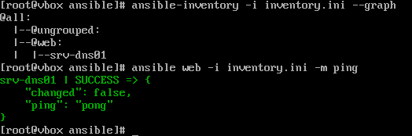

```
srv-dns01 | SUCCESS => { "changed": false, "ping": "pong" }
```

```bash
ansible web -i inventory.ini -m setup -b
```

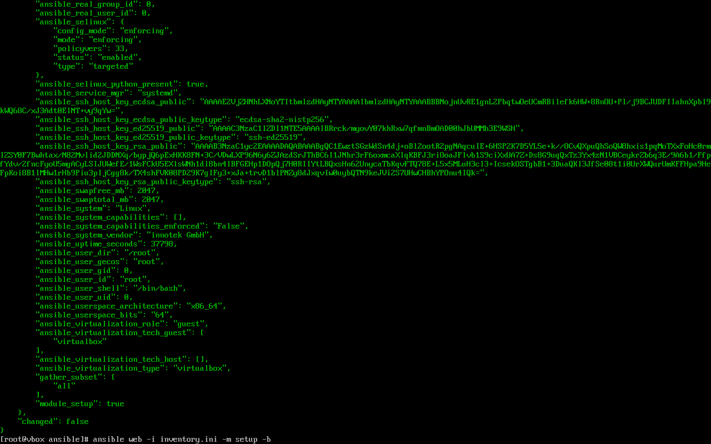

Fact-gathering independently reconfirms `srv-dns01`'s SELinux is
`enforcing` — a different tool arriving at the same answer already
established directly with `getenforce` in section 02.

---

## Ad-hoc baseline checks

```bash
ansible web -i inventory.ini -m command -a "systemctl --failed --no-legend" -b
ansible web -i inventory.ini -m command -a "df -hT" -b
ansible web -i inventory.ini -m command -a "ss -lntup" -b
ansible web -i inventory.ini -m command -a "systemctl is-active nginx" -b
```

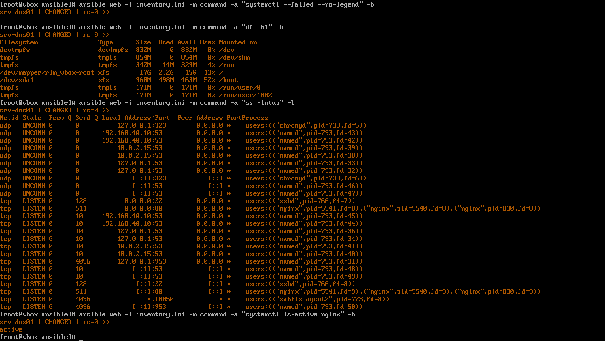

Confirms no failed units, healthy disk usage, the expected port set
listening (22/53/80, plus Zabbix agent on 10050), Nginx active.
**Worth being precise about the method used:** this is four separate ad-hoc
`command` calls, not the structured playbook with `changed_when: false`
originally planned — every one of these reports `CHANGED` regardless of
whether anything actually changed, because the raw `command` module has no
way to know. Functionally fine for a one-off check; a real playbook would
use `changed_when: false` on read-only commands so the output is
trustworthy at a glance rather than always claiming a change.

---

## Templating and deploying the Nginx config

```bash
mkdir -p templates
vi templates/portal.conf.j2
```


```bash
ansible web -i inventory.ini -m package -a "name=nginx state=present" -b
```

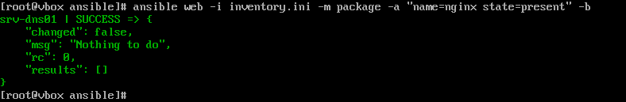

```bash
ansible web -i inventory.ini -m service -a "name=nginx state=started enabled=yes" -b
```

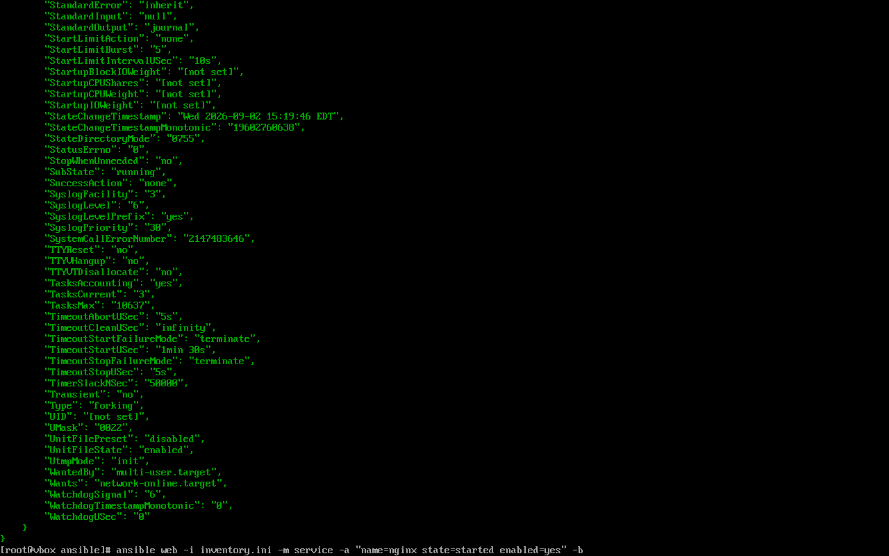

```bash
ansible web -i inventory.ini -m copy -a "src=templates/portal.conf.j2 dest=/etc/nginx/conf.d/portal.conf owner=root mode=0644" -b
ansible web -i inventory.ini -m command -a "nginx -t" -b
```

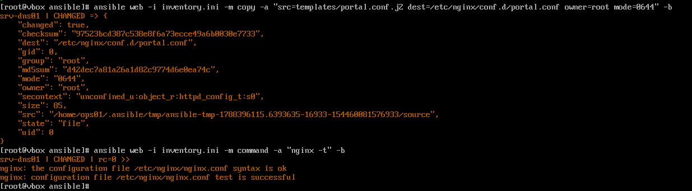

`"changed": true` — the file was actually written. `nginx -t` passed because
the template is syntactically valid; syntax validity says nothing about
whether the *content* is correct — which is exactly what went wrong here.

---

## Fixing the incident: two causes, not one

Checking the live portal after this deployment (`curl http://192.168.40.10 |
grep -i "Enterprise Internal"`) still returned the correct content —
**which was misleading, not reassuring.** The `copy` task never ran a reload
or restart afterward (only `nginx -t`, a syntax check with no effect on the
running process), so Nginx kept serving from the *old, still-correct*
in-memory configuration while the *file on disk* now held the stale one.
The bug was real and already written to disk; it just hadn't been triggered
yet. The next reload — for any reason, at any point in the future — would
have flipped the live site over to the wrong content with no obvious cause
to point to, since so much time would have passed since this deployment.

**Fix, step one — correct the template:**

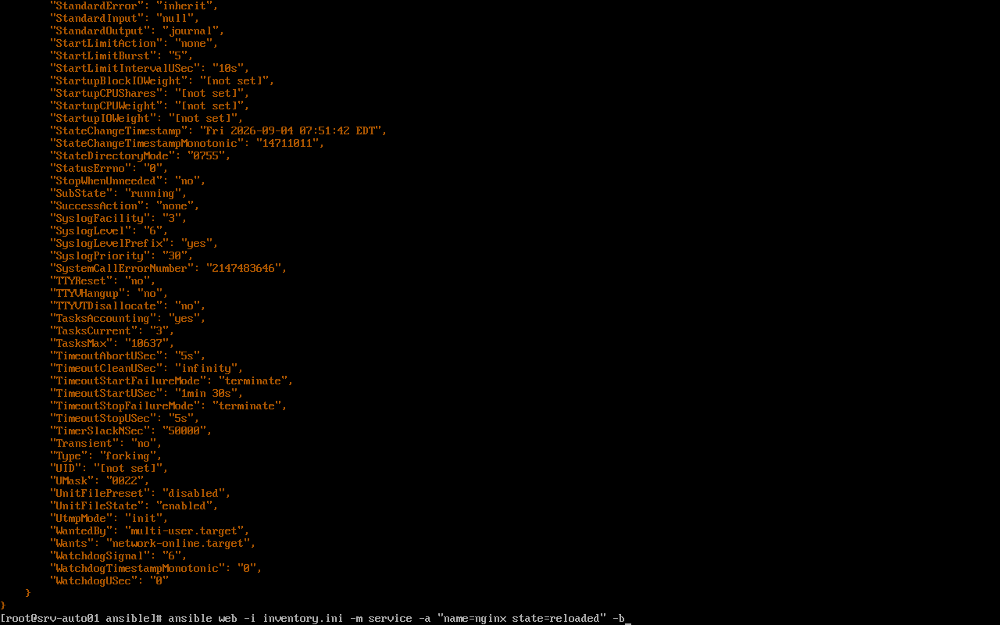

```nginx
server {
    listen 80;
    server_name portal.lab-test.local;
    root /var/www/company;
    index index.html;
}
```

**Fix, step two — redeploy and reload.** The first reload attempt failed,
and the failure was itself informative:

```bash
ansible web -i inventory.ini -m command -a "name=nginx state=reloaded" -b
# FAILED: [Errno 2] No such file or directory: b'name=nginx'
```

The `command` module executes its argument as a literal shell command — it
tried to run a program literally called `name=nginx`, which doesn't exist.
`state=reloaded` is `service`-module syntax, passed to the wrong module.
Corrected:

```bash
ansible web -i inventory.ini -m service -a "name=nginx state=reloaded" -b
```

**Verification, through Ansible itself, against the live process:**

```bash
ansible web -i inventory.ini -m command -a "curl -s http://127.0.0.1" -b
```

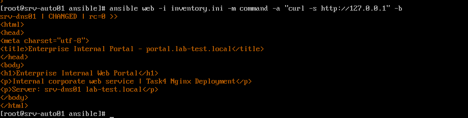

```
<title>Enterprise Internal Portal - portal.lab-test.local</title>
<h1>Enterprise Internal Web Portal</h1>
```

Correct content, confirmed **after** an actual reload — closing the gap the
first check couldn't see. Three separate things had to line up to actually
verify this: the template content itself, the deployed file, and the
running process actually reloading that file. A check that only covers one
of the three can look green while the other two are still wrong.

**A separate, unrelated snag hit while redeploying, worth its own note:**
the first redeploy attempt failed with `UNREACHABLE` — SSH connection to
`192.168.40.10` timed out. Traced to the route added in the Control node
setup (`sudo ip route add 192.168.40.0/24 via 192.168.50.1 dev enp0s8`) —
a route added with `ip route add` directly lives only in the running
kernel's routing table and does **not** survive a reboot, unlike a route
configured through `nmcli` or a persistent route file. `srv-auto01` had
been power-cycled between the original deployment and this fix (as part of
the project's mode-switching routine), silently dropping the route.
Re-adding it resolved the `UNREACHABLE` error immediately. Now documented as
a real limitation rather than a one-off inconvenience — see below.

---

## Idempotency check

The acceptance test: run the same task twice; the second run should report
no change.

```bash
ansible web -i inventory.ini -m package -a "name=nginx state=present" -b
```

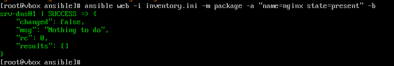

```bash
ansible web -i inventory.ini -m copy -a "src=templates/portal.conf.j2 dest=/etc/nginx/conf.d/portal.conf owner=root mode=0644" -b
```

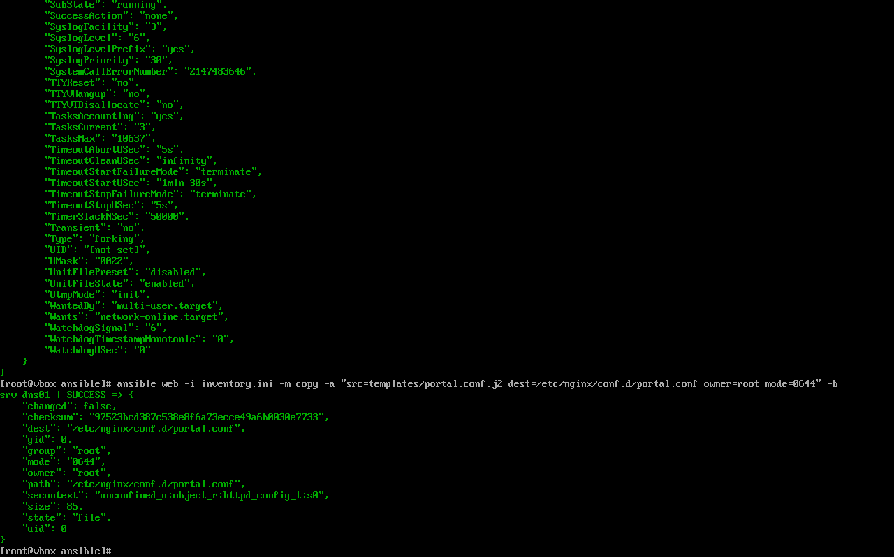

| Task | Run 1 | Run 2 | Idempotent |
|---|---|---|---|
| `package` (nginx present) | `changed: false` | `changed: false` | ✅ |
| `copy` (portal.conf.j2) | `changed: true` | `changed: false` | ✅ |

**This genuinely demonstrates idempotency correctly** — the module compares
checksums and only reports a change when content actually differs. That
mechanism working correctly is exactly *why* this task is confident the file
now matches the template byte-for-byte — which is also exactly why the
template needs to hold the *right* content, per the callout above. A
correctly-idempotent deployment of a wrong file is still a wrong file,
delivered reliably.

---

## Version control and audit trail

```bash
git add inventory.ini templates/
git config --global user.name "secops-lab"
git config --global user.email "secops@lab.local"
git commit -m "Add Ansible inventory and Nginx config template"
git log --oneline
```

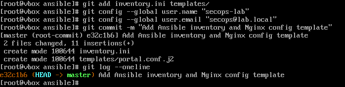

```bash
ansible web -i inventory.ini -m command -a "df -hT" -b 2>&1 | tee baseline_check_$(date +%F).log
ls -la *.log
```

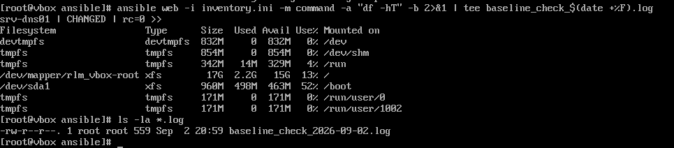

Both acceptance-checklist items from the plan closed out: a Git commit
exists, and a baseline log file was generated and saved.

---

## Verification

| Test | Expected | Result | Evidence |
|---|---|---|---|
| Control node built, reaches managed host | Static IP, route, ping succeed | Pass | `auto-03`, `auto-04` |
| Key-based SSH to managed host | No password prompt | Pass | `auto-07-ssh-passwordless-confirmed.png` |
| Ansible connectivity | `ping` module returns `pong` | Pass | `auto-09-inventory-graph-ping.png` |
| Fact-gathering works | `setup` module returns full host facts | Pass | `auto-10-setup-facts-selinux.png` |
| Config deployed via template | `copy` reports `changed: true` on first run | Pass | `auto-15-copy-portal-conf-changed-true.png` |
| Deployment is idempotent | Second run reports `changed: false` | Pass | `auto-17-copy-portal-conf-changed-false.png` |
| Deployed content is correct | Portal serves real content, right domain | Pass — after tracing and fixing two separate causes (stale template + missing reload) | `auto-20`, `auto-21` |
| Config change actually reflected by the running service, not just on disk | Reload confirmed, not assumed | Pass — fixed a missed `nginx -t`-only deploy with a proper `service ... reloaded` | `auto-20-service-reload-correct-module.png` |
| Work is version-controlled | Git commit exists | Pass | `auto-18-git-commit.png` |
| Baseline output is saved | Dated log file exists | Pass | `auto-19-baseline-log-file.png` |

## Known limitations

1. **Manually-added routes (`ip route add`) don't survive a reboot.** This
   caused a real `UNREACHABLE` failure when fixing the incident above, after
   `srv-auto01` had been power-cycled. The durable fix is to add the route
   through `nmcli` (as the interface's own config) or a persistent route
   file, not a one-off `ip route add` — otherwise this same failure recurs
   every time the control node restarts.
2. **`ops01` has unrestricted, passwordless sudo (`NOPASSWD: ALL`)** on
   `srv-dns01` — convenient for automation, but it means the control node's
   root user has unrestricted remote root access with no password gate.
   A tighter version would scope `ops01`'s sudo rights to only the specific
   commands/paths Ansible actually needs (`systemctl`, `nginx`, package
   management), not `ALL`.
3. **Baseline checks were run as ad-hoc commands, not a structured
   playbook.** Every `command` module call reports `changed` regardless of
   whether anything changed — functional for a one-off check, but a real
   playbook with `changed_when: false` on read-only tasks would make the
   output trustworthy without having to reason about it each time.
4. **No `--check` (dry-run) mode was used before the live deployment** — the
   `copy` task went straight to a real run against the only host in
   inventory. Low-risk here with one host, but not the habit to build for a
   larger fleet.
5. **Only `srv-dns01` is managed.** `srv-mon01`, `srv-log01`, and
   `srv-auto01` itself aren't in the inventory or under any playbook's
   control.
6. **No Ansible Vault used** — nothing sensitive was in this inventory, but
   there's no established pattern here yet for handling secrets if a future
   playbook needs one.
7. **Three separate admin accounts now exist on `srv-dns01`** (`yang01`,
   `secadmin`, `ops01`) — each with a real, distinct purpose, but the
   division was never a deliberate up-front design; it's what accumulated
   across sections 02, 05, and 09. Worth stating as the actual final model
   rather than leaving three accounts unexplained.
