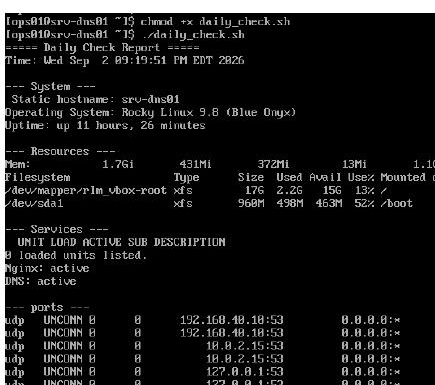
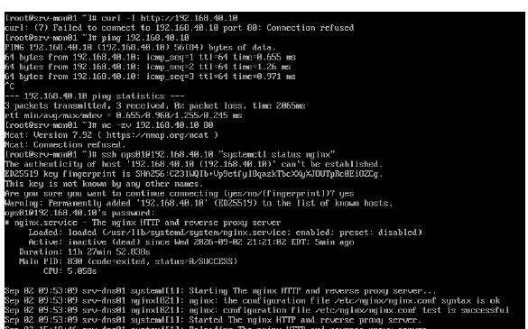
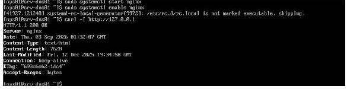
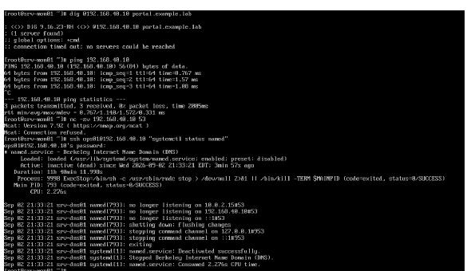
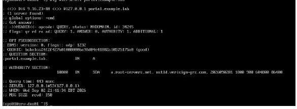
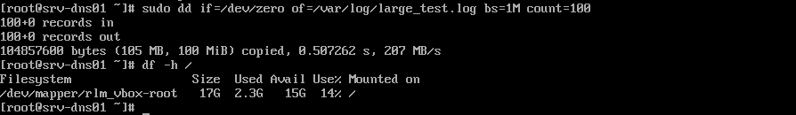
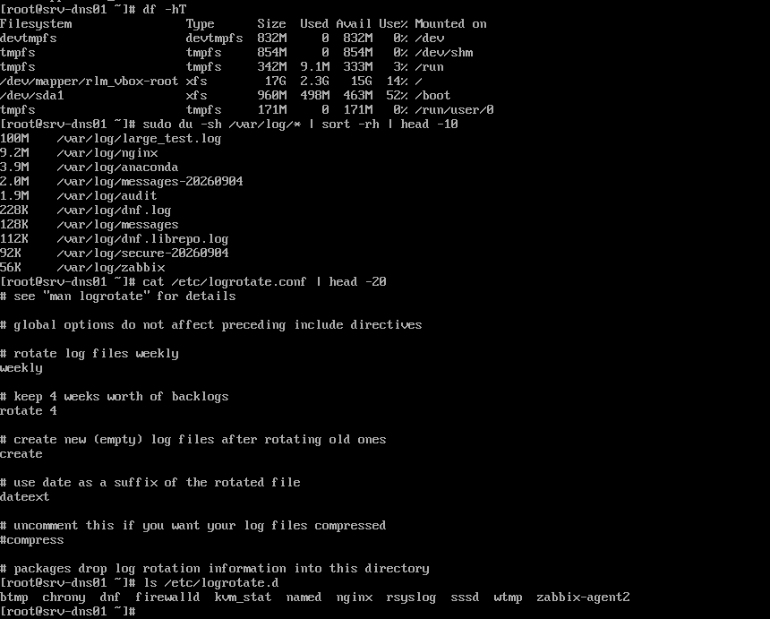
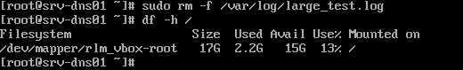

# 10 · Operations — health checks, change control, incident handling

**Task objective.** Put a repeatable process around running the environment:
a daily health check, and a documented incident-response cycle exercised
against real induced failures — not just a written procedure that was never
tested.

Environment for the drills below: OPNsense + srv-dns01 + srv-mon01 powered on,
Zabbix monitoring restored to normal before starting.

---

## Daily health check

A single script run from `srv-mon01` (or `srv-dns01`) covering system,
resources, services, listening ports, and recent warning-level log entries in
one pass — the same five categories the monitoring platform in section 06
watches, so a human running this by hand sees the same picture Zabbix does.

```bash
cat > daily_check.sh << 'SCRIPT'
#!/bin/bash
echo "===== Daily Check Report ====="
echo "Time: $(date)"
echo ""
echo "--- System ---"
hostnamectl | grep -E 'hostname|Operating|Kernel'
echo "Uptime: $(uptime -p)"
echo ""
echo "--- Resources ---"
echo "Load average: $(uptime | awk -F'load average:' '{print $2}')"
free -h | grep -E 'Mem|Swap'
df -hT | grep -vE 'tmpfs|devtmpfs'
echo ""
echo "--- Services ---"
systemctl --failed --no-legend || echo "No failed services"
echo "Nginx: $(systemctl is-active nginx)"
echo "Named (DNS): $(systemctl is-active named 2>/dev/null || echo 'not installed')"
echo "Zabbix Agent: $(systemctl is-active zabbix-agent2 2>/dev/null || echo 'not installed')"
echo ""
echo "--- Listening ports ---"
ss -lntup | grep -E ':(22|53|80|10050)'
echo ""
echo "--- Warning-level log entries, last 1 hour ---"
journalctl -p warning --since "1 hour ago" --no-pager | tail -10
SCRIPT
chmod +x daily_check.sh
./daily_check.sh
```

Actual output against `srv-dns01`:

```
===== Daily Check Report =====
Time: Wed Sep  2 09:19:51 PM EDT 2026

--- System ---
Static hostname: srv-dns01
Operating System: Rocky Linux 9.8 (Blue Onyx)
Uptime: up 11 hours, 26 minutes

--- Resources ---
Mem:     1.7Gi   431Mi   372Mi   13Mi   1.1Gi   1.2Gi
/dev/mapper/rlm_vbox-root  xfs  17G  2.2G  15G  13%  /
/dev/sda1                  xfs 960M  498M  503M  50%  /boot

--- Services ---
0 loaded units listed.
Nginx: active
DNS: active

--- ports ---
tcp   LISTEN  10   192.168.40.10:53   0.0.0.0:*
tcp   LISTEN  10   127.0.0.1:53       0.0.0.0:*
tcp   LISTEN  128  0.0.0.0:80         0.0.0.0:*
```

`0 loaded units listed` under Services means `systemctl --failed` came back
clean — no failed units at the time of the run.




---

## Incident drill A — INC-03: portal unreachable

**Method:** deliberately break the service, then troubleshoot it exactly the
way a real report would arrive — from the user's side inward, one layer at a
time, rather than jumping straight to a restart.

**1. Fault injection**, on `srv-dns01`:

```bash
sudo systemctl stop nginx
```

**2. Layered troubleshooting**, run from `srv-mon01` (simulated client):

| Layer | Command | Result | Interpretation |
|---|---|---|---|
| User side | `curl -I http://192.168.40.10` | `Failed to connect... Connection refused` | Something is wrong, but not yet which layer |
| Network | `ping -c 3 192.168.40.10` | 3 packets, 0% loss, ~0.7–1.3ms | Host is up, network path is fine — rules out routing/link issues |
| Port | `nc -zv 192.168.40.10 80` | `Connection refused` | The host is reachable but nothing is listening on 80 — points at the service, not the network |
| Service | `ssh` in, `systemctl status nginx` | `Active: inactive (dead)` | Confirmed: Nginx is not running |
| Logs | `sudo journalctl -u nginx -n 20` | Shows `Stopping...` / `Deactivated successfully` at the exact time of the induced stop | Confirms *when* and *that* it was a clean stop, not a crash |

That sequence — user report → ping → port check → service status → logs — is
what turns "the website is down" into a specific, evidenced root cause instead
of a guess. Ping succeeding first is what rules out the network and focuses
the rest of the investigation on the host itself.




**3. Recovery and verification:**

```bash
sudo systemctl start nginx
sudo systemctl enable nginx
curl -I http://127.0.0.1
```

```
HTTP/1.1 200 OK
Server: nginx
Content-Type: text/html
Content-Length: 7628
```

`enable` alongside `start` matters here — restarting the process fixes the
symptom, but without `enable` the same failure mode reappears after the next
reboot. The incident isn't closed until both the immediate service and its
persistence are confirmed.




**4. Incident ticket:**

| Field | Content |
|---|---|
| Ticket ID | INC-03 |
| Reported at / by | Simulated user report |
| Symptom | Portal unreachable, `curl` connection refused |
| Affected service and scope | Company portal (Nginx) unavailable; internal users affected |
| Recent changes | None |
| Monitoring and log evidence | Zabbix Nginx port-80 check alerted; `journalctl` showed the service had stopped |
| Investigation steps | curl → ping → port check → `systemctl status` → `journalctl`, in that order |
| Root cause | Nginx service not running (induced stop, for this drill) |
| Temporary fix | `systemctl start nginx` |
| Permanent fix | Start + `systemctl enable nginx` so the service persists across reboot |
| Recovery verification | `curl -I` → 200 OK; `ss` confirms port 80 listening; Zabbix alert cleared |
| Preventive action | Continuous Zabbix monitoring on the service and port, `systemd` restart policy, scheduled health checks |
| Handled by / reviewed by | `[Your name]` / `[Instructor / self-reviewed]` |
| Closed at | `[recovery time]` |

---

## Incident drill B — INC-02: name resolution failure

Same layered method, applied to DNS instead of the web service.

**1. Fault injection**, on `srv-dns01`:

```bash
sudo systemctl stop named
```

**2. Layered troubleshooting**, from `srv-mon01`:

| Layer | Command | Result | Interpretation |
|---|---|---|---|
| User side | `dig @192.168.40.10 portal.example.lab` | Connection timed out; no servers could be reached | Resolver isn't answering at all |
| Network | `ping -c 3 192.168.40.10` | 3 packets, 0% loss | Host and network are fine |
| Port | `nc -zv 192.168.40.10 53` | Connection refused | Nothing listening on 53 — service-level problem |
| Service | `ssh` in, `systemctl status named` | `Active: inactive (dead)` | Confirmed: `named` is not running |
| Logs | `sudo journalctl -u named -n 20` | Shows the managed-keys and resolver shutting down at the expected time | Confirms clean stop, matches the induced fault |




**3. Recovery and verification:**

```bash
sudo systemctl start named
sudo systemctl enable named
dig @127.0.0.1 portal.example.lab
```

**Result as recorded at the time:** `status: NOERROR` but the ANSWER section
came back empty, with a root-server SOA in the authority section — the
signature of a recursive lookup that found nothing, not a locally
authoritative answer. So `named` being back to `active` restored the
*service*, but this specific run didn't confirm the zone itself was
resolving correctly. It's logged here as it was found, an open item at the
time rather than a clean pass reported dishonestly.

**Update: this was resolved.** The underlying cause — the zone wasn't
correctly serving as authoritative, compounded by a later domain migration
from `example.lab` to `lab-test.local` — was fully diagnosed and fixed in
[`../03-web-dns/README.md`](../03-web-dns/README.md), including a
cross-host `dig` from `srv-mon01` confirming a real, authoritative answer.
This INC-02 write-up is kept as originally recorded (including the old
`example.lab` domain in the commands below) because it's an accurate account
of what was found and when — not backfilled to look correct in hindsight.




---

## Incident drill C — INC-05: disk space alert

**1. Fault injection**, on `srv-dns01` — simulate a runaway log file:

```bash
sudo dd if=/dev/zero of=/var/log/large_test.log bs=1M count=100
df -h /
```



100 MB file created; `/` usage moved to 14%.

**2. Investigation:**

```bash
df -hT
sudo du -sh /var/log/* | sort -rh | head -10
cat /etc/logrotate.conf | head -20
ls /etc/logrotate.d/
```



```
100M    /var/log/large_test.log
9.2M    /var/log/nginx
3.9M    /var/log/anaconda
2.0M    /var/log/messages-20260904
1.9M    /var/log/audit
```

`du` confirms the test file is, by a wide margin, the largest thing in
`/var/log` — real logs (`nginx`, `anaconda`, `messages`, `audit`) are all a
reasonable size, not the cause.

**The point of checking `logrotate.conf` and `/etc/logrotate.d/` here, not
just deleting the file:** a single large file is a symptom; whether it can
recur on its own is a separate question that only rotation config answers.

**Finding: rotation is correctly configured, not the root cause.**
`logrotate.conf` shows `weekly` / `rotate 4` / `dateext` (which is exactly
why `messages-20260904` and `secure-20260904` already exist as dated,
rotated files — rotation is visibly working, not just configured on paper).
`/etc/logrotate.d/` includes a dedicated `nginx` entry, confirming the
service most likely to generate this alert in a real scenario already has
its own rotation policy. **The honest conclusion is the less dramatic one:**
this alert's cause was the deliberately-injected test file, not a gap in log
management. Recording that plainly is more useful than manufacturing a
rotation fix for a problem that wasn't actually there.

**3. Recovery:**

```bash
sudo rm -f /var/log/large_test.log
df -h /
```



Usage back to 13% — space reclaimed, confirmed by `df`, not assumed from the
`rm` command succeeding.

**4. Incident ticket:**

| Field | Content |
|---|---|
| Ticket ID | INC-05 |
| Reported at / by | Simulated monitoring alert |
| Symptom | Disk usage on `/` approaching threshold |
| Affected service and scope | No service impact — usage rose from 13% to 14%, well under any alerting threshold in this drill |
| Recent changes | None (test file injected for this drill) |
| Monitoring and log evidence | `df -h` before/after; `du -sh /var/log/*` ranked by size |
| Investigation steps | `df -hT` → `du -sh` ranked → `logrotate.conf` → `/etc/logrotate.d/` |
| Root cause | Deliberately injected 100 MB test file; **not** a logrotate gap — rotation confirmed correctly configured (weekly, 4 backlogs, dateext, per-service entries including `nginx`) |
| Temporary fix | `rm -f /var/log/large_test.log` |
| Permanent fix | None needed — no underlying misconfiguration found |
| Recovery verification | `df -h /` confirms usage back to baseline (13%) |
| Preventive action | None required for rotation (already correct); general recommendation to keep Zabbix disk-usage alerting in place as the early-warning layer |
| Handled by / reviewed by | `[Your name]` / `[Instructor / self-reviewed]` |
| Closed at | `[recovery time]` |

---

## Templates

Blank forms used during the build: [`templates/`](templates/)

- Incident ticket
- Change record
- Security event record
- Acceptance checklist

## Acceptance checklist for this section

- [x] Daily check script runs cleanly and reports system/resources/services/ports/logs
- [x] At least two incident drills completed (INC-03 and INC-02)
- [x] Each drill has full evidence: fault injection → layered troubleshooting
      (user → network → port → service → logs) → recovery → verification
- [x] Each completed drill has a filled incident ticket
- [x] Troubleshooting shows layered reasoning, not "just restart it and see"
- [x] INC-05 (disk alert) — full cycle complete: injection, investigation
      (including a real rotation-config check), recovery, and ticket

## Known limitations

1. **Tickets are tracked as markdown files in this repo, not in a ticketing
   system.** Fine for a lab of this size; would not scale to a real team.
2. **Drills were run manually, on demand** — no scheduled chaos testing, no
   alerting-to-ticket automation.

