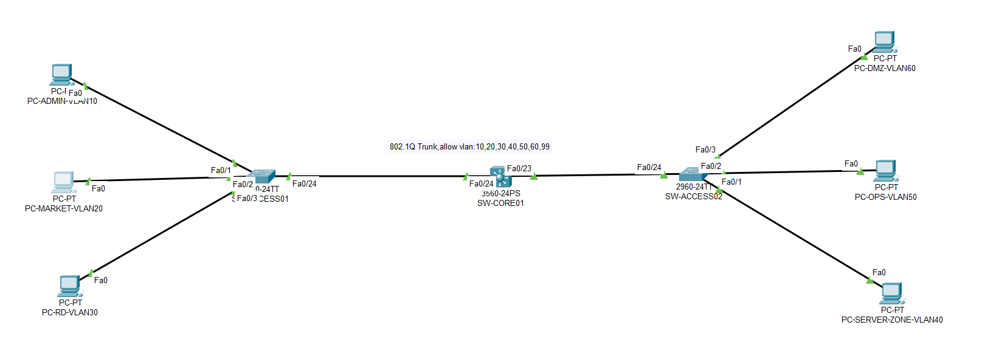

# Enterprise Network & Security Operations Lab

An end-to-end build of the network, server, security, monitoring and automation
stack for a simulated 80-user company — from VLAN design through to incident
handling. Built as a personal lab project.

> **Scope note.** This is a lab environment, not production infrastructure. All
> addressing is private, all credentials are redacted, and no scanning or
> security testing was performed against any system outside the simulation.

---

## The scenario

A fictional 80-person technology company with four departments (Administration,
Marketing, R&D, Operations) is moving into a new office. The existing network is
flat, device configurations are not backed up, server accounts are managed
ad hoc, failures are found by users rather than by monitoring, and security logs
are not collected anywhere.

The build covers the full path a small IT team would actually walk: design the
segmentation, deploy it, stand up the services, harden them, get visibility into
them, automate the repetitive parts, and put a process around running them.

---

## Build log

| #   | Area                                    | What it covers                                                              | Status |
| --- | --------------------------------------- | --------------------------------------------------------------------------- | ------ |
| —   | [Design](docs/)                         | Zone model, addressing plan, access-control matrix                          | ✅      |
| 01  | [Network](01-network/)                  | VLANs, inter-VLAN routing, DHCP, trunking, switch management hardening      | ✅      |
| 02  | [Linux baseline](02-linux-baseline/)    | Server deployment, accounts, SSH key auth, time sync, health checks         | 🚧     |
| 03  | [Web & DNS](03-web-dns/)                | Nginx portal, BIND internal resolver, config backup and restore drill       | 🚧     |
| 04  | [Edge firewall](04-firewall/)           | Zones, NAT, port forwarding, policy enforcement and rollback                | 🚧     |
| 05  | [Host hardening](05-hardening/)         | Account and SSH hardening, service/port reduction, file permissions, auditd | 🚧     |
| 06  | [Monitoring](06-monitoring/)            | Zabbix agent and SNMP onboarding, thresholds, alert drills                  | 🚧     |
| 07  | [Logging & IR](07-logging/)             | Wazuh log collection, alert triage, incident tickets                        | 🚧     |
| 08  | [Vulnerability mgmt](08-vulnerability/) | Authorized scanning, manual validation, remediation and retest              | 🚧     |
| 09  | [Automation](09-automation/)            | Ansible inventory and playbooks, idempotency checks                         | 🚧     |
| 10  | [Operations](10-operations/)            | Health-check routine, change records, incident handling, postmortems        | 🚧     |

✅ documented · 🚧 built, write-up in progress

Each section has its own README with the design decision, the configuration,
how it was verified, and what it still gets wrong.

---

## Target architecture

| Zone              | VLAN | Subnet          | Purpose                                    |
| ----------------- | ---- | --------------- | ------------------------------------------ |
| Administration    | 10   | 192.168.10.0/24 | Office workstations                        |
| Marketing         | 20   | 192.168.20.0/24 | Office workstations                        |
| R&D               | 30   | 192.168.30.0/24 | Office workstations                        |
| Server            | 40   | 192.168.40.0/24 | DNS, monitoring, log collection            |
| Operations        | 50   | 192.168.50.0/24 | Admin workstation, automation control node |
| DMZ               | 60   | 192.168.60.0/24 | Internet-facing company portal             |
| Device management | 99   | 192.168.99.0/24 | Switch and firewall management addresses   |

Full plan: `[docs/ip-vlan-plan.md](docs/ip-vlan-plan.md)` ·
Intended policy: `[docs/access-control-matrix.md](docs/access-control-matrix.md)`

---

## Principles the build follows

- **Design before configuration.** Addressing, zones and the access matrix were
agreed before any device was touched.
- **Back up before changing.** Every change has a recorded pre-change state and a
defined rollback condition.
- **Least privilege.** Only the accounts, ports and management paths a task
actually needs.
- **Evidence over assertion.** Conclusions are backed by configuration output,
logs, or test results — not by "it worked when I tried it".
- **Recovery first.** During an incident, contain and restore before analysing
root cause.

---

## Tools

Cisco IOS (Catalyst 3560 / 2960) · Packet Tracer · Rocky Linux · Nginx · BIND ·
OPNsense · Zabbix · Wazuh · Ansible · Git

---

## Author

**[Rhodes Yang]** — [Rhodes Yang | LinkedIn](https://www.linkedin.com/in/xiaohu-yang/)

Feedback on the design is welcome; open an issue if you spot something.